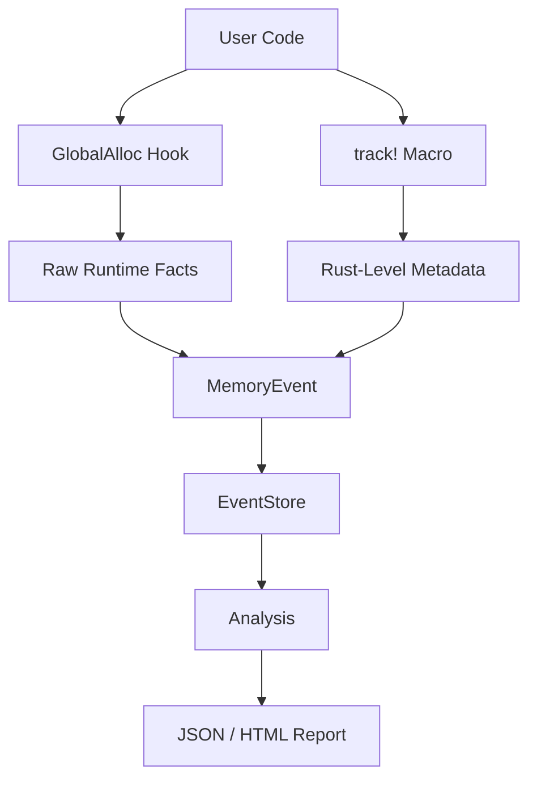
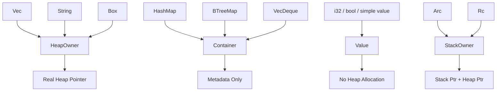

+++
title = "Single-Thread Tracking: From GlobalAlloc to Rust-Level Memory Semantics"
date = 2026-05-20
description = "How memscope-rs combines GlobalAlloc runtime tracking with Rust-level semantic metadata for single-thread memory analysis."
weight = 1
[taxonomies]
tags = ["Rust", "Memory"]
[extra]
toc = true
+++

# Single-Thread Tracking: From `GlobalAlloc` to Rust-Level Memory Semantics

Rust gives us strong memory safety guarantees, but memory safety does not automatically mean memory behavior is transparent.

In real Rust applications, developers still need answers to questions like:

- Which variable caused this allocation?
- Which Rust type owns this memory?
- Was this object a real heap owner, a container, or just metadata?
- Which source file and line introduced this allocation?

`memscope-rs` approaches this problem in layers. The single-thread tracking path is the foundation: it combines raw runtime allocation facts from `GlobalAlloc` with Rust-level semantic metadata from `track!` and `Trackable`.

This article focuses on the base layer: how `memscope-rs` turns raw allocation events into analysis-ready Rust memory records.

---

## 1. Why Single-Thread Tracking Comes First

Before multithreading, async tasks, ownership graphs, dashboards, or FFI analysis, the core question is simple:

> Can the tool reliably collect useful memory events for one execution flow?

The single-thread model splits data collection into two complementary sources:

1. `GlobalAlloc` captures runtime allocation facts.
2. `track!` and `Trackable` add Rust-level context.



`GlobalAlloc` is the ground truth for pointer and size information, but it does not know Rust variable names or ownership semantics. The Rust-level semantic layer fills that gap explicitly.

---

## 2. Runtime Ground Truth: `GlobalAlloc`

At the lowest layer, `memscope-rs` wraps the system allocator with a custom allocator.

A simplified version looks like this:

```rust
unsafe impl GlobalAlloc for TrackingAllocator {
    unsafe fn alloc(&self, layout: Layout) -> *mut u8 {
        let ptr = System.alloc(layout);

        if !ptr.is_null() {
            let _ = tracker.track_allocation(ptr as usize, layout.size());
        }

        ptr
    }

    unsafe fn dealloc(&self, ptr: *mut u8, layout: Layout) {
        let _ = tracker.track_deallocation(ptr as usize);
        System.dealloc(ptr, layout);
    }
}
```

The real implementation also includes a thread-local guard to avoid recursive tracking. Tracking itself can allocate, so the allocator must temporarily disable tracking while recording allocation metadata.

```rust
thread_local! {
    static TRACKING_DISABLED: std::cell::Cell<bool> =
        const { std::cell::Cell::new(false) };
}
```

This layer provides high-confidence data:

| Data | Source | Reliability |
|---|---|---|
| Pointer address | `GlobalAlloc` | High |
| Allocation size | `Layout::size()` | High |
| Allocation event | `alloc()` | High |
| Deallocation event | `dealloc()` | High |

But this layer cannot tell whether a pointer belongs to a `Vec<T>`, `String`, `Box<T>`, `HashMap<K, V>`, or a custom application type.

---

## 3. Why Raw Allocation Data Is Not Enough

Allocator-level data might look like this:

```text
alloc ptr=0x1048a0000 size=1024
alloc ptr=0x1048b4000 size=24
dealloc ptr=0x1048a0000
```

That is useful, but Rust developers usually want something closer to:

```text
variable: users
type: Vec<User>
source: src/main.rs:42
size: 1024 bytes
```

This is why `memscope-rs` uses an explicit macro layer:

```rust
let users = vec![User::new("Alice"), User::new("Bob")];
track!(tracker, users);
```

The macro injects compile-time metadata:

```rust
macro_rules! track {
    ($tracker:expr, $var:expr) => {{
        let var_name = stringify!($var);
        $tracker.track_as(
            &$var,
            var_name,
            file!(),
            line!(),
            module_path!(),
        );
    }};
}
```

This is explicit by design. The tool does not pretend to automatically understand every variable in a Rust program.

---

## 4. `Trackable`: The Semantic Layer

To let a Rust value describe its memory role, `memscope-rs` uses the `Trackable` trait.

```rust
pub trait Trackable {
    fn track_kind(&self) -> TrackKind;

    fn get_type_name(&self) -> &'static str;

    fn get_size_estimate(&self) -> usize;


    fn get_ref_count(&self) -> Option<usize> {
        None
    }

    fn get_data_ptr(&self) -> Option<usize>;
    fn get_data_size(&self) -> Option<usize>;
}
```

The most important method is `track_kind()` because not all Rust types should be modeled as simple heap pointers.

---

## 5. `TrackKind`: Rust Types as Memory Roles

`TrackKind` classifies tracked values into memory roles:

```rust
pub enum TrackKind {
    HeapOwner { ptr: usize, size: usize },
    Container,
    Value,
    StackOwner { ptr: usize, heap_ptr: usize, size: usize },
}
```



This classification prevents `memscope-rs` from treating every Rust value as a fake heap allocation.

---

## 6. Built-in Type Modeling

For `Vec<T>`, the implementation uses the data pointer and capacity-based size estimate:

```rust
impl<T> Trackable for Vec<T> {
    fn track_kind(&self) -> TrackKind {
        TrackKind::HeapOwner {
            ptr: self.as_ptr() as usize,
            size: self.capacity() * std::mem::size_of::<T>(),
        }
    }

    fn get_type_name(&self) -> &'static str {
        "Vec<T>"
    }

    fn get_size_estimate(&self) -> usize {
        std::mem::size_of::<T>() * self.capacity()
    }
}
```

For `HashMap<K, V>`, the implementation is intentionally more conservative:

```rust
impl<K, V> Trackable for std::collections::HashMap<K, V> {
    fn track_kind(&self) -> TrackKind {
        TrackKind::Container
    }

    fn get_type_name(&self) -> &'static str {
        "HashMap<K, V>"
    }

    fn get_size_estimate(&self) -> usize {
        std::mem::size_of::<(K, V)>() * self.capacity()
    }

    fn get_data_ptr(&self) -> Option<usize> {
        None
    }
}
```

This avoids exposing unstable internal container pointers as if they were simple user-owned heap buffers.

---

## 7. User-Defined Types

Standard library support is only half the story. Real applications use custom structs and enums.

`memscope-rs` provides a derive macro for custom types:

```rust
use memscope_rs::{track, tracker, Trackable};
use memscope_derive::Trackable;

#[derive(Trackable)]
struct UserProfile {
    id: u64,
    name: String,
    tags: Vec<String>,
}

fn main() {
    let tracker = tracker!();

    let profile = UserProfile {
        id: 1,
        name: "Alice".to_string(),
        tags: vec!["rust".to_string(), "memory".to_string()],
    };

    track!(tracker, profile);
}
```

The derive macro estimates size by walking fields that implement `Trackable`. This is not perfect memory-layout reconstruction, but it provides a practical semantic layer for application objects.

---

## 8. Event Recording Strategy

When `track!` calls `track_as()`, the tracker branches based on `TrackKind`.

For `HeapOwner`:

```rust
let mut event = MemoryEvent::allocate(ptr, size, thread_id);
event.var_name = Some(name.to_string());
event.type_name = Some(type_name);
event.source_file = Some(file.to_string());
event.source_line = Some(line);
event.module_path = Some(module_path.to_string());
self.event_store.record(event);
```

For `Container` or `Value`:

```rust
let mut event = MemoryEvent::metadata(
    name.to_string(),
    type_name,
    thread_id,
    var.get_size_estimate(),
);
self.event_store.record(event);
```

The important distinction is that containers and values produce metadata events, not fake heap allocation records.

---

## 9. Benchmark Interpretation

The benchmark log shows that single-variable tracking is generally sub-microsecond for small tracked values:

| Benchmark | Approximate Time |
|---|---:|
| `track_single/vec/64` | ~653 ns |
| `track_single/vec/1024` | ~666 ns |
| `track_single/vec/1048576` | ~4.93 µs |
| `track_multiple/variables/1000` | ~669.67 µs |
| `track_multiple/variables/10000` | ~6.59 ms |

The honest interpretation is that absolute latency is usable for profiling, but the benchmark log also contains regressions relative to previous runs. Performance should be described as measured and evolving, not magically zero-cost.

---

## 10. What This Layer Can and Cannot Know

High-confidence data:

- pointer address
- allocation size
- allocation/deallocation event
- timestamp
- thread id

Explicit metadata:

- variable name
- type name
- source file
- line number
- module path
- semantic role through `TrackKind`

Not directly known:

- every ownership transfer
- every borrow
- every move
- every variable unless explicitly tracked

This distinction matters. `memscope-rs` is strongest when it clearly separates runtime facts, explicit metadata, and later inference.

---

## 11. Summary

The single-thread tracking layer is not the most glamorous part of `memscope-rs`, but it is the foundation.

It combines:

- `GlobalAlloc` for raw runtime facts;
- `track!` for variable context;
- `Trackable` for Rust type semantics;
- `TrackKind` for memory role classification;
- `EventStore` for later analysis and export.

The key design principle is simple:

> Capture what is real at runtime, then add Rust semantics explicitly and conservatively.

