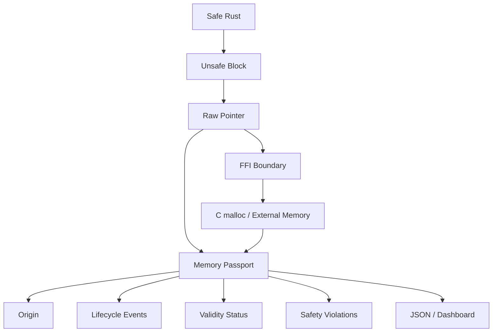

+++
title = "Unsafe and FFI Memory Passport: Tracking Memory Across Rust's Trust Boundary"
date = 2026-05-20
description = "Rust is safe until you cross the boundary."
weight = 5
[taxonomies]
tags = ["Rust", "unsafe/ffi"]
[extra]
toc = true
+++

# Unsafe and FFI Memory Passport: Tracking Memory Across Rust’s Trust Boundary

Rust is safe until you cross the boundary.

That boundary may be:

- an `unsafe` block;
- a raw pointer;
- `std::alloc::alloc`;
- C `malloc/free`;
- a pointer returned by an external library;
- an ownership contract that exists outside Rust’s type system.

`memscope-rs` does not claim to prove unsafe code correct. Instead, it records lifecycle evidence for memory that crosses Rust’s trust boundary.

The concept is called a memory passport.

---

## 1. Why Unsafe and FFI Need a Separate Model

Allocator-level tracking can tell us:

- pointer;
- size;
- allocation event;
- deallocation event.

For unsafe and FFI memory, that is not enough. We also want to know:

- who created this memory?
- was it handed to foreign code?
- was it freed by Rust or by foreign code?
- is it still in foreign custody?
- does its lifecycle look suspicious?



---

## 2. What Is a Memory Passport?

A memory passport is a runtime identity record for a memory allocation.

The core structure contains:

```rust
pub struct MemoryPassport {
    pub passport_id: String,
    pub allocation_ptr: usize,
    pub size_bytes: usize,
    pub type_name: String,
    pub var_name: String,
    pub status_at_shutdown: PassportStatus,
    pub lifecycle_events: Vec<PassportEvent>,
    pub created_at: u64,
    pub updated_at: u64,
    pub metadata: HashMap<String, String>,
}
```

This is not just an allocation record. It is a lifecycle document.

---

## 3. Allocation Source

The unsafe/FFI tracker models where memory came from:

```rust
pub enum AllocationSource {
    RustSafe,
    UnsafeRust {
        unsafe_block_location: String,
        call_stack: CallStackRef,
        risk_assessment: RiskAssessment,
    },
    FfiC {
        resolved_function: ResolvedFfiFunction,
        call_stack: CallStackRef,
        libc_hook_info: LibCHookInfo,
    },
    CrossBoundary {
        from: Box<AllocationSource>,
        to: Box<AllocationSource>,
        transfer_timestamp: u128,
        transfer_metadata: TransferMetadata,
    },
}
```

This allows `memscope-rs` to distinguish normal Rust allocation from unsafe Rust allocation, C allocation, and cross-boundary transfer.

---

## 4. Safety Violation Signals

The tracker records suspicious patterns as safety violation signals:

```rust
pub enum SafetyViolation {
    DoubleFree { ... },
    InvalidFree { ... },
    PotentialLeak { ... },
    CrossBoundaryRisk { ... },
}
```

These are runtime signals, not formal proofs.

The careful wording is:

- double free candidate;
- invalid free signal;
- potential leak;
- cross-boundary risk.

Not every suspicious runtime signal is automatically a proven bug, but each one is worth investigation.

---

## 5. Creating and Updating Passports

Creating a passport inserts an initial lifecycle event:

```rust
pub fn create_passport(
    &self,
    allocation_ptr: usize,
    size_bytes: usize,
    initial_context: String,
    type_name: Option<String>,
    var_name: Option<String>,
) -> TrackingResult<String> {
    let passport_id = self.generate_passport_id(allocation_ptr)?;

    let initial_event = PassportEvent {
        event_type: PassportEventType::AllocatedInRust,
        timestamp: current_time,
        context: initial_context,
        call_stack: self.capture_call_stack()?,
        metadata: HashMap::new(),
        sequence_number: self.get_next_event_sequence(),
    };

    let passport = MemoryPassport {
        passport_id: passport_id.clone(),
        allocation_ptr,
        size_bytes,
        type_name: type_name.unwrap_or_else(|| "-".to_string()),
        var_name: var_name.unwrap_or_else(|| "-".to_string()),
        status_at_shutdown: PassportStatus::Unknown,
        lifecycle_events: vec![initial_event],
        created_at: current_time,
        updated_at: current_time,
        metadata: HashMap::new(),
    };

    Ok(passport_id)
}
```

Later events include:

- `HandoverToFfi`
- `FreedByForeign`
- `ReclaimedByRust`
- `BoundaryAccess`
- `OwnershipTransfer`
- `ValidationCheck`
- `CorruptionDetected`

---

## 6. Shutdown Status

At shutdown or export time, a passport can be summarized with a final status:

```rust
pub enum PassportStatus {
    FreedByRust,
    HandoverToFfi,
    FreedByForeign,
    ReclaimedByRust,
    InForeignCustody,
    Unknown,
}
```

This status helps summarize lifecycle state:

- was the memory freed by Rust?
- was it handed to FFI?
- did foreign code free it?
- is it still in foreign custody?
- is the status unknown?

---

## 7. Example: Unsafe Allocation

The showcase example tracks manually allocated unsafe Rust memory:

```rust
unsafe {
    let layout = Layout::new::<[i32; 64]>();
    let ptr = alloc(layout);

    if !ptr.is_null() {
        tracker.create_passport(
            ptr as usize,
            layout.size(),
            format!("unsafe_vec_{}", i),
        )?;

        let slice = std::slice::from_raw_parts_mut(ptr as *mut i32, 64);
        for (j, item) in slice.iter_mut().enumerate() {
            *item = (i * 100 + j) as i32;
        }

        dealloc(ptr, layout);
    }
}
```

The passport gives this memory an identity before it is manually written and released.

---

## 8. Example: FFI Allocation

The same example also tracks C allocation:

```rust
extern "C" {
    fn malloc(size: usize) -> *mut std::ffi::c_void;
    fn free(ptr: *mut std::ffi::c_void);
}

let ffi_ptr = unsafe { malloc(size) };

if !ffi_ptr.is_null() {
    tracker.create_passport(
        ffi_ptr as usize,
        size,
        format!("ffi_alloc_{}", i),
    )?;

    tracker.record_handover(
        ffi_ptr as usize,
        "foreign_function".to_string(),
        format!("ffi_call_{}", i),
    );

    unsafe {
        std::ptr::write_bytes(ffi_ptr as *mut u8, (0x40 + i) as u8, size);
        free(ffi_ptr);
    }
}
```

This is a typical trust-boundary case: Rust sees a raw `*mut c_void`, but the allocation and release semantics are foreign.

---

## 9. Export Pipeline

The export pipeline writes passport-related JSON files:

- `memory_passports.json`
- `leak_detection.json`
- `unsafe_ffi.json`

The memory passport export includes fields such as:

```rust
serde_json::json!({
    "passport_id": p.passport_id,
    "allocation_ptr": format!("0x{:x}", p.allocation_ptr),
    "size_bytes": p.size_bytes,
    "created_at": p.created_at,
    "lifecycle_events": p.lifecycle_events.len(),
    "status": format!("{:?}", p.status_at_shutdown),
})
```

The unsafe/FFI export filters passports with FFI-related final states such as:

- `HandoverToFfi`
- `InForeignCustody`
- `FreedByForeign`

---

## 10. What This Can and Cannot Prove

It can observe:

- pointer creation;
- allocation size;
- lifecycle events;
- handover to FFI;
- foreign free records;
- suspicious invalid or repeated frees;
- final passport status.

It cannot prove:

- all unsafe code is correct;
- foreign code obeyed its ownership contract;
- every external pointer has a complete origin;
- every suspicious signal is definitely a bug.

This is runtime observability, not formal verification.

---

## 11. Summary

The memory passport model is useful because it turns unsafe and FFI memory into something auditable.

It records:

- origin;
- lifecycle events;
- custody transitions;
- final status;
- safety violation signals.

The most honest description is:

> `memscope-rs` does not make unsafe code safe. It makes unsafe and FFI memory lifecycles easier to observe and audit.

