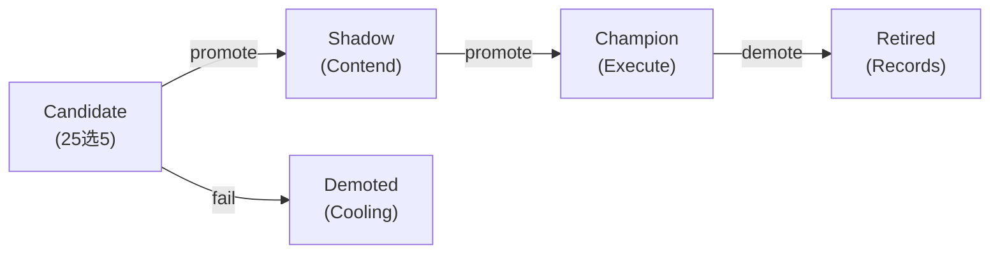
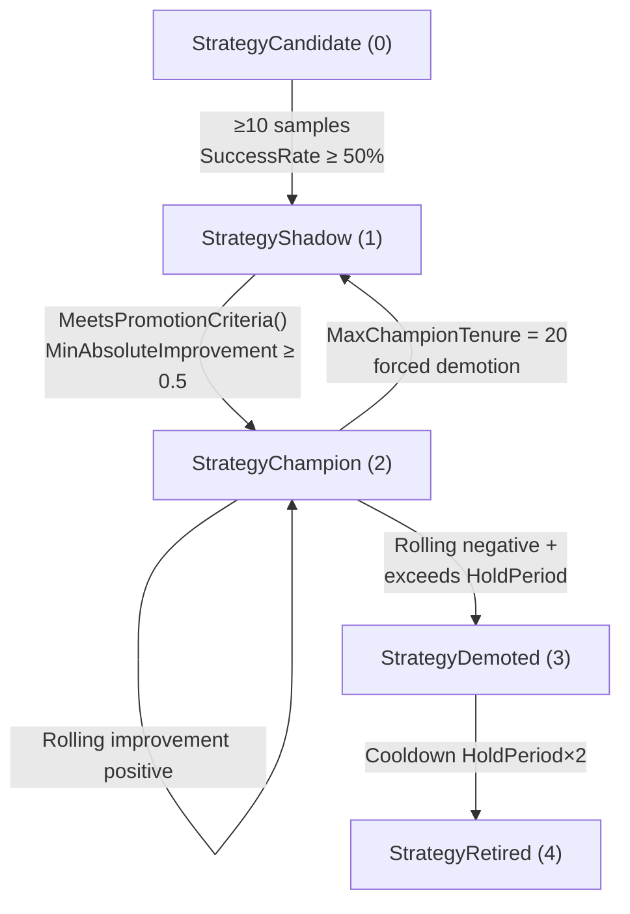

+++
title = "Promoter — Champion/Challenger Promotion and the Five-State State Machine"
date = 2026-06-28
description = "A five-state promotion state machine with 12-parameter criteria and rolling improvement detection."
weight = 27
[taxonomies]
tags = ["Go", "Agent", "Genetic Algorithm", "Promotion"]
series = ["ARES"]
[extra]
series = "ARES"
+++

# Promoter Champion/Challenger Promotion System — A Deep Dive into the Five-State State Machine

> This article provides an in-depth analysis of the Promotion System implementation in the ARES evolution system, covering the five-state state machine, 12-parameter promotion criteria, evidence scoring formula, and rolling improvement detection. All code snippets are from the actual source code.

## 1. System Overview

The Promoter is the core component of the evolution system that manages the "candidate strategy → champion strategy" promotion pipeline. Its design is inspired by the **Champion/Challenger** pattern: the system maintains a known-good "Champion" and multiple "Challengers" attempting to surpass it, determining strategy promotion and demotion through a rigorous evaluation process.



Source path: `internal/ares_evolution/promotion/`

## 2. Five-State State Machine

### 2.1 State Definitions

```go
// File: internal/ares_evolution/promotion/types.go
type StrategyState int

const (
    // Candidate state: strategy just created, needs to collect samples
    StrategyCandidate StrategyState = iota  // 0
    // Shadow state: intermediate state competing with the champion
    StrategyShadow                           // 1
    // Champion state: current best strategy
    StrategyChampion                         // 2
    // Demoted state: was champion but has been surpassed
    StrategyDemoted                          // 3
    // Retired state: permanently withdrawn from competition
    StrategyRetired                          // 4
)
```

Complete lifecycle of the five states:



### 2.2 State Transition Validation: Explicit Directed Graph

```go
// File: internal/ares_evolution/promotion/types.go
// CanPromoteTo and CanDemoteTo use explicit transition mapping tables
// This design is safer and more maintainable than implicit if-else chains

// Promotion transition mapping (key = current state)
var promotionTransitions = map[StrategyState][]StrategyState{
    StrategyCandidate: {StrategyShadow},
    StrategyShadow:    {StrategyChampion},
}

// Demotion transition mapping (key = current state)
var demotionTransitions = map[StrategyState][]StrategyState{
    StrategyChampion: {StrategyDemoted, StrategyShadow},
    StrategyDemoted:  {StrategyRetired},
}
```

Design highlights:
- The transition mapping is a **Directed Acyclic Graph** (DAG) with no circular dependencies
- Each state has a limited set of transition targets (at most 2)
- `StrategyShadow → StrategyChampion` is the most critical transition in the system

## 3. PromotionCriteria: The 12-Parameter Promotion Standard

### 3.1 Data Structure

```go
type PromotionCriteria struct {
    MinSampleCount         int     // Minimum sample count: 100
    MinSuccessRate         float64 // Minimum success rate: 0.85 (85%)
    MaxErrorRate           float64 // Maximum error rate: 0.15 (15%)
    MaxLatencyP95          int64   // Maximum P95 latency: 5000ms
    MinConfidence          float64 // Minimum confidence: 0.7

    ChampionHoldPeriod     int     // Champion hold period: 5 generations
    DemotionThreshold      float64 // Demotion threshold: 0.3
    CoolDownGenerations    int     // Cooldown generations: 3 generations
    MinAbsoluteImprovement float64 // Minimum absolute improvement: 0.5
    MinRollingImprovement  float64 // Minimum rolling improvement: 0.1
    ImprovementWindow      int     // Improvement window: 3 generations
    MaxChampionTenure      int     // Maximum champion tenure: 20 generations
}
```

### 3.2 Default Values

```go
func DefaultPromotionCriteria() PromotionCriteria {
    return PromotionCriteria{
        MinSampleCount:         100,
        MinSuccessRate:         0.85,
        MaxErrorRate:           0.15,
        MaxLatencyP95:          5000,
        MinConfidence:          0.7,
        ChampionHoldPeriod:     5,
        DemotionThreshold:      0.3,
        CoolDownGenerations:    3,
        MinAbsoluteImprovement: 0.5,
        MinRollingImprovement:  0.1,
        ImprovementWindow:      3,
        MaxChampionTenure:      20,
    }
}
```

### 3.3 Promotion Condition Check

```go
// MeetsPromotionCriteria checks whether the strategy meets the promotion conditions
// Checks 5 thresholds simultaneously; all must pass for promotion to be allowed
func MeetsPromotionCriteria(info StrategyInfo, criteria PromotionCriteria) bool {
    // 1. Sufficient samples
    if info.SampleCount < criteria.MinSampleCount {
        return false
    }
    // 2. Success rate ≥ 85%
    if info.SuccessRate < criteria.MinSuccessRate {
        return false
    }
    // 3. Error rate ≤ 15%
    if info.ErrorRate > criteria.MaxErrorRate {
        return false
    }
    // 4. P95 latency ≤ 5000ms
    if info.LatencyP95 > criteria.MaxLatencyP95 {
        return false
    }
    // 5. Confidence ≥ 0.7
    if info.Confidence < criteria.MinConfidence {
        return false
    }
    return true
}
```

## 4. EvidenceScore: Weighted Evidence Scoring

### 4.1 Scoring Formula

```go
// CalculateEvidenceScore calculates the evidence-weighted score for a strategy
// Weight allocation:
//   - Success rate: 40%
//   - Low error rate: 30%
//   - Confidence: 20%
//   - Low latency: 10%
func CalculateEvidenceScore(info StrategyInfo) float64 {
    normalizedLatency := 1.0
    if info.LatencyP95 > 0 {
        normalizedLatency = 1.0 - float64(info.LatencyP95)/10000.0
        if normalizedLatency < 0 {
            normalizedLatency = 0
        }
    }
    return info.SuccessRate*0.4 +
        (1-info.ErrorRate)*0.3 +
        info.Confidence*0.2 +
        normalizedLatency*0.1
}
```

**Rationale behind the weight design**:
- **Success Rate (0.4)**: Highest weight, because the core value of a strategy is its task completion success rate
- **Low Error Rate (0.3)**: Second highest weight; high success rate accompanied by high error rate is undesirable
- **Confidence (0.2)**: Medium weight; larger sample sizes yield higher confidence
- **Low Latency (0.1)**: Lowest weight; although latency is an important metric, some latency can be sacrificed for higher success rate

## 5. Promoter Core Evaluation Flow

### 5.1 DefaultPromoter Structure

```go
type DefaultPromoter struct {
    mu sync.RWMutex  // Protects all internal state

    criteria    PromotionCriteria  // Promotion criteria
    strategies  map[string]*StrategyInfo  // strategyID → strategy info
    champions   []string  // Current champion list
    candidatePool []string  // Candidate pool
    shadowPool    []string  // Shadow pool
    generation    int  // Current generation
}
```

### 5.2 Evaluate() Main Dispatcher

```go
func (p *DefaultPromoter) Evaluate(ctx context.Context, name string, info StrategyInfo) (Action, error) {
    p.mu.Lock()
    defer p.mu.Unlock()

    // Dispatch to different evaluation functions based on current state
    // Each state has different promotion/demotion logic
    switch info.CurrentState {
    case StrategyCandidate:
        return p.evaluateCandidate(name, info)
    case StrategyShadow:
        return p.evaluateShadow(name, info)
    case StrategyChampion:
        return p.evaluateChampion(name, info)
    case StrategyDemoted:
        return p.evaluateDemoted(name, info)
    case StrategyRetired:
        // Retired state is no longer processed
        return ActionNoop, nil
    default:
        return ActionNoop, nil
    }
}
```

### 5.3 Candidate → Shadow Promotion

```go
// Candidate → Shadow: only requires meeting minimum sample requirements
// The bar is low, intended to allow enough candidate strategies into the competition pool
func (p *DefaultPromoter) evaluateCandidate(name string, info StrategyInfo) (Action, error) {
    if info.SampleCount >= 10 && info.SuccessRate >= 0.5 {
        // Conditions met, promote to shadow state
        action := Action{
            Name:       name,
            FromState:  StrategyCandidate,
            ToState:    StrategyShadow,
            ActionType: ActionPromote,
            Reason:     "candidate has sufficient samples and success rate",
        }
        return action, nil
    }
    return ActionNoop, nil
}
```

The Candidate → Shadow threshold (10 samples + 50% success rate) is deliberately set low to:
- Allow more strategies into the shadow pool to compete
- Avoid prematurely淘汰ing potentially promising strategies
- Collect more data before applying stricter selection

### 5.4 Shadow → Champion Promotion

```go
// Shadow → Champion: the most stringent promotion path
// Must simultaneously satisfy:
//   1. MeetsPromotionCriteria (5 threshold checks)
//   2. MinAbsoluteImprovement ≥ 0.5 (relative to current champion)
//   3. Rolling improvement check already performed
func (p *DefaultPromoter) evaluateShadow(name string, info StrategyInfo) (Action, error) {
    if !MeetsPromotionCriteria(info, p.criteria) {
        return ActionNoop, nil
    }
    // Check absolute improvement
    improvement := info.EvidenceScore - info.BaselineScore
    if improvement < p.criteria.MinAbsoluteImprovement {
        return ActionNoop, nil
    }
    // Promote to champion
    action := Action{
        Name:       name,
        FromState:  StrategyShadow,
        ToState:    StrategyChampion,
        ActionType: ActionPromote,
        Reason:     fmt.Sprintf("promotion criteria met, improvement=%.2f", improvement),
    }
    return action, nil
}
```

### 5.5 Champion Evaluation: Three Exit Paths

A champion strategy has three possible fates:

```go
func (p *DefaultPromoter) evaluateChampion(name string, info StrategyInfo) (Action, error) {
    // Evaluation 1: Check if tenure exceeds MaxChampionTenure
    // If so, force demotion to shadow (give other strategies a chance)
    if info.GenerationCount > p.criteria.MaxChampionTenure {
        return Action{
            Name:       name,
            FromState:  StrategyChampion,
            ToState:    StrategyShadow,
            ActionType: ActionDemote,
            Reason:     fmt.Sprintf("max tenure (%d) exceeded", p.criteria.MaxChampionTenure),
        }, nil
    }

    // Evaluation 2: Check if hold period is sufficient
    if info.GenerationCount < p.criteria.ChampionHoldPeriod {
        return ActionNoop, nil
    }

    // Evaluation 3: Check rolling improvement
    rollingImprovement := p.calculateRollingImprovement(info)
    if rollingImprovement < p.criteria.DemotionThreshold {
        return Action{
            Name:       name,
            FromState:  StrategyChampion,
            ToState:    StrategyDemoted,
            ActionType: ActionDemote,
            Reason: fmt.Sprintf("rolling improvement (%.2f) below threshold (%.2f)",
                rollingImprovement, p.criteria.DemotionThreshold),
        }, nil
    }

    return ActionNoop, nil
}
```

**Design rationale behind the three exit paths**:
1. **Tenure Exit** (MaxChampionTenure=20): Prevents "safe but stagnant" strategies from permanently occupying the champion position. Even if performance is acceptable after 20 generations, demotion gives new strategies a chance
2. **Hold Period Lock** (ChampionHoldPeriod=5): A new champion has a 5-generation protection period and will not be immediately demoted, giving it sufficient time to prove itself
3. **Insufficient Improvement Exit** (DemotionThreshold=0.3): After the hold period ends, if rolling improvement falls below 0.3, the champion is demoted

### 5.6 Demoted → Retired Cooldown Period

```go
func (p *DefaultPromoter) evaluateDemoted(name string, info StrategyInfo) (Action, error) {
    // Cooldown period is ChampionHoldPeriod × 2 = 10 generations
    if info.GenerationCount > p.criteria.ChampionHoldPeriod*2 {
        return Action{
            Name:       name,
            FromState:  StrategyDemoted,
            ToState:    StrategyRetired,
            ActionType: ActionDemote,
            Reason:     "demoted period expired, transitioning to retired",
        }, nil
    }
    return ActionNoop, nil
}
```

## 6. Rolling Improvement Detection

The Promoter uses a sliding window to calculate improvement trends, which is a key indicator for determining whether a champion should step down.

```go
// calculateRollingImprovement calculates the average score delta within the sliding window
// ImprovementWindow = 3 (default)
// Takes the average of score changes over the last 3 generations
func (p *DefaultPromoter) calculateRollingImprovement(info StrategyInfo) float64 {
    history := info.ScoreHistory
    if len(history) < 2 {
        return 1.0 // Assume positive improvement when insufficient data
    }

    window := p.criteria.ImprovementWindow
    if window <= 0 {
        window = 3
    }

    start := len(history) - window
    if start < 0 {
        start = 0
    }

    var totalDelta float64
    count := 0
    for i := start; i < len(history)-1; i++ {
        delta := history[i+1] - history[i]
        totalDelta += delta
        count++
    }

    if count == 0 {
        return 1.0
    }
    return totalDelta / float64(count)
}
```

**Difference between Rolling Improvement and Absolute Improvement**:
- **Absolute Improvement**: The difference between the current score and the baseline score, used for Shadow→Champion promotion
- **Rolling Improvement**: The sliding average of score changes over the most recent N generations, used for champion state retention judgment

## 7. Cooldown Period and Transition Protection

```go
// canTransition checks whether a strategy can transition states
// New strategies (GenerationCount=0) can transition immediately
// Strategies with history must satisfy the cooldown generation requirement
func (p *DefaultPromoter) canTransition(info StrategyInfo) bool {
    if info.GenerationCount == 0 {
        return true // New strategy takes effect immediately
    }
    return info.GenerationCount >= p.criteria.CoolDownGenerations
}
```

**CoolDownGenerations=3**: After a state transition, the strategy must remain in the current state for at least 3 generations to prevent frequent oscillation.

## 8. Key Parameter Tuning Guide

| Parameter | Default | Increase | Decrease |
|-----------|---------|----------|----------|
| MinSampleCount | 100 | More conservative, fewer false promotions | Faster promotion, but more noise |
| MinSuccessRate | 0.85 | Higher quality, but fewer promotions | More strategies can be promoted |
| MaxErrorRate | 0.15 | Tolerates more errors | Requires higher precision |
| MaxLatencyP95 | 5000ms | Tolerates slower strategies | Requires faster responses |
| ChampionHoldPeriod | 5 | Champion is more stable | Faster champion turnover |
| DemotionThreshold | 0.3 | Champion is more easily demoted | Champion is more stable |
| MinAbsoluteImprovement | 0.5 | Requires larger improvement | Allows smaller promotions |
| MaxChampionTenure | 20 | Champion can reign longer | Faster champion turnover |

## 9. Summary

The Promoter's five-state state machine serves as the **quality control layer** of the evolution system, ensuring that only fully validated strategies can become champions:

1. **Candidate→Shadow** has a low threshold (10 samples / 50% success rate) to ensure pool liquidity
2. **Shadow→Champion** has strict standards (5 thresholds + 0.5 absolute improvement) to ensure champion quality
3. **Champion** rolling improvement detection prevents strategy stagnation (DemotionThreshold=0.3)
4. **MaxChampionTenure=20** acts as a safety valve, preventing permanent champion lock-in
5. **Cooldown Period (CoolDownGenerations=3)** prevents state oscillation

This system ensures the principle of "**survival of the fittest, but never let the victor reign forever**" in the evolution process — giving excellent strategies enough time to shine (hold period of 5 generations) while preventing them from hindering innovation due to historical advantage (maximum tenure of 20 generations).