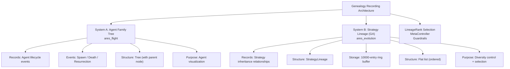
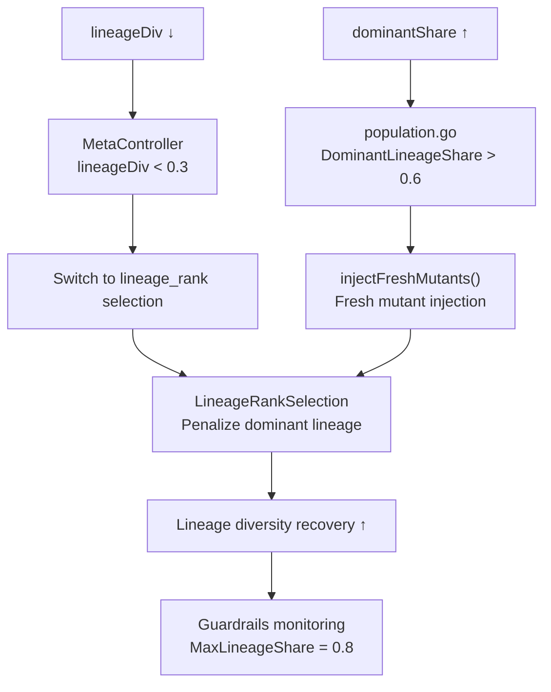

+++
title = "Genealogy — Recording and Tracing the Evolutionary Family Tree"
date = 2026-06-28
description = "Two parallel genealogy systems: the Agent Family Tree and Strategy Lineage, with diversity measurement."
weight = 28
[taxonomies]
tags = ["Go", "Agent", "Genetic Algorithm", "Genealogy"]
series = ["ARES"]
[extra]
series = "ARES"
+++

# Genealogy Recording and Family Tree — Tracing from Parents to Evolutionary Origins

> This article provides an in-depth analysis of the two parallel genealogy recording systems in the ARES evolution system: the Agent Family Tree (event-driven) and the Strategy Lineage (GA-driven), covering PopulationGenealogyRecorder, LineageRankSelection, lineage diversity measurement, MetaController dynamic switching, and crossover ancestor tracking. All code is sourced from the actual codebase.

## 1. Two Genealogy Systems

ARES's evolution system maintains **two parallel genealogy records** serving different purposes:



## 2. StrategyLineage: Core Data Structure

### 2.1 Evolution Package Definition

```go
// File: internal/ares_evolution/interfaces.go:191-224
type StrategyLineage struct {
    ParentID         string  `json:"parent_id"`          // Parent strategy ID
    ChildID          string  `json:"child_id"`           // Child strategy ID
    MutationType     string  `json:"mutation_type"`      // Mutation type
    WinRate          float64 `json:"win_rate"`           // Win rate
    ScoreImprovement float64 `json:"score_improvement"`  // Score improvement
    ParentScore      float64 `json:"parent_score"`       // Parent score
    ChildScore       float64 `json:"child_score"`        // Child score
    ImprovementSignificant bool  `json:"improvement_significant"` // Significant improvement flag
    Timestamp        int64   `json:"timestamp"`          // Timestamp
}
```

### 2.2 GenealogyRecorder Interface

```go
// File: internal/ares_evolution/interfaces.go:226-228
type GenealogyRecorder interface {
    Record(ctx context.Context, lineage StrategyLineage) error
}
```

A minimalist interface design — only one `Record()` method. Any type implementing this interface can serve as a genealogy recorder, facilitating test mocking and future replacement.

## 3. PopulationGenealogyRecorder: Core Implementation

### 3.1 Data Structure

```go
// File: internal/ares_evolution/genome_wiring.go:846-960
type PopulationGenealogyRecorder struct {
    mu          sync.RWMutex
    lineages    []StrategyLineage
    maxLineages int // default 10000
    scoreHistory map[string]*ScoreRollingWindow // agentID → rolling window
}
```

**maxLineages=10000**: This is a ring-buffer-style truncation strategy. When the lineage record exceeds 10000 entries, the oldest records are discarded. This guarantees bounded memory usage while retaining sufficient historical data for diversity analysis.

### 3.2 Record() Method

```go
func (r *PopulationGenealogyRecorder) Record(ctx context.Context, lineage StrategyLineage) error {
    r.mu.Lock()
    defer r.mu.Unlock()

    r.lineages = append(r.lineages, lineage)

    // When exceeding the limit, discard the oldest records
    if len(r.lineages) > r.maxLineages {
        excess := len(r.lineages) - r.maxLineages
        r.lineages = r.lineages[excess:]
    }

    return nil
}
```

### 3.3 ScoreRollingWindow: 3-Generation Moving Average

```go
// File: internal/ares_evolution/genome_wiring.go:805-840
type ScoreRollingWindow struct {
    scores  []float64
    maxSize int // default 3
}

func (w *ScoreRollingWindow) Add(score float64) {
    if len(w.scores) >= w.maxSize {
        w.scores = w.scores[1:] // Remove the oldest
    }
    w.scores = append(w.scores, score)
}

func (w *ScoreRollingWindow) Mean() float64 {
    if len(w.scores) == 0 {
        return 0
    }
    var sum float64
    for _, s := range w.scores {
        sum += s
    }
    return sum / float64(len(w.scores))
}
```

**Why use a rolling average instead of a single-point score?** During evolution, a strategy's score may fluctuate due to varying opponents. A 3-generation moving average smooths out noise, providing a more stable baseline for calculating improvement.

## 4. RecordPopulationLineage: The Core Bridge for GA Lineage Recording

This is the core function connecting `genome.Population` with `GenealogyRecorder`, executed generation by generation.

```go
// File: internal/ares_evolution/genome_wiring.go:968-1071
func RecordPopulationLineage(
    ctx context.Context,
    pop *genome.Population,
    recorder GenealogyRecorder,
    parentSnapshot []*mutation.Strategy,
    generation int,
) (int, error) {
```

### 4.1 Execution Flow

```
1. Nil guard → pop == nil || recorder == nil → return immediately
2. pop.Snapshot() → Get a thread-safe copy of all agents in the current generation
3. Build parentScores lookup table (map[string]float64)
4. Iterate over agents in the current generation:
   a. Skip if ParentID == "" or Version <= 1
   b. Deduplication: record the same (parentID, childID) pair only once
   c. Look up parent score
   d. If ParentID contains "\u00d7" (crossover) → average the two parent scores
   e. Prefer rolling average as the baseline
   f. Compute scoreDelta = child.Score - baselineScore
   g. Record the lineage
```

### 4.2 Crossover Ancestor Handling

```go
// Crossover handling: when ParentID contains the "\u00d7" separator
// it indicates the strategy was produced by crossover with two parents
if parts := strings.Split(agent.ParentID, "\u00d7"); len(parts) == 2 {
    if ps1, ok1 := parentScores[parts[0]]; ok1 {
        if ps2, ok2 := parentScores[parts[1]]; ok2 {
            parentScore = (ps1 + ps2) / 2  // Average the two parent scores
            ok = true
        }
    }
}
```

### 4.3 Rolling Average Baseline

```go
// Prefer rolling average over single-point parent score
// Single-point scores may be noisy; a 3-generation average is more stable
baselineScore := parentScore
if useRolling {
    if rolling := historyRecorder.RollingMeanScore(agent.ParentID); rolling > 0 {
        baselineScore = rolling
    }
}
```

### 4.4 Improvement Calculation

```go
scoreDelta := child.Score - baselineScore
improvementSignificant := scoreDelta > 0

lineage := StrategyLineage{
    ParentID:         agent.ParentID,
    ChildID:          agent.ID,
    MutationType:     string(agent.StrategyMutationType),
    ScoreImprovement: scoreDelta,
    ParentScore:      baselineScore,
    ChildScore:       child.Score,
    ImprovementSignificant: improvementSignificant,
    Timestamp:        time.Now().UnixMilli(),
}
```

## 5. Lineage Diversity Measurement

Lineage diversity is a critical indicator of the health of an evolutionary system. ARES measures lineage diversity at multiple levels.

### 5.1 measureLineageDiversityLocked()

```go
// File: internal/ares_evolution/genome/adaptive.go:321-355
func (p *Population) measureLineageDiversityLocked() (float64, float64) {
    n := len(p.Agents)
    if n < 2 {
        return 1.0, 1.0
    }

    parentCount := make(map[string]int, n)
    for _, a := range p.Agents {
        pid := a.ParentID
        if pid == "" {
            pid = "(root)"  // Normalize empty parent
        }
        parentCount[pid]++
    }

    maxCount := 0
    for _, c := range parentCount {
        if c > maxCount {
            maxCount = c
        }
    }

    // lineageDiv: number of unique parents / total agents (normalized to [0, 1])
    // 1.0 = every agent has a different parent
    // 0.0 = all agents share the same parent
    lineageDiv := float64(len(parentCount)) / float64(n)

    // dominantShare: proportion of the most common parent
    // 0.2 = most common parent accounts for 20%
    // 1.0 = all agents come from the same parent
    dominantShare := float64(maxCount) / float64(n)

    return lineageDiv, dominantShare
}
```

**Return Value Interpretation**:
- `lineageDiv = 0.5`: 50% of agents have unique parents, the remaining 50% share parents
- `dominantShare = 0.6`: 60% of agents come from the same parent

### 5.2 DiversityReport Structure

```go
// File: internal/ares_evolution/service/types.go:461-480
type DiversityReport struct {
    Numeric              float64 `json:"numeric"`                // Numeric diversity
    Categorical          float64 `json:"categorical"`            // Categorical diversity
    Lineage              float64 `json:"lineage"`                // Lineage diversity (1.0 = all different parents)
    DominantLineageShare float64 `json:"dominant_lineage_share"` // Most common parent proportion
}
```

## 6. LineageRankSelection: Lineage-Aware Selection Operator

When lineage diversity decreases, the system needs a way to proactively select strategies from different lineages. LineageRankSelection was designed for this purpose.

### 6.1 Configuration

```go
// File: internal/ares_evolution/genome/selection.go:434-460
type LineageRankSelection struct {
    rng              *rand.Rand
    penaltyThreshold float64 // default 0.4 — penalize when share exceeds this ratio
    penaltyStrength  float64 // default 0.5 — penalty strength
}
```

### 6.2 Core Algorithm: computeLineageRankWeights

```go
// File: internal/ares_evolution/genome/selection.go:609-658
func (s *LineageRankSelection) computeLineageRankWeights(sorted []*mutation.Strategy) []float64 {
    // Step 1: Count lineage distribution
    lineageCount := make(map[string]int)
    for _, agent := range sorted {
        pid := agent.ParentID
        if pid == "" {
            pid = "(root)"
        }
        lineageCount[pid]++
    }
    total := float64(len(sorted))

    // Step 2: Compute weights for each strategy
    // baseWeight = rank (descending: best = N, worst = 1)
    weights := make([]float64, len(sorted))
    for i, agent := range sorted {
        pid := agent.ParentID
        if pid == "" {
            pid = "(root)"
        }
        share := float64(lineageCount[pid]) / total
        rankWeight := float64(len(sorted) - i) // best = N, worst = 1

        // Step 3: Apply penalty to over-represented lineages
        if share > s.penaltyThreshold {
            // excess = (share - 0.4) / 0.6, normalized to [0, 1]
            excess := (share - s.penaltyThreshold) / (1.0 - s.penaltyThreshold)
            // penalty = 0.5 * excess, max 0.5
            penalty := s.penaltyStrength * excess
            rankWeight *= (1.0 - penalty)
        }

        weights[i] = rankWeight
    }

    return weights
}
```

**Algorithm Effect Examples**:

| Scenario | Lineage Distribution | penaltyThreshold | Weight Change | Effect |
|---------|---------------------|-----------------|--------------|--------|
| Uniform distribution | 5 lineages at 20% each | 0.4 | No penalty | Normal selection |
| Concentrated distribution | 1 lineage at 60%, rest 40% | 0.4 | 60% lineage weight × (1 - 0.5×0.33) = ×0.83 | Slight penalty on dominant lineage |
| Extreme concentration | 1 lineage at 90% | 0.4 | 90% lineage weight × (1 - 0.5×0.83) = ×0.58 | Significant penalty on dominant lineage |

### 6.3 Select() Flow

```go
func (s *LineageRankSelection) Select(pop *Population) ([]*mutation.Strategy, error) {
    // 1. Sort by score descending
    sorted := pop.SortByScore()

    // 2. Compute lineage rank weights
    weights := s.computeLineageRankWeights(sorted)

    // 3. Weighted roulette selection
    selected := make([]*mutation.Strategy, pop.Params.SurvivorCount)
    totalWeight := 0.0
    for _, w := range weights {
        totalWeight += w
    }

    for i := 0; i < len(selected); i++ {
        r := s.rng.Float64() * totalWeight
        cumulative := 0.0
        for j, w := range weights {
            cumulative += w
            if r <= cumulative {
                selected[i] = sorted[j].Clone()
                break
            }
        }
    }

    return selected, nil
}
```

## 7. MetaController: Dynamic Strategy Switching

The MetaController is the "meta-decision layer" of the evolution system. It dynamically selects the selection operator based on lineage diversity metrics.

### 7.1 Switching Logic

```go
// File: internal/ares_evolution/genome/meta_evolution.go:215-226
func (mc *MetaController) selectBestStrategy(div, lineageDiv float64) string {
    // Condition: both lineage diversity and overall diversity are below 0.3
    // This indicates the population has become severely homogenized
    if lineageDiv < 0.3 && div < 0.3 {
        return "lineage_rank"  // Switch to lineage-aware selection
    }
    // ... other strategy selection logic
}
```

**Intent behind the dual condition lineageDiv < 0.3 && div < 0.3**:
- `lineageDiv < 0.3`: Fewer than 30% of agents have unique parents, indicating lineage concentration
- `div < 0.3`: Overall diversity (numeric/categorical) is also low
- When both conditions are met, it is almost certain that the population has fallen into a homogenization trap

### 7.2 Selector Factory

```go
// File: internal/ares_evolution/genome/population.go:545-560
case "lineage_rank":
    return NewLineageRankSelection(
        WithLineageRankSeed(seed),
        WithLineagePenaltyThreshold(0.4),
        WithLineagePenaltyStrength(0.5),
    )
```

## 8. Diversity Recovery Mechanism

When lineage diversity drops too low, the system proactively injects fresh mutants.

### 8.1 DominantLineageShare > 0.6 Triggers Injection

```go
// File: internal/ares_evolution/genome/population.go:405
if report.Overall < p.cfg.DiversityThreshold || report.DominantLineageShare > 0.6 {
    p.injectFreshMutantsLocked(len(elites))
}
```

When the most common parent's share exceeds 60%, it means more than half of the strategies originate from the same ancestor. The system injects randomly generated mutants to increase diversity.

### 8.2 Per-Lineage Elite Preservation

```go
// File: internal/ares_evolution/genome/population_guard.go:138-217
func (p *Population) preservePerLineageElites(survivors []*mutation.Strategy) []*mutation.Strategy {
    // Find the best strategy for each lineage
    lineageBest := make(map[string]int)
    for i, s := range survivors {
        pid := s.ParentID
        if pid == "" {
            pid = "(root)"
        }
        existingIdx, ok := lineageBest[pid]
        if !ok || s.Score > survivors[existingIdx].Score {
            lineageBest[pid] = i
        }
    }

    // First preserve the top 1 from each lineage
    for _, idx := range lineageBest {
        elites = append(elites, survivors[idx].Clone())
    }

    // Fill remaining slots from the global top
    // ...
}
```

**Configuration**:
```go
// File: internal/ares_evolution/genome/population_config.go:111-150
PerLineageElites     bool `json:"per_lineage_elites"`      // default true
PerLineageEliteCount int  `json:"per_lineage_elite_count"` // default 1
```

### 8.3 Guardrails Lineage Concentration Warning

```go
// File: internal/ares_evolution/guardrails.go:355-396
if maxShare > g.MaxLineageShare { // default 0.8
    event := GuardrailEvent{
        Level:           GuardrailWarning,
        Rule:            "lineage_concentration",
        ErrorCode:       ErrCodeLineageConcentration,
        Message:         fmt.Sprintf("lineage concentration %.2f exceeds threshold %.2f", maxShare, g.MaxLineageShare),
        SuggestedAction: "increase selection pressure or introduce external diversity",
    }
}
```

## 9. Crossover Lineage Tracking

Crossover produces offspring with two parents, which presents a challenge for lineage tracking.

### 9.1 ParentID Encoding

```go
// File: internal/ares_evolution/genome/crossover.go:523-525
func formatParentIDs(idA, idB string) string {
    return idA + "\u00d7" + idB // Unicode multiplication sign ×
}
```

For crossover-produced offspring, the `ParentID` field is formatted as `"parentA_ID×parentB_ID"`, using the Unicode multiplication sign `\u00d7` as a separator.

### 9.2 Child ID Generation

```go
// File: internal/ares_evolution/genome/crossover.go:250-260
child := &mutation.Strategy{
    ID:       c.generateChildID(a.ID, b.ID),
    ParentID: formatParentIDs(a.ID, b.ID),
    Version:  maxVersion(a.Version, b.Version) + 1,
    StrategyMutationType: mutation.MutationCrossover,
}
```

### 9.3 Crossover Score Handling in Lineage Recording

In `RecordPopulationLineage`, the parent score for a crossover offspring is the average of the two parents' scores:

```go
if parts := strings.Split(agent.ParentID, "\u00d7"); len(parts) == 2 {
    if ps1, ok1 := parentScores[parts[0]]; ok1 {
        if ps2, ok2 := parentScores[parts[1]]; ok2 {
            parentScore = (ps1 + ps2) / 2
        }
    }
}
```

## 10. Lineage Recording Across the System Lifecycle

### 10.1 RunIdleEvolution Integration

```go
// File: internal/ares_evolution/genome_wiring_system.go:681-710
// Capture parent snapshot before evolution (for subsequent score lookup)
var parentSnapshot []*mutation.Strategy
if system.Genealogy != nil {
    parentSnapshot, _ = system.Population.Snapshot()
}

// Evolve
if err := system.PopAdapter.Run(ctx); err != nil {
    // ...
}

// Genealogy recording
if system.Genealogy != nil {
    _, err := RecordPopulationLineage(
        ctx, system.Population, system.Genealogy,
        parentSnapshot, gen,
    )
    // ...
}
```

### 10.2 Lineage Recording in DreamCycle

**ES Path**:
```go
// File: internal/ares_evolution/dream_cycle.go:461-475
lineage := StrategyLineage{
    ParentID:         parent.ID,
    ChildID:          winner.strategy.ID,
    MutationType:     "dream_cycle",
    WinRate:          winner.winRate,
    ScoreImprovement: winner.scoreImprovement,
    ParentScore:      parent.Score,
    ChildScore:       winner.scoreImprovement + parent.Score,
    Timestamp:        time.Now().Unix(),
}
```

**GA Path** (note: ParentID is not recorded — because the GA population overwrites the previous generation):
```go
// File: internal/ares_evolution/dream_cycle_ga.go:96-106
lineage := StrategyLineage{
    ChildID:          best.ID,
    MutationType:     "ga_evolution",
    WinRate:          best.Score,
    ScoreImprovement: winner.scoreImprovement,
    ChildScore:       best.Score,
    Timestamp:        time.Now().Unix(),
}
```

## 11. Lineage Diversity Control Panorama



## 12. Summary

The genealogy recording system is the core infrastructure for **diversity control** in the ARES evolution framework:

1. **Two Parallel Systems**: The Agent Family Tree (event-driven, tree structure) and Strategy Lineage (GA-driven, flat list) serve different visualization and analysis needs
2. **PopulationGenealogyRecorder**: A ring buffer with a 10000-entry cap, combined with ScoreRollingWindow (size=3) to provide a noise-robust improvement baseline
3. **LineageRankSelection**: Begins penalizing over-represented lineages at penaltyThreshold=0.4, with penaltyStrength=0.5 controlling the penalty magnitude
4. **MetaController**: Automatically switches to lineage-aware selection when lineageDiv < 0.3 && div < 0.3
5. **Diversity Recovery**: DominantLineageShare > 0.6 triggers fresh mutant injection, with 1 elite preserved per lineage
6. **Crossover Ancestors**: Uses the `\u00d7` separator to encode dual parents, with the lineage record averaging the two parent scores as the baseline

This system ensures that the evolutionary algorithm does not converge prematurely to local optima — by tracking "who is the descendant of whom" and proactively penalizing homogenized lineages, it maintains the genetic diversity of the population.