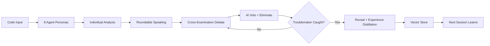

+++
title = "CodeTribunal Deep-Dive Series: When LLM Agents Hold a Code Review Trial"
date = 2026-05-28
description = "This series walks through CodeTribunal, a Go project where multiple LLM agents debate and critique code in a roundtable format — with one secret saboteur among them. It covers persona engineering, game mechanics, debate protocols, and the vector-based experience system that makes each session smarter than the last."
weight = 35
[taxonomies]
tags = ["Go", "LLM", "Multi-Agent", "Code Review"]
series = ["CodeTribunal"]
[extra]
series = "CodeTribunal"
+++

# CodeTribunal Deep-Dive Series: When LLM Agents Hold a Code Review Trial

This series walks through CodeTribunal, a Go project where multiple LLM agents debate and critique code in a roundtable format — with one secret saboteur among them. It covers persona engineering, game mechanics, debate protocols, and the vector-based experience system that makes each session smarter than the last.

CodeTribunal asks one question: **if you put 8 LLM agents with different reviewing philosophies in a room and told one of them to secretly sabotage the review, could the others catch them?**

In one sentence: CodeTribunal is a Go application that orchestrates multi-LLM code review sessions where specialized agent personas analyze code, debate findings, vote to eliminate suspects, and learn from past sessions — turning code review from a chore into a game with real engineering value.



## Articles

| # | Article | Core Question |
|---|---------|---------------|
| 01 | [Why Code Review Needs Drama](@/log/CodeTribunal/01-why-code-review-needs-drama.md) | Why do developers ignore code review tools, and can gamification fix that? |
| 02 | [Architecture Overview](@/log/CodeTribunal/02-architecture-overview.md) | How do you wire 8 LLM agents, a debate engine, and a game loop into one Go binary? |
| 03 | [The Persona System](@/log/CodeTribunal/03-persona-system.md) | How do you make 8 LLM instances behave like 8 different reviewers using only prompts? |
| 04 | [The Troublemaker Mechanic](@/log/CodeTribunal/04-troublemaker-mechanic.md) | How do you make one agent subtly sabotage a review without breaking the game? |
| 05 | [Debate, Cross-Examination, and Voting](@/log/CodeTribunal/05-debate-and-voting.md) | How does the roundtable actually work — accusations, evidence, and elimination? |
| 06 | [The Experience System: Learning from Past Sessions](@/log/CodeTribunal/06-experience-and-vector.md) | How does CodeTribunal get smarter over time without fine-tuning? |
| 07 | [Random Events and Game Dynamics](@/log/CodeTribunal/07-random-events-and-fun.md) | Why does a code review tool have cosmic rays and ghost reviewers? |
| 08 | [WebSocket Layer and Real-Time UI](@/log/CodeTribunal/08-websocket-and-ui.md) | How does the game stream to a browser in real time? |

## Reading Order

The articles are ordered by dependency. Each one builds on concepts introduced in the previous:

```
01 Motivation (why gamify code review?)
 └─► 02 Architecture (how the system is wired)
      └─► 03 Personas (the 8 reviewer types)
           └─► 04 Troublemaker (the core game mechanic)
                └─► 05 Debate (how the roundtable works)
                     ├─► 06 Experience (how it learns)
                     └─► 07 Events (randomness and fun)
                          └─► 08 WebSocket (real-time delivery)
```

## Source Reading Map

- Entry: `cmd/roundtable/main.go`
- Core types: `internal/roundtable/types.go`
- Personas: `internal/roundtable/persona.go`
- Session logic: `internal/roundtable/session.go`
- LLM layer: `internal/roundtable/llm.go`
- Experience: `internal/roundtable/experience.go`, `internal/store/vector.go`
- Events: `internal/roundtable/events.go`
- WebSocket: `internal/chat/handler.go`, `internal/chat/hub.go`
- Storage: `internal/store/sqlite.go`, `internal/store/vector.go`

## How to Read

Each article follows one implementation path: how input becomes a game session, how personas are engineered through prompts, how the troublemaker stays hidden, how debate cycles converge on a verdict, and how experience accumulates across sessions.

This series is written as technical explainer content. It starts from implementation constraints, data flow, and module boundaries instead of abstract definitions. Each article follows the same pattern:

1. State the engineering problem first.
2. Show the source entry points, not just the abstraction.
3. Break down the data structures that hold session state.
4. Explain why the design exists and where it breaks down.
