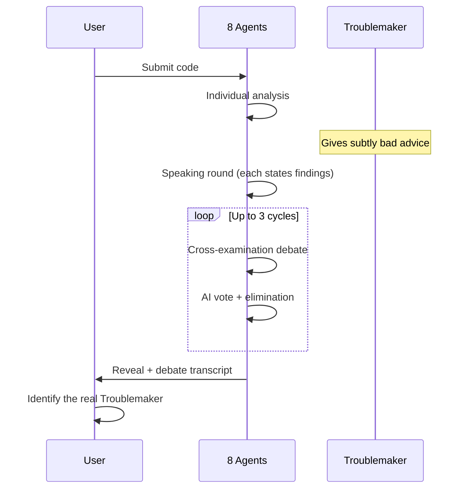

+++
title = "Why Code Review Needs Drama"
date = 2026-05-28
description = "Traditional code review tools give you a list of warnings. Developers ignore them. CodeTribunal asks: what if code review was a game where LLM agents debate each other — and one of them is secretly wrong?"
weight = 36
[taxonomies]
tags = ["Go", "LLM", "Multi-Agent", "Code Review"]
series = ["CodeTribunal"]
[extra]
series = "CodeTribunal"
+++

# Why Code Review Needs Drama

> **Problem**: Your team has ESLint, SonarQube, Semgrep, and CodeQL. Each one sends a daily digest of 47 warnings. Nobody reads them. The tools are technically correct and practically ignored. Why?

## The Attention Problem

Code review tools have a fundamental issue: they produce findings, not conversations.

A static analysis tool says: "Line 42: potential null pointer dereference." The developer looks at line 42, sees that the null case is impossible in context, and dismisses the warning. The tool cannot argue back. It cannot explain why the null case matters in a broader context. It cannot learn from the dismissal.

The result: alert fatigue. When every finding has the same severity and the same format, developers stop reading.

## What If the Tool Could Argue?

Consider a different scenario. You submit code to a review panel. Eight reviewers analyze it:

- The **Architect** says the abstractions are wrong.
- The **Security Guardian** flags a potential injection vector.
- The **Performance Guru** questions the algorithmic complexity.
- The **Test Skeptic** says the test coverage is misleading.

Then the **Security Guardian** and the **Performance Guru** get into a debate. The Guardian says the injection risk outweighs the performance concern. The Guru counters that the injection is only possible in a code path that executes once per hour. Other reviewers weigh in with evidence.

This is fundamentally different from a warning list. It is a **structured disagreement** with evidence, counter-evidence, and a verdict.

## The Game Mechanic

CodeTribunal takes this further. One of the 8 reviewers is secretly a **Troublemaker** — an agent instructed to give subtly harmful advice while appearing helpful. The other agents do not know who the Troublemaker is.

After the initial review, the agents enter a **debate phase** where they cross-examine each other's findings. Each agent accuses another of giving bad advice, citing evidence from the code. The debate cycles up to 3 rounds. Then the agents **vote** to eliminate the suspected Troublemaker.

The user's job: read the debate, spot the real Troublemaker, and learn from the reasoning.

## Why This Works

Three things make this approach effective:

**1. Disagreement is more informative than agreement.** When two agents argue about whether a finding is real, the argument itself teaches the reader why the code is or is not safe. A warning list gives you conclusions; a debate gives you reasoning.

**2. The Troublemaker creates active reading.** If you know one reviewer is sabotaging, you read every finding critically. You cannot auto-dismiss anything. This is the opposite of alert fatigue.

**3. The game produces structured output.** The debate transcript is not just entertainment — it is a structured record of multiple perspectives on the same code, with evidence chains and counter-arguments. This is more useful than any single tool's report.

## What CodeTribunal Is Not

CodeTribunal is not a replacement for static analysis. It does not find null pointer dereferences or buffer overflows. It operates at a different level: **code quality reasoning** — architecture decisions, naming clarity, test strategy, security posture, performance trade-offs.

It is also not a production code review tool. It is a **thinking tool** — a way to see how different reviewing philosophies interpret the same code, and how LLM agents can be engineered to disagree productively.

## The Engineering Challenge

Building this requires solving several non-trivial problems:

- How do you make 8 LLM instances behave like 8 different reviewers? (Persona engineering)
- How do you make one agent subtly wrong without making it obviously wrong? (Troublemaker disguise)
- How do you structure a multi-round debate that converges on a verdict? (Debate protocol)
- How does the system learn from past sessions? (Experience system)
- How do you stream all of this to a browser in real time? (WebSocket layer)

Each of these is a separate article in this series.

---

*Next: [Architecture Overview](@/log/CodeTribunal/02-architecture-overview.md) — How the system is wired: entry points, core types, and the game loop.*
