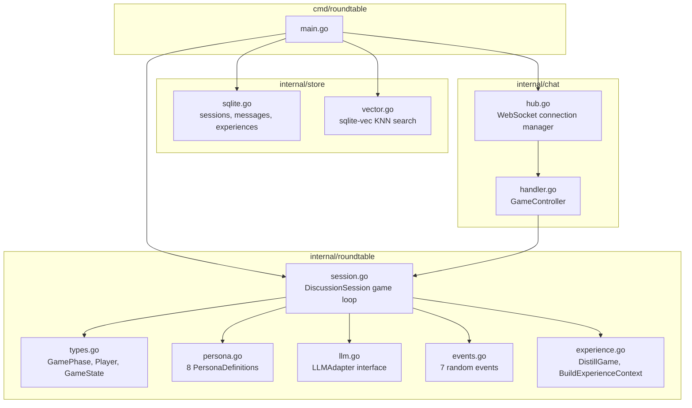
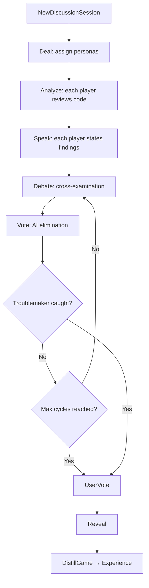

+++
title = "Architecture Overview: Wiring 8 LLM Agents Into a Game Loop"
date = 2026-05-28
description = "CodeTribunal is a single Go binary that runs as either a CLI or a WebSocket server. This article traces the data path from code input to debate transcript, and explains why the module boundaries are drawn where they are."
weight = 37
[taxonomies]
tags = ["Go", "LLM", "Multi-Agent", "Code Review"]
series = ["CodeTribunal"]
[extra]
series = "CodeTribunal"
+++

# Architecture Overview: Wiring 8 LLM Agents Into a Game Loop

This article traces the data path from code input to debate transcript, and explains why the module boundaries are drawn where they are.

## Start with the problem: a game loop is not a pipeline

A typical code review tool runs a pipeline: parse → analyze → report. Each step feeds the next. There is no back-and-forth.

CodeTribunal's game loop is different. It has phases that repeat: Analyze → Speak → Debate → Vote. The debate phase can loop up to 3 times. The Troublemaker's behavior changes depending on the phase. Results stream to clients in real time.

If you mix the game logic, LLM calls, and WebSocket transport into one package, every change breaks everything. CodeTribunal separates them into `roundtable` (game logic), `llm` (model calls), `store` (persistence), and `chat` (transport).

## The four packages



## Entry point: dual-mode binary

`cmd/roundtable/main.go` has two modes:

- **CLI mode** (default): interactive REPL. You paste code, the game runs in the terminal.
- **Server mode** (`-serve` flag): HTTP server on `:8765`. WebSocket at `/ws`, web UI at `/`.

The wiring is straightforward: create storage adapters, create a `Moderator`, and either start the REPL loop or the HTTP server.

```go
// cmd/roundtable/main.go (simplified)
if *serve {
    store := store.NewSQLiteStore(dbPath)
    vecStore := store.NewVectorStore(vecPath)
    mod := roundtable.NewModerator(store, vecStore)
    hub := chat.NewHub(mod)
    http.Handle("/", webUI)
    http.Handle("/ws", hub)
    log.Fatal(http.ListenAndServe(":8765", nil))
} else {
    runCLI(store, mod)
}
```

The adapter pattern bridges `store.SQLiteStore` and `store.VectorStore` into `roundtable.MessageStore` and `roundtable.VectorSearcher` interfaces. The roundtable package never imports the store package directly.

## Core types: the game state machine

`internal/roundtable/types.go` defines the state machine:

```go
type GamePhase int

const (
    PhaseDeal      GamePhase = iota // Assign personas
    PhaseAnalyze                     // Individual code analysis
    PhaseSpeak                       // Each player states findings
    PhaseDebate                      // Cross-examination
    PhaseVote                        // AI vote to eliminate
    PhaseUserVote                    // User guesses the Troublemaker
    PhaseReveal                      // Show who it was
    PhaseDone
)
```

A `Player` holds persona configuration, provider/model settings, elimination state, and the LLM-generated `Statement`. A `GameState` tracks the current phase, all players, the code under review, event history, and AI vote history.

The key design decision: `GameState` is a value object, not a stateful service. The `DiscussionSession` mutates it through phases. This makes the game loop inspectable — you can snapshot the state at any phase for debugging or replay.

## The game loop lives in DiscussionSession

`DiscussionSession` in `internal/roundtable/session.go` orchestrates everything:



The loop is synchronous within a session. Each phase completes before the next starts. The async part is the LLM calls — `NextSpeaker` calls the LLM for each player in sequence, not in parallel. This is deliberate: the debate needs ordered output, and parallel LLM calls would produce non-deterministic results.

## LLM layer: three providers, one interface

`internal/roundtable/llm.go` defines:

```go
type LLMAdapter interface {
    Generate(ctx context.Context, system, user string) (string, error)
}
```

Three implementations: `openaiAdapter` (also serves DeepSeek, Groq, any OpenAI-compatible API), `anthropicAdapter`, and `ollamaAdapter`. All are raw HTTP clients — no SDK dependency.

`GenerateStructured` adds JSON mode for OpenAI-compatible providers. This is used for structured output like vote results and persona validation.

The design choice: raw HTTP clients instead of SDKs. Reason: SDKs change frequently, add dependencies, and hide retry behavior. A 50-line HTTP client is stable and debuggable.

## Storage: two databases for two access patterns

`internal/store/sqlite.go` uses `modernc.org/sqlite` (pure-Go, no CGo) for three tables:

- `sessions`: game session metadata
- `messages`: all LLM-generated statements and debate transcripts
- `experiences`: distilled game summaries

`internal/store/vector.go` uses `mattn/go-sqlite3` (CGo) + `sqlite-vec` extension for KNN similarity search on 128-dimensional float32 embeddings. This lives in a separate `.vec` database file.

Why two SQLite libraries? `modernc.org/sqlite` is pure-Go and cross-platform. `sqlite-vec` requires CGo for the vector extension. The trade-off: slightly more complex build, but vector search runs in-process with no external dependencies.

## Summary

CodeTribunal's architecture separates concerns into four packages: `roundtable` owns game logic, `llm` owns model calls, `store` owns persistence, `chat` owns transport. The game loop in `DiscussionSession` is a synchronous state machine with async LLM calls. Storage splits into two databases matching two access patterns: transactional (sessions/messages) and similarity (vectors).

The boundaries exist because each package has a different reason to change: game mechanics change when rules evolve, LLM adapters change when providers change, storage changes when schema evolves, transport changes when the UI changes.

---

*Next: [The Persona System](@/log/CodeTribunal/03-persona-system.md) — How do you make 8 LLM instances behave like 8 different reviewers using only prompts?*
