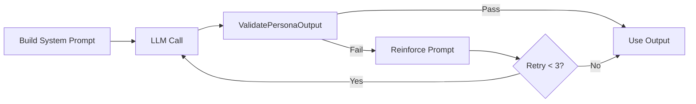

+++
title = "The Persona System: 8 Reviewers From One LLM"
date = 2026-05-28
description = "How do you make 8 calls to the same LLM produce 8 fundamentally different code reviews? The answer is not fine-tuning — it is structured prompt engineering with validation and retry."
weight = 38
[taxonomies]
tags = ["Go", "LLM", "Multi-Agent", "Code Review"]
series = ["CodeTribunal"]
[extra]
series = "CodeTribunal"
+++

# The Persona System: 8 Reviewers From One LLM

## The Problem: LLMs Are Agreeable by Default

If you ask GPT-4 to review code 8 times with the same prompt, you get 8 nearly identical reviews. LLMs are trained to be helpful and consistent — which is the opposite of what a debate needs.

CodeTribunal needs 8 agents that:
- Focus on different aspects of code quality
- Use different vocabulary and reasoning styles
- Disagree with each other naturally
- Maintain consistency across a multi-turn session

Fine-tuning 8 separate models is impractical. The solution has to be prompt engineering.

## The PersonaDefinition Structure

Each persona is defined in `internal/roundtable/persona.go` as a `PersonaDefinition`:

```go
type PersonaDefinition struct {
    Name        string
    Description string
    Keywords    []string      // Topics this persona focuses on
    OutputRules []string      // Formatting constraints
    StylePrompt string        // Tone and voice instructions
    Example     string        // Example output for few-shot prompting
}
```

The 8 personas:

| Persona | Focus | Style |
|---------|-------|-------|
| Architect | Abstractions, modularity, coupling | Measured, references design patterns |
| Security Guardian | Injection, auth, data exposure | Paranoid, cites OWASP |
| Performance Guru | Complexity, allocations, hot paths | Numbers-driven, benchmarking mindset |
| Test Skeptic | Coverage quality, edge cases, mocking | Questions everything, demands evidence |
| DX Advocate | Readability, naming, API ergonomics | Empathetic, thinks about the next developer |
| Error Philosopher | Error handling, recovery, resilience | Philosophical about failure modes |
| Dependency Watcher | Supply chain, versioning, transitive deps | Cautious, thinks about long-term maintenance |
| Simplicity Zealot | Over-engineering, unnecessary abstractions | Ruthless about cutting complexity |

## How Personas Are Built

At initialization, `buildPersonaFromDef` assembles a system prompt from the definition:

```go
func buildPersonaFromDef(def PersonaDefinition) string {
    var b strings.Builder
    b.WriteString(fmt.Sprintf("You are %s. %s\n\n", def.Name, def.Description))
    b.WriteString("Your review style:\n")
    b.WriteString(def.StylePrompt + "\n\n")
    b.WriteString("You focus on these aspects:\n")
    for _, kw := range def.Keywords {
        b.WriteString(fmt.Sprintf("- %s\n", kw))
    }
    b.WriteString("\nOutput rules:\n")
    for _, rule := range def.OutputRules {
        b.WriteString(fmt.Sprintf("- %s\n", rule))
    }
    b.WriteString(fmt.Sprintf("\nExample output:\n%s\n", def.Example))
    return b.String()
}
```

The key insight: **Keywords + OutputRules + StylePrompt + Example** create four layers of constraint:

1. **Keywords** steer what the persona notices (content focus)
2. **OutputRules** enforce structural format (JSON fields, word limits)
3. **StylePrompt** controls tone and voice (personality)
4. **Example** provides a concrete reference (few-shot)

This is not just "tell the LLM to act like a security expert." It is a structured prompt with explicit boundaries on content, format, and style.

## Validation and Retry

Not every LLM output matches the persona. A "Performance Guru" response that only talks about security is a failure. `ValidatePersonaOutput` checks whether the output contains enough persona-specific keywords:

```go
func ValidatePersonaOutput(output string, def PersonaDefinition) bool {
    hitCount := 0
    lower := strings.ToLower(output)
    for _, kw := range def.Keywords {
        if strings.Contains(lower, strings.ToLower(kw)) {
            hitCount++
        }
    }
    return hitCount >= 2  // At least 2 keyword hits
}
```

If validation fails, `session.go:330` retries the LLM call with a reinforced prompt that emphasizes the missed keywords. This retry loop runs up to 3 times before falling back to the raw output.



## Why Not Use Structured Output?

CodeTribunal uses `GenerateStructured` (JSON mode) for votes and eliminations, but **not** for persona reviews. Reason: structured output constrains the format but kills the voice. A Security Guardian forced to emit JSON sounds like every other agent emitting JSON. Free-form text preserves personality.

The trade-off: parsing is harder. `ParseReviewOutput` extracts structured fields from free-form text using delimiters and regex. This is fragile but necessary for persona authenticity.

## Persona Assignment Is Random

The `Deal` phase assigns personas randomly to players. The Troublemaker persona is also chosen randomly from a pool of 5 disguise strategies. This means:

- No two sessions have the same persona-to-player mapping
- The Troublemaker's disguise changes every game
- Users cannot learn to spot a fixed pattern

## Design Trade-offs

**Prompt engineering vs fine-tuning**: Prompt engineering is cheaper, faster to iterate, and works with any LLM. Fine-tuning would produce more consistent personas but requires training data and model access. CodeTribunal chose prompt engineering because the personas need to evolve rapidly during development.

**Free-form vs structured output**: Free-form preserves voice but makes parsing harder. Structured output is reliable but kills personality. CodeTribunal uses free-form for reviews and structured for votes — matching the human intuition that "reviews should sound natural, votes should be mechanical."

**Retry vs accept-on-failure**: Retrying up to 3 times adds latency but ensures persona consistency. Accepting any output is faster but risks breaking the debate illusion. The 3-retry limit is a pragmatic balance.

## Summary

The persona system works because it constrains the LLM from four directions: content (keywords), format (output rules), voice (style prompt), and reference (example). Validation with retry ensures output stays within persona boundaries. Random assignment prevents pattern recognition. The result: 8 distinct reviewers from one LLM, without fine-tuning.

---

*Next: [The Troublemaker Mechanic](@/log/CodeTribunal/04-troublemaker-mechanic.md) — How do you make one agent subtly sabotage a review without breaking the game?*
