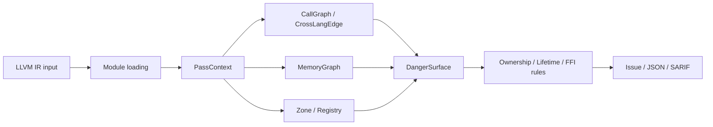

+++
title = "OmniScope Deep-Dive Series: From LLVM IR to Cross-Language Ownership Auditing"
date = 2026-05-21
description = "This series explains what OmniScope does, how data moves through the project, and which modules make which decisions. It is written for readers interested in LLVM IR, static analysis, FFI safety, and cross-language boundaries across Rust, C, Zig, Go, and C++."
weight = 15
[taxonomies]
tags = ["Rust", "LLVM", "FFI"]
series = ["OmniScope"]
[extra]
series = "OmniScope"
+++

# OmniScope Deep-Dive Series: From LLVM IR to Cross-Language Ownership Auditing

This series explains what OmniScope does, how data moves through the project, and which modules make which decisions. It is written for readers interested in LLVM IR, static analysis, FFI safety, and cross-language boundaries across Rust, C, Zig, Go, and C++.

OmniScope focuses on one concrete question: **after ownership, lifetime, and deallocation protocols cross a language boundary, can a static analyzer recover enough semantics to produce reviewable findings?**

In one sentence: OmniScope reads LLVM IR (`.ll` / `.bc`), turns calls, pointer flows, allocation/free events, language boundaries, and unsafe regions into queryable facts, then reports high-risk paths related to FFI, ownership, and lifetime through text, JSON, or SARIF.



## Articles

1. [Why OmniScope analyzes cross-language safety at the LLVM IR layer](@/log/OmniScope/01-what-is-omniscope.md)
2. [Lifecycle of an analysis run: CLI, IRLoader, Pipeline, and output](@/log/OmniScope/02-cli-to-pipeline.md)
3. [Inside the Pass system: dependency ordering, shared context, and graceful degradation](@/log/OmniScope/03-pass-system.md)
4. [Zone Classification and Semantic Registry: avoiding blacklist-style reporting](@/log/OmniScope/04-zone-and-registry.md)
5. [MemoryGraph and DangerSurface: from pointer facts to risk paths](@/log/OmniScope/05-memory-graph-danger-surface.md)
6. [Rust FFI Auditor: reconstructing and checking cross-language ownership protocols](@/log/OmniScope/06-rust-ffi-auditor.md)
7. [Reporting pipeline: Issue objects, JSON, SARIF, and engineering integration](@/log/OmniScope/07-output-and-integration.md)

## Source Reading Map

- Entry and output: `src/main.zig:73`, `src/main.zig:153`, `src/main.zig:171`, `src/main.zig:207`
- Pipeline: `src/pipeline/pipeline.zig:27`, `src/pipeline/pipeline.zig:66`, `src/pipeline/pipeline.zig:223`
- Pass system: `src/pass/manager.zig:61`, `src/pass/manager.zig:193`, `src/pass/pass.zig:192`
- Semantic layer: `src/semantics/zone_classifier.zig:24`, `src/registry/semantic_registry.zig:90`
- Risk paths: `src/pass/pass.zig:866`, `src/semantics/memory_graph.zig:892`, `src/pass/analysis/danger_surface.zig:37`
- Rust FFI: `src/pass/analysis/rust_ffi_auditor.zig:63`, `src/pass/analysis/rust_ffi_auditor.zig:180`

## How to Read

Read this as a problem chain: first identify where cross-language security auditing gets difficult, then look at why common approaches fall short, and finally see how OmniScope turns those constraints into LLVM IR input, passes, MemoryGraph, Zone, Registry, Rust FFI auditing, and structured output.

Each article follows one implementation path: how input becomes analysis context, how passes exchange facts, how Zone and Registry reduce noise, how MemoryGraph models pointer flow, and how Rust FFI ownership rules are checked.

This series is written as technical explainer content. It starts from implementation constraints, data flow, and module boundaries instead of abstract definitions. Each article follows the same pattern:

1. State the engineering problem first.
2. Show the source entry points, not just the abstraction.
3. Break down the data structures that hold analysis facts.
4. Explain why the design exists and where it breaks down.

If you want to read the code first, start here:

```text
main.zig
  └─ runSingleFileAnalysis / runModulePipeline / emitOutput
pipeline.zig
  └─ Pipeline.init / Pipeline.run
pass.zig
  └─ PassContext / addIssue / isOnDangerPathFull
manager.zig
  └─ resolveDependencies / run
semantics/memory_graph.zig
  └─ MemoryGraph / isOnDangerPath
pass/analysis/danger_surface.zig
  └─ DangerSurfacePass.run
pass/analysis/rust_ffi_auditor.zig
  └─ auditFunction / Rust-specific rules / universal FFI rules
```

The real architecture is not just “uses LLVM IR”. It is the way OmniScope turns low-level IR facts into three reusable semantic layers: `PassContext`, `MemoryGraph`, and `DangerSurface`.
