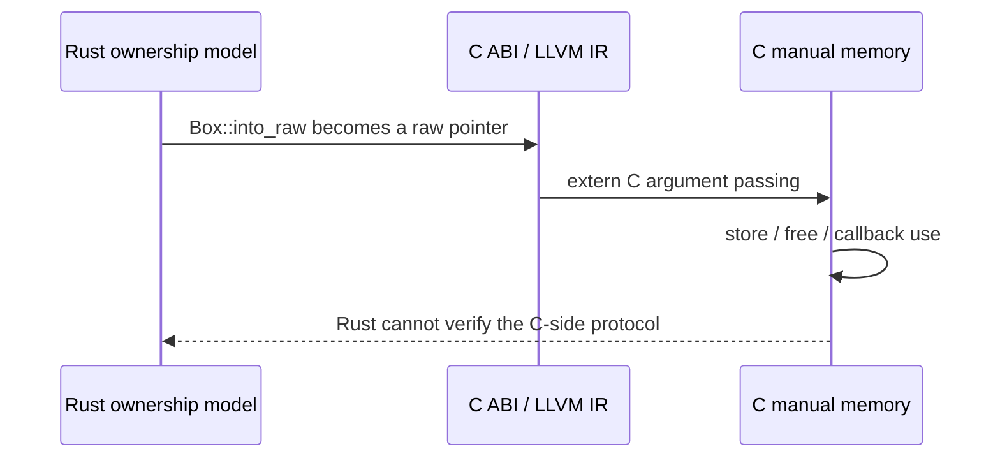
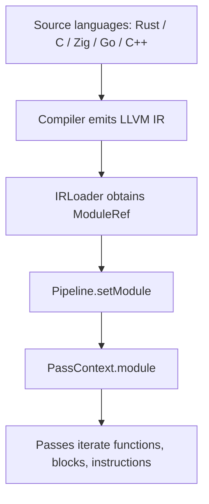
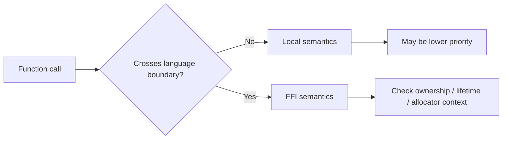
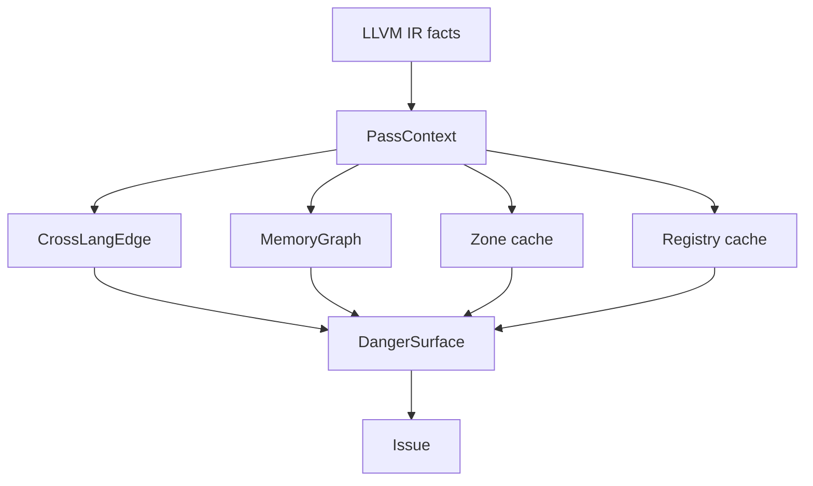

+++
title = "Why OmniScope Analyzes Cross-Language Safety at the LLVM IR Layer"
date = 2026-05-21
description = "Rust ownership, Zig allocators, Go GC, and C++ RAII are language-level safety models. Across FFI, those models are lowered into ABI-level facts: functions, pointers, integers, layouts, and calling conventions. OmniScope works at this layer because many cross-language issues are difficult to cover from a single language AST alone."
weight = 16
[taxonomies]
tags = ["Rust", "LLVM", "FFI"]
series = ["OmniScope"]
[extra]
series = "OmniScope"
+++

# Why OmniScope Analyzes Cross-Language Safety at the LLVM IR Layer

Rust ownership, Zig allocators, Go GC, and C++ RAII are language-level safety models. Across FFI, those models are lowered into ABI-level facts: functions, pointers, integers, layouts, and calling conventions. OmniScope works at this layer because many cross-language issues are difficult to cover from a single language AST alone.

## The issue is not `free`; it is the lost deallocation protocol

A common Rust/C boundary pattern is: Rust exposes a pointer through `Box::into_raw`, then C stores or releases that pointer. In Rust, `into_raw` is an explicit ownership transfer. In C, `free(ptr)` is an ordinary deallocation. The problem is that no single compiler verifies the full protocol across both sides.

At the IR layer, source syntax is gone, but external declarations, call/invoke instructions, allocas, loads/stores, bitcasts, symbol names, and some debug information may remain. The analyzer tries to recover enough ownership and lifetime semantics from these facts.

## What OmniScope actually analyzes

OmniScope’s entry point consumes LLVM IR files such as `.ll` and `.bc`, not source directories. Argument parsing starts at `src/main.zig:73`, the main entry is `src/main.zig:567`, and single-module analysis is driven by `runModulePipeline` at `src/main.zig:171`.

This also defines the limits. OmniScope can inspect facts that remain in IR and can use symbols and debug information when available. Heavy optimization, missing symbols, or wrapper-heavy code may reduce the amount of recoverable semantics.

## It is not a dangerous-function blacklist

`src/registry/semantic_registry.zig:3` describes the registry as a function-semantics knowledge base for FFI boundary analysis, not a simple blacklist. `src/registry/semantic_registry.zig:8` also notes that the same function may carry different risk depending on context.

For example:

- A local C `free` may be a normal lifetime endpoint.
- A Rust `Box` pointer released by C may indicate allocator mismatch or ownership protocol breakage.
- Rust `as_ptr` used locally may be benign, while passing it to FFI and storing it may create a dangling pointer.

## Main source-level pillars

The implementation is organized around shared analysis structures:

- `PassContext`: shared state for passes, defined at `src/pass/pass.zig:192`.
- `cross_lang_edges`: cross-language call edges.
- `MemoryGraph`: memory objects, frees, call arguments, returns, and alias relations.
- `ZoneKind`: `safe`, `unsafe`, `ffi`, `runtime_internal`, and `unknown`, defined at `src/semantics/zone_classifier.zig:24`.
- `SemanticRegistry`: layered function semantics, looked up through `src/registry/semantic_registry.zig:90`.

## Practical limits

OmniScope performs static recovery and risk classification; it is not a runtime proof system. It depends on:

- Enough call and symbol information remaining in IR.
- Recognizable cross-language declarations and call sites.
- MemoryGraph coverage for relevant pointer flows.
- Zone and Registry rules that cover the project’s FFI patterns.

A careful description should avoid absolute detection claims. A more accurate framing is: OmniScope reconstructs queryable facts about ownership, lifetime, and allocator protocols at language boundaries, then uses risk-path filtering to prioritize findings.
