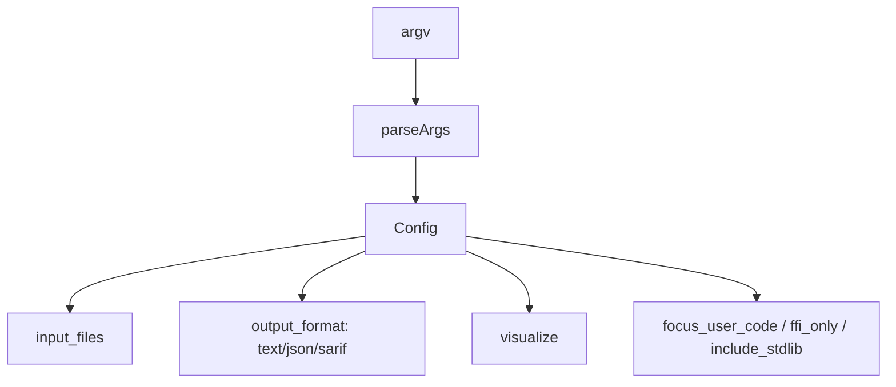
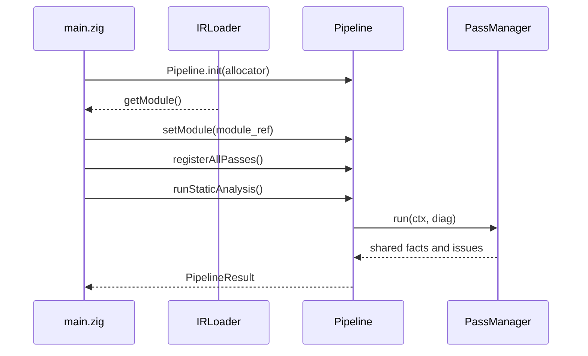
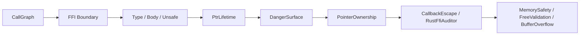
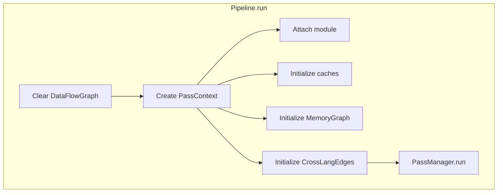
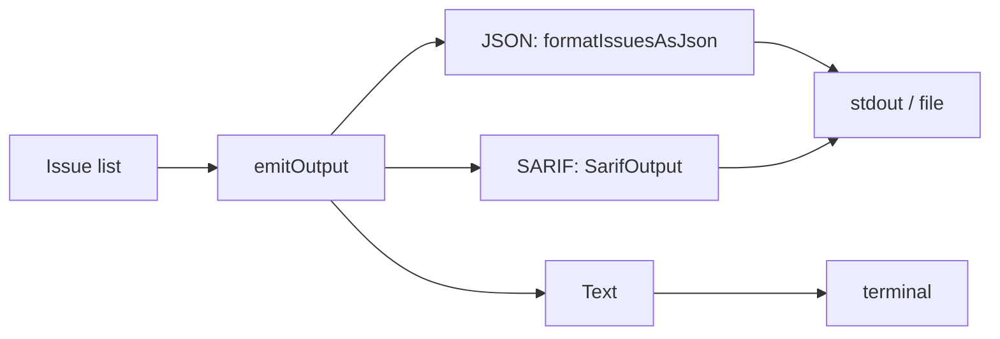

+++
title = "Lifecycle of an Analysis Run: CLI, IRLoader, Pipeline, and Output"
date = 2026-05-21
description = "This article follows one OmniScope run from command-line arguments to structured findings. The important part is how the code turns user input into a `PassContext`, runs analysis passes, and emits reports."
weight = 17
[taxonomies]
tags = ["Rust", "LLVM", "FFI"]
series = ["OmniScope"]
[extra]
series = "OmniScope"
+++

# Lifecycle of an Analysis Run: CLI, IRLoader, Pipeline, and Output

This article follows one OmniScope run from command-line arguments to structured findings. The important part is how the code turns user input into a `PassContext`, runs analysis passes, and emits reports.

## Config defines the external shape of the run

`Config` is defined at `src/main.zig:24`. It stores input files, output format, output path, visualization flag, user-code focus, FFI-only mode, and stdlib inclusion. Argument parsing starts at `src/main.zig:73`.

One implementation detail matters: the CLI parses analysis intent, but the exact effect depends on individual pass implementations. For example, some noise-reduction options are instantiated inside specific passes.

## `runModulePipeline` is the analysis loop

`runModulePipeline` is located at `src/main.zig:171`. It initializes the Pipeline, attaches the LLVM module, registers passes, runs static analysis, and collects issues.

Source anchors:

- `src/main.zig:171` initializes `Pipeline`.
- `src/main.zig:173` obtains the module from `IRLoader`.
- `src/main.zig:177` registers passes.
- `src/main.zig:180` runs static analysis.
- `src/main.zig:184` reads issues from the pipeline.

## `registerAllPasses` reveals the analysis sequence

`registerAllPasses` is at `src/main.zig:153`. It registers CallGraph, TaintPropagation, FFI Boundary, FFI Type Mismatch, FFI Body Check, FFI Unsafe, PtrLifetime, DangerSurface, PointerOwnership, CallbackEscape, RustFfiAuditor, ReturnCheck, MemorySafety, FreeValidation, and BufferOverflow.

The registration order is not necessarily the final execution order. The final order is resolved by `PassManager`, with execution starting at `src/pass/manager.zig:193`.

## `Pipeline.run` builds the analysis context

`Pipeline` is defined at `src/pipeline/pipeline.zig:27`. It stores `FactStore`, `QueryEngine`, `DataFlowGraph`, `PassManager`, and the current module. `Pipeline.run` creates the `PassContext` at `src/pipeline/pipeline.zig:66`.

`PassContext` contains shared state such as:

- facts and query engine;
- data-flow graph;
- value-id map;
- registry and zone caches;
- `cross_lang_edges`;
- `global_alloc_tracker`;
- `memory_graph`;
- `danger_surface_relevant`, `ffi_auto_relevant`, and `relevant_functions`.

## Output is part of the design

`emitOutput` is at `src/main.zig:207`. It branches into JSON, SARIF, or text output. JSON is produced by `formatIssuesAsJson`; SARIF is produced by `SarifOutput`.

## Summary

An OmniScope run follows a clear data path: CLI creates configuration, IRLoader supplies a module, Pipeline creates shared analysis context, PassManager executes passes, and `emitOutput` formats results.
