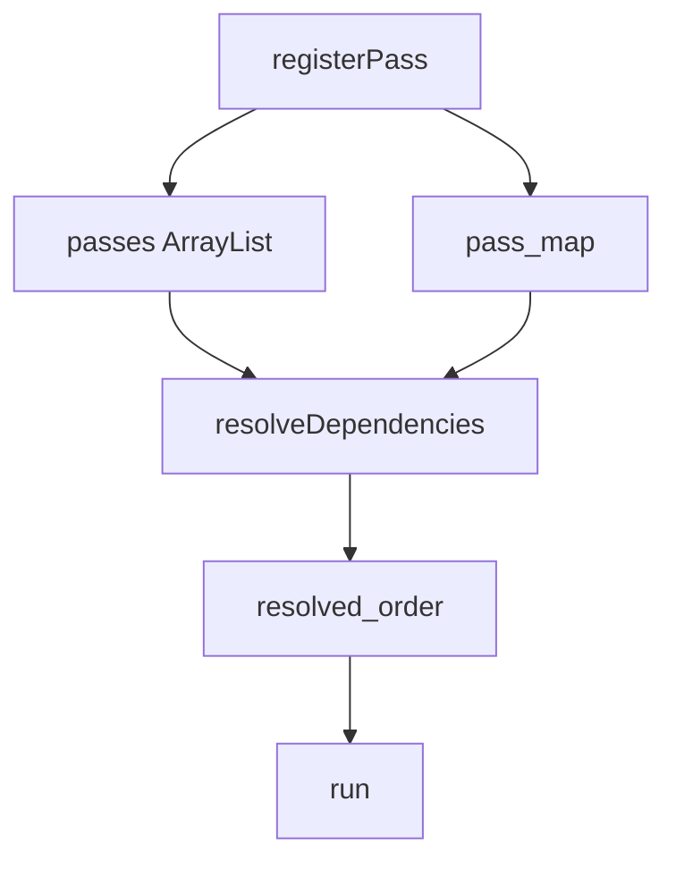
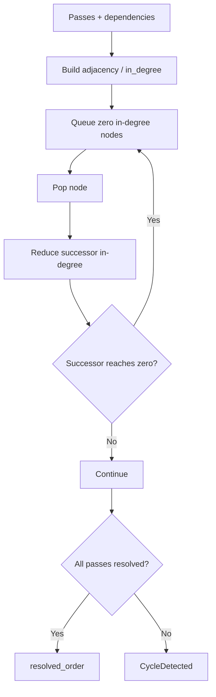
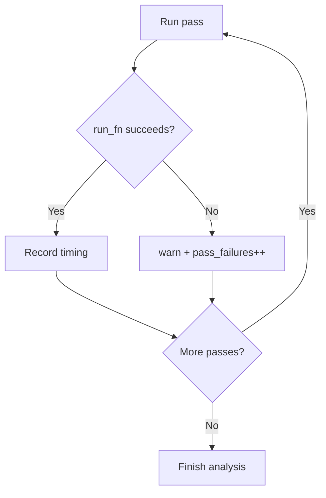
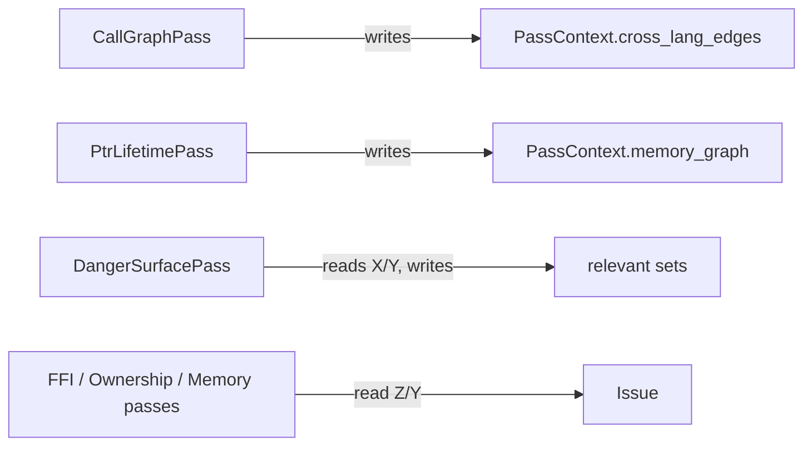
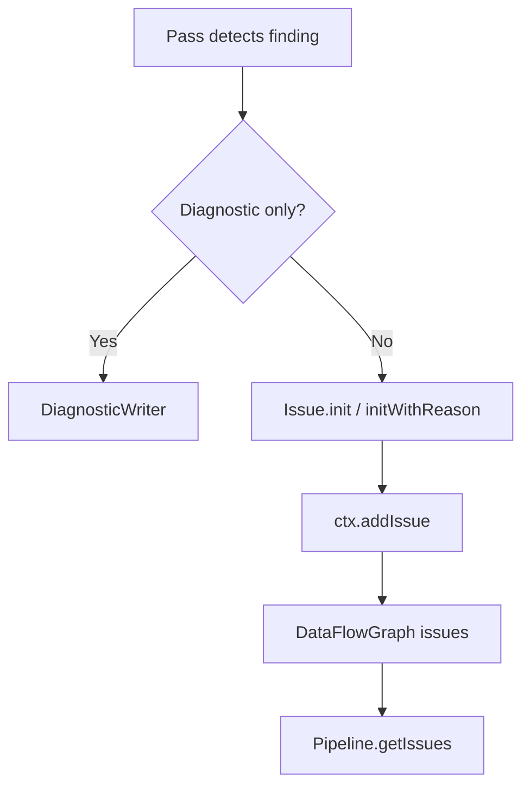

+++
title = "Inside the Pass System: Dependency Ordering, Shared Context, and Graceful Degradation"
date = 2026-05-21
description = "OmniScope organizes analysis logic as passes rather than one large procedure. The relevant implementation questions are how passes share facts, how execution order is resolved, and how the system behaves when one pass fails."
weight = 18
[taxonomies]
tags = ["Rust", "LLVM", "FFI"]
series = ["OmniScope"]
[extra]
series = "OmniScope"
+++

# Inside the Pass System: Dependency Ordering, Shared Context, and Graceful Degradation

OmniScope organizes analysis logic as passes rather than one large procedure. The relevant implementation questions are how passes share facts, how execution order is resolved, and how the system behaves when one pass fails.

## What PassManager owns

`PassManager` is defined at `src/pass/manager.zig:23`. It stores registered passes, a name-to-index map, resolved execution order, and cached execution names. Registration starts at `src/pass/manager.zig:61`.

This keeps scheduling separate from the CLI and from each individual pass.

## Dependency resolution uses Kahn topological sorting

The dependency resolver builds an adjacency list and in-degree table. Passes with zero in-degree enter the queue. Each popped node reduces the in-degree of its successors. If the final result contains fewer nodes than the registered pass count, a cycle is reported.

This matters because later passes may consume facts produced by earlier passes: risk-path checks need cross-language edges and memory facts; ownership checks need allocation and call information.

## Graceful degradation is deliberate

The run loop starts at `src/pass/manager.zig:193`. If a pass fails, the manager logs a warning, increments a failure counter, and continues executing later passes.

This is useful for real-world IR, which may come from different compilers, optimization levels, or link configurations. A failure in one analysis stage should not necessarily discard unrelated findings.

## PassContext is the fact bus

`PassContext` is defined at `src/pass/pass.zig:192`. It is the shared state through which passes exchange information. CallGraphPass may write `cross_lang_edges`; PtrLifetimePass may write `memory_graph`; DangerSurfacePass may write relevance sets; issue-producing passes read those facts.

## DiagnosticWriter and structured issues

Passes receive both `PassContext` and `DiagnosticWriter`. `DiagnosticWriter` handles logs and diagnostics. Structured findings are added through `ctx.addIssue`, whose entry point is at `src/pass/pass.zig:458`.

## Summary

The pass system provides registration, dependency ordering, shared state, graceful degradation, and structured issue collection. The later MemoryGraph, Zone, and Registry mechanisms rely on this shared execution model.
