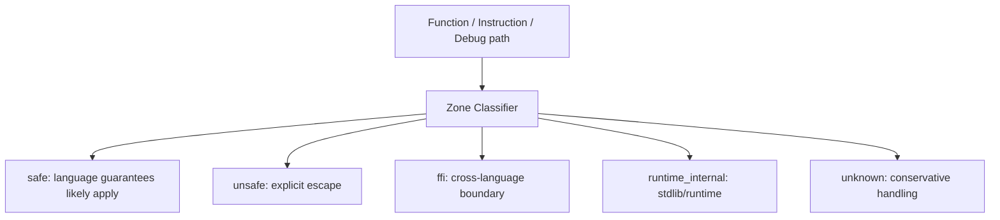
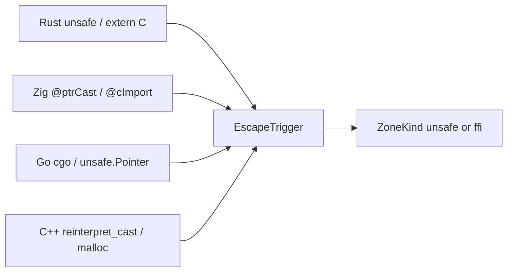
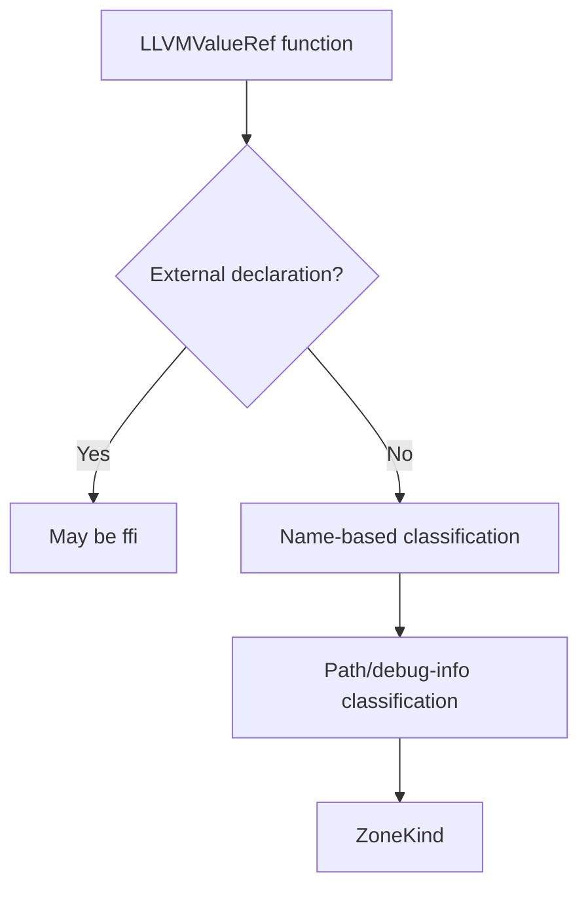
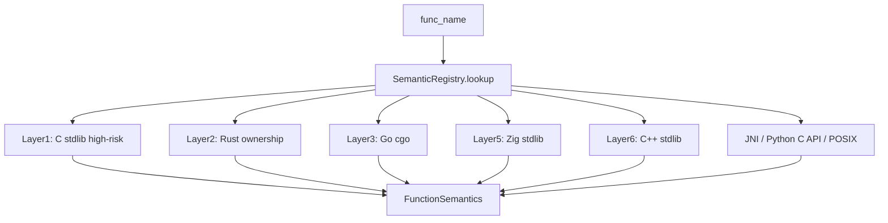
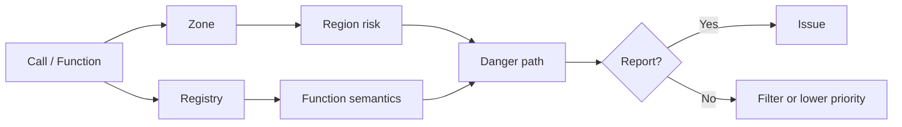

+++
title = "Zone Classification and Semantic Registry: Avoiding Blacklist-Style Reporting"
date = 2026-05-21
description = "A static analyzer without semantic layers can easily become a dangerous-function list. OmniScope separates region classification from function semantics before deciding whether a path should be analyzed in depth."
weight = 19
[taxonomies]
tags = ["Rust", "LLVM", "FFI"]
series = ["OmniScope"]
[extra]
series = "OmniScope"
+++

# Zone Classification and Semantic Registry: Avoiding Blacklist-Style Reporting

A static analyzer without semantic layers can easily become a dangerous-function list. OmniScope separates region classification from function semantics before deciding whether a path should be analyzed in depth.

## ZoneKind classifies code by risk region

`ZoneKind` is defined at `src/semantics/zone_classifier.zig:24`. It includes `safe`, `unsafe`, `ffi`, `runtime_internal`, and `unknown`. The file-level comment states the operating principle: focus where language guarantees stop.

This model is not a proof that safe zones are bug-free. It is a prioritization layer. For an FFI-focused analyzer, runtime glue or container internals should usually not have the same weight as user-written unsafe wrappers.

## Multi-language escape triggers

`EscapeTrigger` is defined at `src/semantics/zone_classifier.zig:45`. It represents cross-language escape points across ecosystems: Rust unsafe/extern/raw pointers, Zig pointer casts and C imports, Go cgo and `unsafe.Pointer`, and C++ extern C, reinterpret casts, and manual memory.

This gives the implementation a common vocabulary for multiple language-specific risk boundaries.

## Function-level and LLVM-level classification

The classifier includes both name-based and LLVM-function-based entry points:

- `src/semantics/zone_classifier.zig:347` classifies by function name.
- `src/semantics/zone_classifier.zig:394` classifies LLVM functions using declarations, intrinsics, debug information, and path data when available.

These rules are heuristic. Symbol names and debug information quality can affect classification, so Zone should be described as a risk-prioritization mechanism rather than a formal proof.

## Semantic Registry describes function meaning in FFI context

`SemanticRegistry` is defined at `src/registry/semantic_registry.zig:48`; lookup starts at `src/registry/semantic_registry.zig:90`. The registry is layered by ecosystem: C standard library, Rust ownership patterns, Go cgo, Zig, C++, JNI, Python C API, POSIX, and dynamic loading.

The registry helps interpret calls in context. `Box::into_raw` is not a vulnerability by itself; it changes the ownership protocol. `strcpy` in local C code and `strcpy` at a Rust-to-C boundary may require different review priorities.

## Zone + Registry + Danger Path

Zone and Registry should not produce most findings directly. A more controlled path is: classify the region, look up function semantics, ask whether the pointer or function is on a relevant risk path, then produce an issue if warranted.

## Summary

OmniScope avoids pure blacklist reporting by splitting a finding into three questions: where is the code located, what does the function mean at an FFI boundary, and does the pointer or function participate in a relevant risk path?
