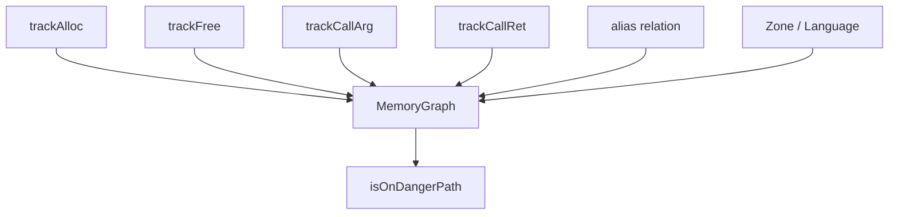
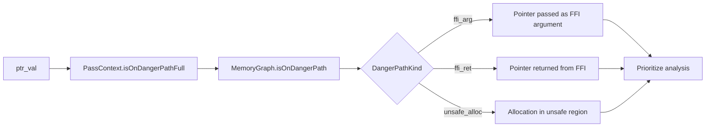
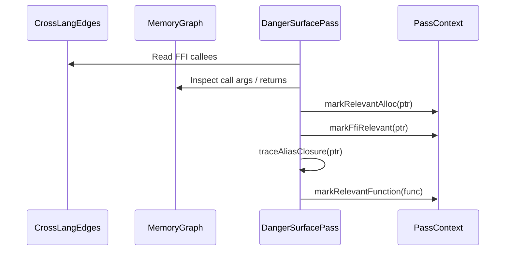
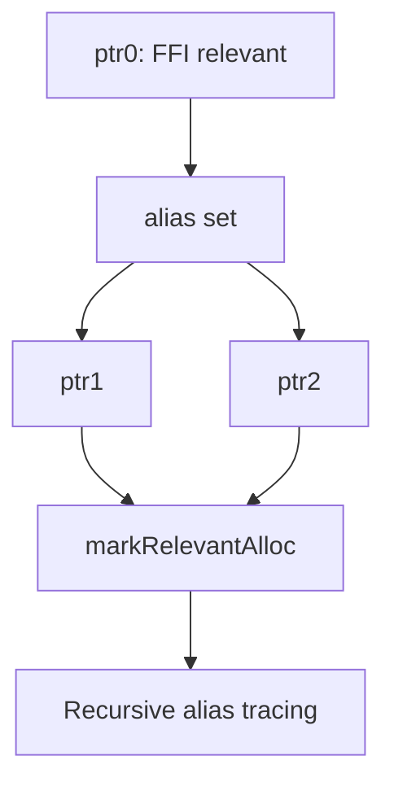
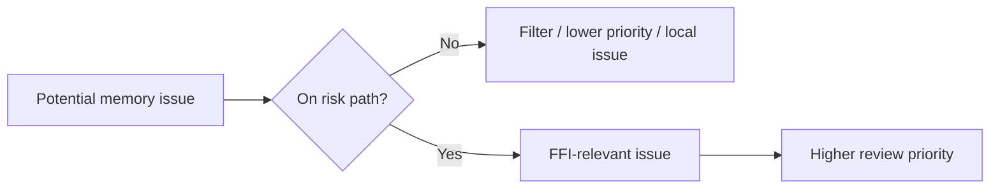

+++
title = "MemoryGraph and DangerSurface: From Pointer Facts to Risk Paths"
date = 2026-05-21
description = "Cross-language memory analysis should not only ask whether `malloc` or `free` exists. It should ask whether a pointer crosses FFI, comes from an unsafe region, or propagates through aliases. OmniScope uses `MemoryGraph` and `DangerSurfacePass` to connect these facts."
weight = 20
[taxonomies]
tags = ["Rust", "LLVM", "FFI"]
series = ["OmniScope"]
[extra]
series = "OmniScope"
+++

# MemoryGraph and DangerSurface: From Pointer Facts to Risk Paths

Cross-language memory analysis should not only ask whether `malloc` or `free` exists. It should ask whether a pointer crosses FFI, comes from an unsafe region, or propagates through aliases. OmniScope uses `MemoryGraph` and `DangerSurfacePass` to connect these facts.

## Role of MemoryGraph

`MemoryGraph` is defined at `src/semantics/memory_graph.zig:160`. It stores memory-related facts: allocations, frees, call arguments, call returns, alias relations, zones, and language sources.

The graph does not attempt to model every possible program path. It answers a narrower question: is there enough evidence that this pointer is relevant to an FFI/unsafe risk path?

## Risk-path classification

`MemoryGraph.isOnDangerPath` is implemented around `src/semantics/memory_graph.zig:892`. It may return categories such as `ffi_arg`, `ffi_ret`, and `unsafe_alloc`. `PassContext.isOnDangerPathFull` at `src/pass/pass.zig:866` provides a shared entry point for other passes.

A shared entry point keeps later passes from inventing inconsistent risk definitions.

## How DangerSurfacePass marks relevant objects

`DangerSurfacePass` starts at `src/pass/analysis/danger_surface.zig:37`. It consumes `cross_lang_edges` and `memory_graph`, then updates `danger_surface_relevant`, `ffi_auto_relevant`, and `relevant_functions`.

Two implementation choices are visible in the source: known FFI arguments and returns can be marked directly, while MemoryGraph nodes already on a risk path can be expanded through alias closure.

## Why alias closure matters

`traceAliasClosure` is at `src/pass/analysis/danger_surface.zig:144`. In LLVM IR, one memory object may appear through several SSA values after bitcasts, loads, stores, parameters, and returns. Marking only the original pointer may miss later uses.

This is not a full alias analysis. It is a focused propagation step for FFI-related pointer families.

## From risk paths to prioritized reporting

Later passes can use `isOnDangerPathFull` or relevance sets to filter findings. A local C allocation/free pair may be lower priority, while a pointer crossing FFI through arguments, returns, or callbacks may require review.

## Summary

MemoryGraph stores pointer facts. DangerSurfacePass turns those facts into relevance sets tied to FFI/unsafe paths. This is the layer that connects low-level IR events with higher-level ownership and lifetime checks.
