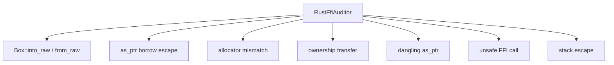
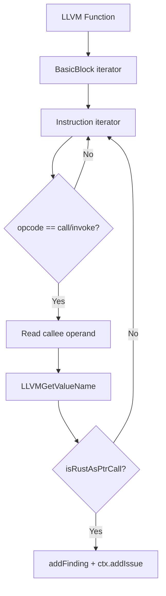
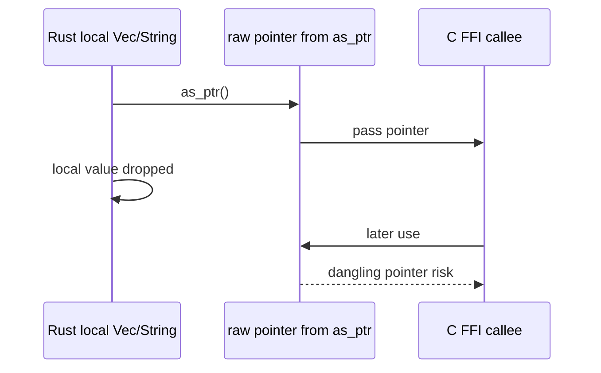
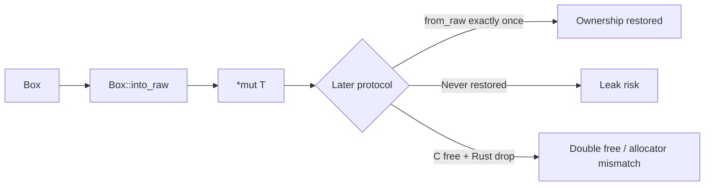
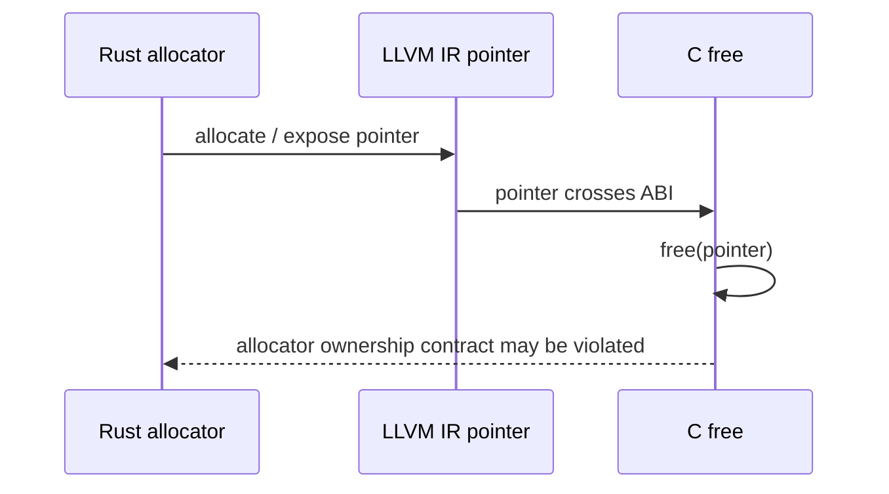
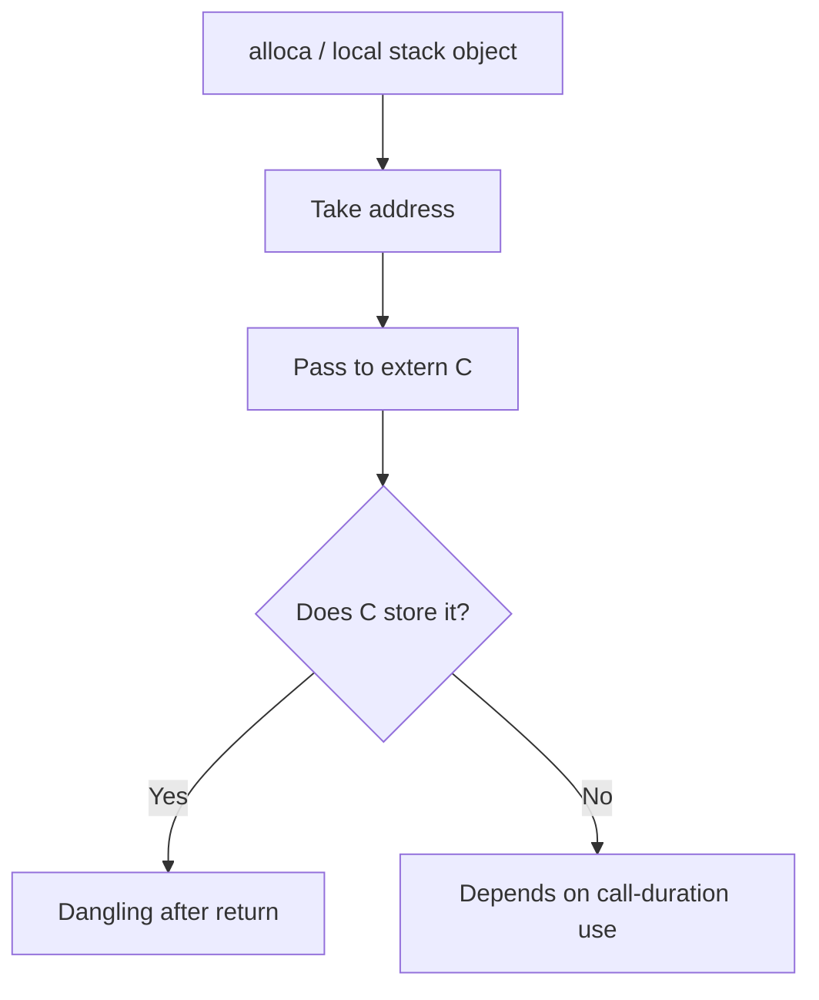

+++
title = "Rust FFI Auditor: Reconstructing and Checking Cross-Language Ownership Protocols"
date = 2026-05-21
description = "Rust FFI risk often appears when Rust’s ownership and borrowing protocols cross an ABI boundary. `RustFfiAuditor` maps those protocols back onto LLVM IR patterns that can be inspected statically."
weight = 21
[taxonomies]
tags = ["Rust", "LLVM", "FFI"]
series = ["OmniScope"]
[extra]
series = "OmniScope"
+++

# Rust FFI Auditor: Reconstructing and Checking Cross-Language Ownership Protocols

Rust FFI risk often appears when Rust’s ownership and borrowing protocols cross an ABI boundary. `RustFfiAuditor` maps those protocols back onto LLVM IR patterns that can be inspected statically.

## Rule surface

`RustFfiAuditor` is defined at `src/pass/analysis/rust_ffi_auditor.zig:63`. Its function-level logic covers Rust-specific patterns and general FFI boundary checks:

- `into_raw` without a matching `from_raw`;
- `as_ptr` borrow escape;
- Rust allocator and C `free` mismatch;
- ownership-transfer protocol violations;
- dangling `as_ptr` after parent object drop;
- unsafe FFI calls;
- stack address escape to `extern C`.

## `as_ptr` borrow escape: recovering a lifetime risk from IR calls

`detectAsPtrEscape` is implemented at `src/pass/analysis/rust_ffi_auditor.zig:180`. It iterates LLVM functions, basic blocks, and instructions; handles only `LLVMCall` and `LLVMInvoke`; retrieves the callee from the final operand; reads the callee name; and matches Rust `as_ptr` patterns.

The risk is that `String` or `Vec` `as_ptr` returns a borrowed pointer. If C stores it, the Rust object may be dropped while C still holds the address.

At `src/pass/analysis/rust_ffi_auditor.zig:212`, the rule creates a `borrow_escape` issue through `Issue.initWithReason`, with a reason explaining that a local `String/Vec` pointer passed to extern C may dangle.

## `into_raw/from_raw`: ownership transfer should close correctly

`Box::into_raw` converts Rust-managed heap ownership into a raw pointer. The caller must ensure the later deallocation protocol is correct. Missing restoration can leak; double restoration can double free; C-side release can produce allocator mismatch depending on allocation protocol.

`into_raw` alone is not a vulnerability. The finding depends on the surrounding protocol and subsequent pointer flow.

## Cross-language allocator mismatch

`detectCrossLangMismatch` starts at `src/pass/analysis/rust_ffi_auditor.zig:230`. It iterates call/invoke instructions and attempts to identify Rust allocation paired with C deallocation.

The accuracy of this kind of check depends on symbol names, preserved call relationships, wrappers, inlining, and custom allocators.

## General FFI checks

The auditor also runs checks that are not Rust-only, such as unsafe FFI call scanning and stack address escape. Stack escape is relevant when a pointer to a local object is passed to C and then stored beyond the call.

## Summary

`RustFfiAuditor` maps Rust ownership and borrowing concepts onto IR-level call and pointer patterns. It should be described as static protocol recovery and checking, with accuracy bounded by available IR information.
