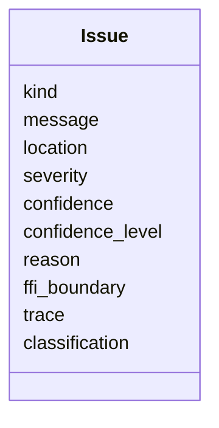
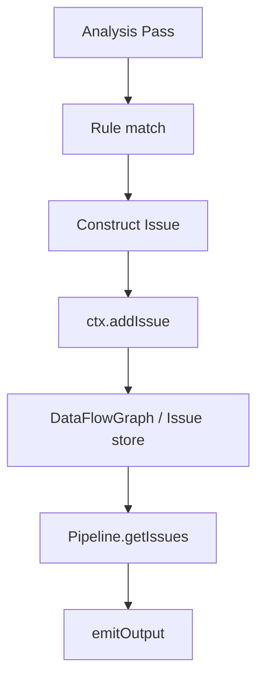
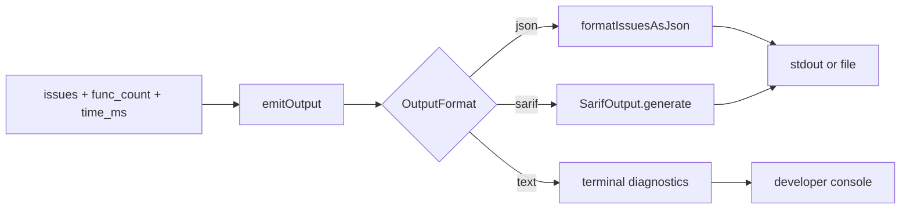
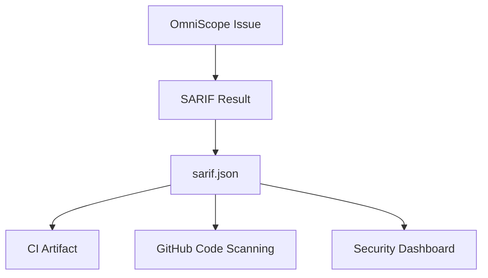

+++
title = "Reporting Pipeline: Issue Objects, JSON, SARIF, and Engineering Integration"
date = 2026-05-21
description = "Static analysis results need to be reviewable and machine-readable. OmniScope’s reporting path starts with `Issue` objects, then emits text, JSON, or SARIF through `emitOutput`."
weight = 22
[taxonomies]
tags = ["Rust", "LLVM", "FFI"]
series = ["OmniScope"]
[extra]
series = "OmniScope"
+++

# Reporting Pipeline: Issue Objects, JSON, SARIF, and Engineering Integration

Static analysis results need to be reviewable and machine-readable. OmniScope’s reporting path starts with `Issue` objects, then emits text, JSON, or SARIF through `emitOutput`.

## Issue is the shared result type

`Issue` is defined in `src/diag/issue.zig`, and issue kinds are exposed from `src/common/types.zig:151`. The structure carries kind, message, location, severity, confidence, confidence level, reason, FFI boundary, trace, and classification.



These fields support different review needs:

- `severity` helps triage.
- `confidence` and `confidence_level` distinguish stronger evidence from heuristics.
- `reason` records the rule rationale.
- `ffi_boundary` marks cross-language context.
- `trace` leaves room for evidence paths.
- `classification` separates FFI-boundary findings from local-only findings.

## From Pass to Issue

When a pass finds something reportable, it creates an `Issue` with constructors such as `Issue.init` or `Issue.initWithReason`, then calls `ctx.addIssue`. The entry point is `src/pass/pass.zig:458`.



This decouples rule logic from output format. Passes produce structured findings; the main program decides how to serialize them.

## `emitOutput` dispatches formats

`emitOutput` is implemented at `src/main.zig:207`. The JSON branch calls `formatIssuesAsJson` at `src/main.zig:494`; the SARIF branch uses `SarifOutput`, initialized at `src/main.zig:232`; file output is controlled by `config.output_file`.



## SARIF integration

`SarifOutput` is defined at `src/output/sarif.zig:36`, with file writing at `src/output/sarif.zig:167`. SARIF lets results be consumed by GitHub Code Scanning, CI systems, and security dashboards.



## Example commands

Local inspection:

```bash
omniscope input.ll
```

Structured JSON:

```bash
omniscope --json -o omniscope-report.json input.ll
```

SARIF for CI or code scanning:

```bash
omniscope --sarif -o omniscope.sarif input.ll
```

FFI-focused mode:

```bash
omniscope --ffi-only input.ll
```

## Confidence and review boundaries

Confidence is not decorative. Cross-language static analysis can be affected by optimization, missing symbols, debug information quality, wrappers, and custom allocators. Exposing confidence, reason, and trace fields helps reviewers inspect the analyzer’s reasoning instead of relying only on alert color.

## Summary

The reporting path separates analysis from serialization: passes produce structured issues, `emitOutput` selects the output format, and JSON/SARIF make the results usable in engineering workflows.
