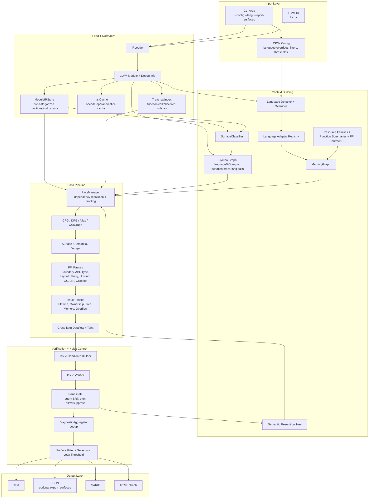
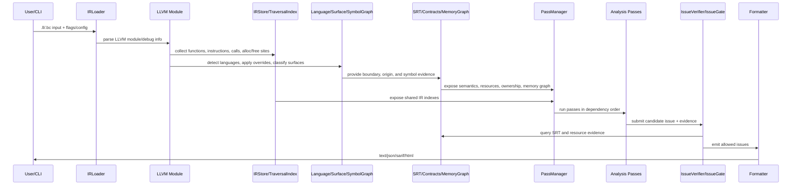
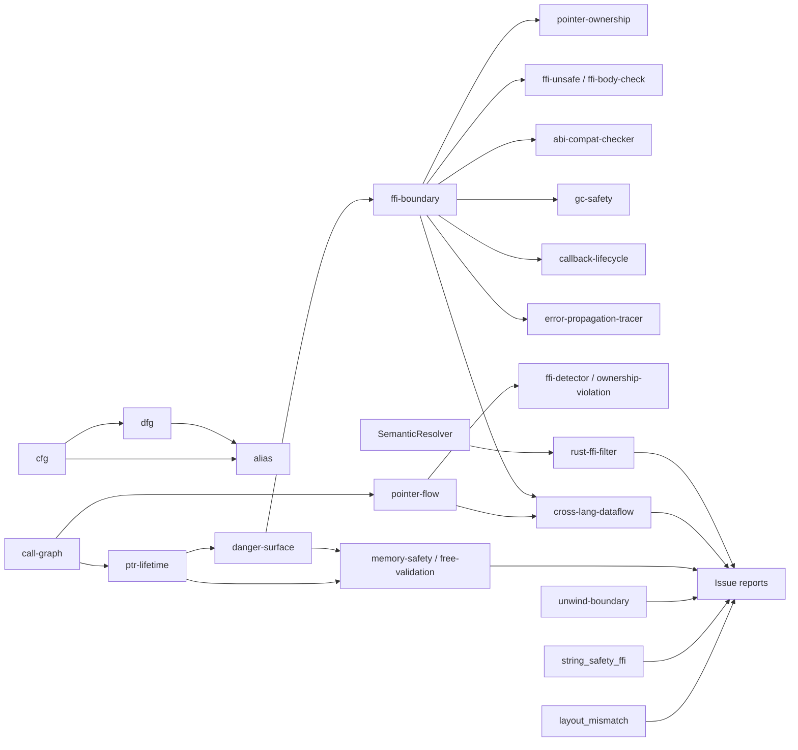

+++
title = "v0.2.0"
date = 2026-06-09
description = "v0.2.0 moves OmniScope from rule-heavy, multi-pass heuristic FFI detection toward a context-aware framework built around semantic resolution, function surface classification, resource contracts, multi-language FFI passes, and a unified Issue Gate."
weight = 24
[taxonomies]
tags = ["Rust", "LLVM", "FFI"]
series = ["OmniScope"]
[extra]
series = "OmniScope"
+++

# v0.2.0 

v0.2.0 is an analysis architecture upgrade. It moves OmniScope from v0.1.8's rule-heavy, multi-pass heuristic FFI detection toward a context-aware framework built around semantic resolution, function surface classification, resource contracts, multi-language FFI passes, and a unified Issue Gate.

## Change Size

- `697 files changed, 2,554,945 insertions(+), 762,475 deletions(-)`.
- `VERSION` is now `0.2.0`.
- Main new areas:
  - `src/pass/analysis/ffi/`
  - `src/pass/analysis/ptr_lifetime/`
  - `src/pass/analysis/noise/`
  - `src/pass/analysis/resource/`
  - `src/semantics/`
  - `src/resource/`
  - `src/lang/`
  - `src/ir/`
  - `test/`, `tests/`, `corpus/`, `docs/en`, `docs/zh`

## Major Updates

1. Adds the Semantic Resolution Tree and `SemanticResolver` so allocator, release, RAII, ownership-transfer, and interior-mutability evidence can be queried.
2. Adds a unified `Issue Gate`; diagnostics are checked against semantic evidence before they are emitted.
3. Adds `SurfaceClassifier` to classify functions as `user_code`, `dependency`, `boundary`, `standard_library`, `compiler_generated`, `runtime`, or `unknown`.
4. Adds `SymbolGraph` for per-symbol language, ABI, export-surface, and cross-language call-site detection.
5. Adds resource contracts: resource families, function summaries, ownership transfer, release-pair validation, and issue verification.
6. Adds or expands FFI checks for ABI, type mismatch, layout mismatch, string safety, unwind boundaries, callback lifecycle, GC safety, JNI leaks, and cross-language dataflow.
7. Adds language override and adapter support: `--lang`, `--lang-prefix`, `--lang-suffix`, `--source-lang`, and `--default-lang`.
8. Adds performance infrastructure: `IRStore`, `InstCache`, `TraversalIndex`, arenas, string interning, prefix trie, Aho-Corasick, and parallel pipeline scaffolding.
9. Expands tests and corpora: inline IR, cross-language fixtures, golden baselines, red-team corpus, real-world corpus, and CI workflow coverage.

## Complete Architecture Diagram

## Data Flow Diagram

## New Pass Functions And Responsibilities

The list below follows the full pipeline registered in `src/pipeline_registration.zig`. Some passes existed before but were reorganized or wired into new v0.2.0 context; they are included because their responsibilities changed in the new architecture.

### Context And Foundation Passes

| Pass | File | Dependencies | Emits issues | Responsibility |
|---|---|---:|---:|---|
| `cfg` | `src/pass/foundation/cfg.zig` | none | no | Builds basic-block control-flow facts so later passes do not each parse terminators differently. |
| `dfg` | `src/pass/foundation/dfg.zig` | `cfg` | no | Builds def-use/value-flow facts shared by pointer, taint, and ownership passes. |
| `alias` | `src/pass/analysis/alias.zig` | `cfg`, `dfg` | no | Provides local alias evidence for lifetime, free validation, and memory-safety checks. |
| `surface-classifier` | `src/pass/analysis/surface_classifier_pass.zig` | none | no | Classifies functions as user code, dependency, boundary, stdlib, compiler-generated, runtime, or unknown. |
| `SemanticResolver` | `src/pass/analysis/semantic_resolver_pass.zig` | none | no | Builds semantic state for allocator/release/RAII/transfer and related evidence. |
| `call-graph` | `src/pass/analysis/call_graph.zig` | none | no | Builds call relationships and cross-language edges for FFI, callback, GC, and error tracing passes. |
| `pointer-flow` | `src/pass/analysis/taint/taint_propagation.zig` | `call-graph` | no | Propagates pointer/taint-style state through arguments, returns, and assignments. |

These passes mainly produce shared evidence rather than diagnostics. Much of v0.2.0's accuracy improvement comes from this layer: later passes reuse a common CFG/DFG/call graph/surface/semantic view instead of rebuilding local guesses.

### FFI Boundary And Cross-Language Passes

| Pass | File | Dependencies | Emits issues | Responsibility |
|---|---|---:|---:|---|
| `ffi-detector` | `src/pass/analysis/ffi/ffi_detector.zig` | `cfg`, `dfg`, `pointer-flow` | no | Combines declarations, calls, signatures, names, and pointer-flow evidence to produce candidate FFI risks. |
| `ffi-boundary` | `src/pass/analysis/ffi/ffi_boundary.zig` | `call-graph`, `danger-surface` | yes | Provides the shared definition of an FFI boundary and reports boundary issues. |
| `ffi-type-mismatch` | `src/pass/analysis/ffi/ffi_type_mismatch.zig` | `call-graph` | yes | Detects cross-language integer width, signedness, pointer, enum, and struct-related type mismatches. |
| `abi-compat-checker` | `src/pass/analysis/ffi/abi_compat_checker.zig` | `call-graph`, `ffi-boundary` | yes | Checks ABI-level compatibility, such as calling convention and ABI representation of parameters/returns. |
| `ffi-body-check` | `src/pass/analysis/issue/ffi_body_check.zig` | `ffi-boundary` | yes | Checks exported or boundary-facing function bodies for risky APIs and patterns. |
| `ffi-unsafe` | `src/pass/analysis/issue/ffi_unsafe.zig` | `ffi-boundary` | yes | Finds unsafe APIs and risky control-flow patterns in boundary context. |
| `ownership-violation` | `src/pass/analysis/ffi/ffi_analysis.zig` | `cfg`, `dfg`, `pointer-flow` | no | Analyzes FFI ownership violations using pointer-flow and allocation/free evidence. |
| `cross-lang-dataflow` | `src/pass/analysis/ffi/cross_lang_dataflow.zig` | `ffi-boundary`, `pointer-flow` | yes | Tracks values created in one language/runtime and consumed in another. |

Important responsibility split:

- `ffi-boundary` is the boundary fact producer for downstream FFI passes.
- `ffi-type-mismatch`, `abi-compat-checker`, and `layout_mismatch` separate type, ABI, and layout concerns so reports can point to narrower causes.
- `cross-lang-dataflow` connects boundary evidence with pointer-flow and is the main path for cross-language ownership/leak reasoning.

### New v0.2.0 FFI-Specific Passes

| Pass | File | Dependencies | Emits issues | Responsibility |
|---|---|---:|---:|---|
| `layout_mismatch` | `src/pass/analysis/ffi/layout_mismatch_detector.zig` | none | yes | Checks struct layout, padding, alignment, and representation mismatches across language boundaries. |
| `string_safety_ffi` | `src/pass/analysis/ffi/string_safety_ffi.zig` | none | yes | Checks loss of string length, encoding, NUL termination, or ownership across FFI. |
| `unwind-boundary` | `src/pass/analysis/ffi/unwind_boundary_checker.zig` | none | yes | Checks whether exceptions or panics may cross C ABI or other non-unwind-safe boundaries. |
| `callback-lifecycle` | `src/pass/analysis/ffi/callback_lifecycle_checker.zig` | `ffi-boundary`, `call-graph` | yes | Checks callback registration, unregistering, context retention, call timing, and resource-consuming callbacks. |
| `gc-safety` | `src/pass/analysis/ffi/gc_safety_analyzer.zig` | `ffi-boundary`, `call-graph` | yes | Checks JNI/Python/GC runtime object references and lifetimes across FFI. |
| `error-propagation-tracer` | `src/pass/analysis/ffi/error_propagation_tracer.zig` | `ffi-boundary`, `call-graph` | yes | Tracks errors crossing FFI and finds dropped or incorrectly translated error values. |
| `jni-leak-detector` | `src/pass/analysis/issue/jni_leak_detector.zig` | `ffi-boundary` | yes | Detects JNI local/global reference management and leak patterns. |

Note: `layout_mismatch`, `string_safety_ffi`, and `unwind-boundary` currently declare empty `deps`. Conceptually they rely on FFI context, but that dependency is not fully explicit in metadata yet. Check registration order and helper use before moving them.

### Lifetime, Ownership, And Memory-Safety Passes

| Pass | File | Dependencies | Emits issues | Responsibility |
|---|---|---:|---:|---|
| `ptr-lifetime` | `src/pass/analysis/ptr_lifetime/ptr_lifetime.zig` | `call-graph` | yes | Tracks raw pointer allocation/free/escape, updates `MemoryGraph`, and reports lifetime violations. |
| `danger-surface` | `src/pass/analysis/danger_surface.zig` | `call-graph`, `ptr-lifetime` | no | Marks functions/paths near FFI or dangerous APIs as report-relevant. |
| `pointer-ownership` | `src/pass/analysis/pointer_ownership.zig` | `ffi-boundary` | no | Tracks allocation/release/transfer evidence near boundaries for downstream ownership checks. |
| `memory-safety` | `src/pass/analysis/issue/memory_safety.zig` | `danger-surface`, `ptr-lifetime` | yes | Reports double free, use-after-free, leak-like behavior, and unsafe release candidates. |
| `free-validation` | `src/pass/analysis/issue/free_validation.zig` | `danger-surface`, `ptr-lifetime` | yes | Validates pointer origin, allocator family, and release family compatibility. |
| `malloc-check` | `src/pass/analysis/issue/malloc_check.zig` | none | yes | Checks whether allocation-like return values are checked. |
| `buffer-overflow` | `src/pass/analysis/buffer_overflow.zig` | none | yes | Checks risky copy/format/buffer operations. |
| `integer-overflow` | `src/pass/analysis/issue/integer_overflow.zig` | none | yes | Checks integer overflows that affect size/count/allocation lengths. |
| `return-check` | `src/pass/analysis/issue/return_check.zig` | none | yes | Checks ignored return values from allocation, I/O, and syscall-style APIs. |
| `lock` | `src/pass/analysis/lock.zig` | none | yes | Checks lock/unlock imbalance and concurrency call patterns. |

Responsibility split:

- `ptr-lifetime` gathers lifetime facts.
- `danger-surface` decides whether facts are relevant enough to report.
- `memory-safety` and `free-validation` are the main reporters.
- `pointer-ownership` and the resource model explain cross-language ownership transfer; they are not equivalent to reporting.

### Language And Runtime-Specific Passes

| Pass | File | Dependencies | Emits issues | Responsibility |
|---|---|---:|---:|---|
| `rust-ffi-filter` | `src/pass/analysis/rust_ffi/rust_ffi_auditor.zig` | `SemanticResolver` | yes | Handles Rust FFI ownership transfer, `into_raw/from_raw`, borrow escape, and drop glue semantics. |
| `callback-escape` | `src/pass/analysis/callback_escape.zig` | `call-graph`, `danger-surface` | yes | Checks whether callbacks retain stack pointers, closures, or state beyond the original language lifetime. |
| `callback-lifecycle` | `src/pass/analysis/ffi/callback_lifecycle_checker.zig` | `ffi-boundary`, `call-graph` | yes | Checks callback registration/unregistration and context retention safety. |
| `gc-safety` | `src/pass/analysis/ffi/gc_safety_analyzer.zig` | `ffi-boundary`, `call-graph` | yes | Checks GC-managed object reference safety across FFI. |
| `jni-leak-detector` | `src/pass/analysis/issue/jni_leak_detector.zig` | `ffi-boundary` | yes | Checks JNI reference leaks and local/global reference handling. |

## How v0.2.0 Reduces Noise And Improves Accuracy

### 1. SurfaceClassifier: first decide whether the function should be analyzed

Implemented in `src/semantics/surface_classifier/surface_classifier.zig`:

- `boundary` has the highest priority, so FFI boundaries are not accidentally removed by stdlib/runtime suppression.
- `standard_library`, `compiler_generated`, and `runtime` are skipped by default, reducing Rust drop glue, C++ ABI internal, and runtime-helper noise.
- `unknown` is kept for analysis, which protects recall when classification is incomplete.

### 2. Issue Gate: every issue goes through the same semantic gate

Implemented in `src/pass/filter/issue_gate.zig`:

- `borrow_escape` can be explained by `heap_provenance`, `global_provenance`, or `mutable_param`.
- `write_to_immutable` can be explained by `mutable_param` or `interior_mutability`.
- `use_after_free` can be explained by `raii_drop_release`.
- `cross_language_free/leak` can be explained by `into_raw_transfer`, non-memory syscalls, or library releases.
- The enhanced gate uses a `0.85` confidence threshold. Conflicting or low-confidence evidence is allowed through instead of hidden.

### 3. Resource Contracts: from “saw a free” to “release pair is correct”

Implemented in `src/resource/ffi_contract_db.zig`:

- `OwnershipModel.gc`, `callee`, and `borrowed` suppress leaks that the caller does not own.
- `caller` and `custom` are reported conservatively.
- `isValidRelease()` validates allocation/release pairing, for example `SSL_new` should match `SSL_free`, not any free-like function.

### 4. SymbolGraph: module-level language detection becomes symbol-level detection

Implemented in `src/ffi/symbol_graph.zig`:

- per-symbol language
- ABI class
- export surface
- cross-language call site

This reduces misclassification caused by treating a mixed LLVM module as a single language, especially in C shims, Rust/C++ mangling, JNI, and Python C API cases.

### 5. IRStore/InstCache/TraversalIndex: shared indexes reduce repeated traversal

New infrastructure:

- `src/ir/ir_store.zig`
- `src/ir/inst_cache.zig`
- `src/pipeline/traversal_index.zig`

Benefits:

- Passes share function, instruction, call, alloc, and free indexes.
- Hot-path O(n) instruction lookup becomes O(1).
- Repeated LLVM C API calls are reduced, which improves stability and performance on large IR corpora.

## v0.1.8 vs v0.2.0

| Dimension | v0.1.8 | v0.2.0 |
|---|---|---|
| Main goal | S+ quality audit, output standardization, silent-error cleanup, MemoryGraph fix | Semantic-analysis and multi-language FFI architecture upgrade |
| Boundary model | More module/pass-level heuristics | SymbolGraph + per-symbol language/ABI/export surface |
| Noise control | Local pass filters and whitelists | SurfaceClassifier + SRT-backed Issue Gate + Resource Contracts |
| Ownership | Allocation/free registry and MemoryGraph fixes | Resource families, summaries, ownership transfer, lifecycle contracts |
| Language handling | Improved registry and detection rules | Adapter framework + language override config + per-symbol classification |
| FFI coverage | Core FFI/memory-safety checks | ABI/type/layout/string/unwind/callback/GC/JNI/cross-lang dataflow |
| Performance | Bug fixes and reduced obvious repeated traversal | IRStore, InstCache, TraversalIndex, profiling, arena/string interning |
| Tests | Integration/red-team tests around v0.1.8 fixes | Inline IR matrix, cross-language suite, golden baseline, real-world corpus |

## One-Line Summary

v0.2.0 upgrades OmniScope from “find suspicious patterns” to “understand language boundaries, resource ownership, and semantic context before reporting suspicious issues.”

