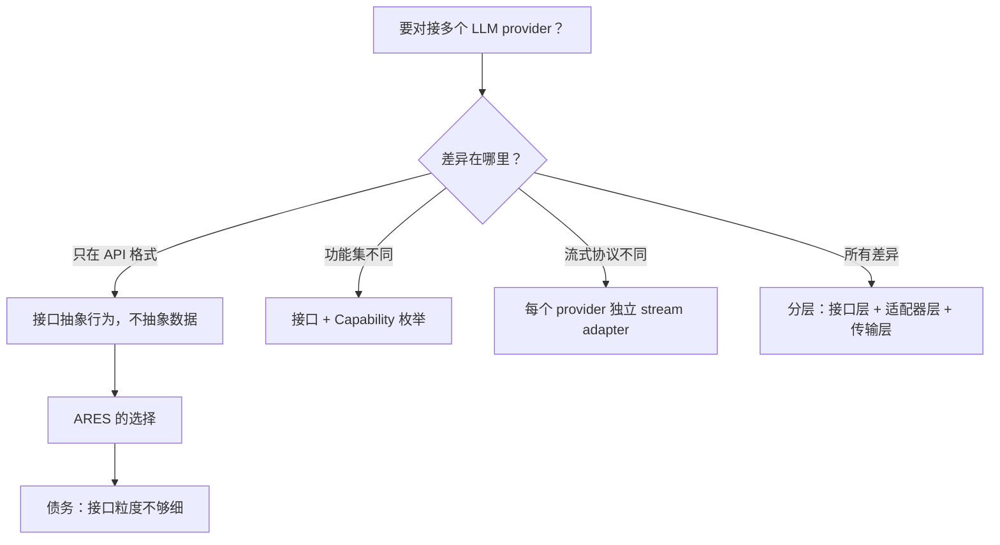

+++
title = "抽象的债务"
date = 2026-06-12
description = "ARES 需要对接四个 LLM 提供商。接口抽象该做到什么程度？从 LLMService 接口的设计决策出发，拆解抽象层的隐性成本。"
weight = 1
[taxonomies]
tags = ["Go", "LLM", "Architecture", "decision-archaeology"]
series = ["decision-archaeology"]
[extra]
series = "decision-archaeology"
+++

# 抽象的债务

> **Problem**: ARES 需要对接 OpenRouter、Ollama、OpenAI、Anthropic 四个 LLM 提供商。接口抽象该做到什么程度？做少了，改一个 provider 要动 N 处代码；做多了，接口本身变成维护负担。这篇文章考古的是那条线到底画在哪里。

## 如果不做抽象，最简单的方案长什么样？

你有一个 Go 项目，需要调用四个 LLM 提供商。最直觉的做法是写四个函数，用 switch 分发：

```go
func callLLM(provider string, prompt string) (string, error) {
    switch provider {
    case "openai":
        return callOpenAI(prompt)
    case "ollama":
        return callOllama(prompt)
    case "openrouter":
        return callOpenRouter(prompt)
    case "anthropic":
        return callAnthropic(prompt)
    }
    return "", fmt.Errorf("unknown provider: %s", provider)
}
```

这能跑。但当你有 10 个调用点、每个调用点需要传不同参数（temperature、max_tokens、system prompt）的时候，switch 就开始腐烂了。每个 provider 的请求格式不同，错误码不同，认证方式不同。你会在每个调用点重复处理这些差异。

有人告诉你"要面向接口编程"。于是你开始设计抽象层。问题来了：**抽象到什么粒度？**

## ARES 的 LLMService 做了什么选择？

ARES 的答案是定义一个 `LLMService` 接口，抽象行为，不抽象数据：

```go
// api/core/llm.go:170-208
type LLMService interface {
    Generate(ctx context.Context, request *GenerateRequest) (*GenerateResponse, error)
    GenerateSimple(ctx context.Context, prompt string) (string, error)
    GenerateEmbedding(ctx context.Context, request *EmbeddingRequest) (*EmbeddingResponse, error)
    GetConfig() *LLMConfig
    IsEnabled() bool
    GetProvider() LLMProvider
    GetModel() string
}
```

七个方法。看起来干净。上层代码只需要依赖这个接口，不用知道底下是 OpenRouter 还是 Ollama。

具体实现长这样：

```go
// api/service/llm/service.go:16-22
type Service struct {
    client          *llm.Client
    repo            core.LLMRepository
    config          *core.BaseConfig
    llmConfig       *core.LLMConfig
    embeddingClient any  // ← 这个 any 已经暴露了问题
}
```

注意那个 `embeddingClient any`。我们一会儿回来讲它。

底层的 `llm.Client` 并没有继续用接口抽象，而是回到了最朴素的 switch：

```go
// internal/llm/client.go:98
func (c *Client) Generate(ctx context.Context, req *GenerateRequest) (*GenerateResponse, error) {
    switch c.config.Provider {
    case "openrouter":
        return c.generateOpenRouter(ctx, req)
    case "ollama":
        return c.generateOllama(ctx, req)
    }
}
```

这是一个刻意的选择：**接口层抽象行为，switch 层处理协议差异**。上层不关心 JSON body 长什么样，底层不关心业务逻辑怎么用生成结果。

## 行业里其他项目怎么做？

在决定抽象粒度之前，值得看看行业里的三种主流方案：

| 方案 | 代表项目 | 抽象粒度 | 核心问题 |
|------|---------|---------|---------|
| 统一接口 + 策略模式 | LangChain Go | 每个 provider 一个 struct | 接口膨胀，新 provider 要实现全部方法 |
| 适配器注册表 | LiteLLM | 配置驱动，运行时分发 | 调试困难，错误信息在适配层丢失 |
| 直接 switch | 大多数小型项目 | 无抽象 | 加 provider 改 N 处，测试困难 |

LangChain Go 的方式是为每个 provider 写一个完整的 struct 实现统一接口。好处是扩展性强，代价是接口越长，新 provider 的实现成本越高。你只是想加一个简单的 completion 调用，却被迫实现 streaming、function calling、token counting 等一整套方法。

LiteLLM 走另一个极端：用配置文件描述 provider 差异，运行时动态分发。Python 的动态性让这招可行，但调试时你面对的是一个黑盒——错误信息经过适配层的包装，常常丢失原始上下文。

ARES 选了中间路线：接口抽象核心行为，switch 处理协议细节。不追求运行时动态性，也不追求完全的策略隔离。

但 LangChain Go 的接口膨胀问题值得展开。假设你的接口定义了 `Generate`、`Stream`、`FunctionCall`、`CountTokens` 四个方法，四个 provider 各自实现，相安无事。现在你要加第五个 provider——比如一个支持 streaming 但不支持 function calling 的国产模型。问题来了：接口要求你实现 `FunctionCall` 方法，但你没有这个能力。你只能返回 `ErrNotSupported`。调用方拿到这个 error 之前，编译器不会给出任何警告——接口签名骗它说"我能做"，运行时才告诉你"我做不了"。这就是接口膨胀的经典症状：**接口承诺的能力超过了实现的实际能力，类型系统无法表达"部分实现"**。你被迫在文档里写"Provider X 不支持 FunctionCall"，而这正是类型系统应该帮你解决的问题。每加一个 provider，这份文档就长一截，直到没人记得哪个 provider 到底支持什么。

## 为什么抽象行为而不抽象数据？

四家 LLM API 的请求体格式差异是本质性的，不是表面性的：

- OpenAI 和 OpenRouter 用 `messages` 数组，Anthropic 用 `messages` 但顶层多一个 `system` 字段
- Ollama 的本地 API 格式和 OpenAI 兼容模式不完全一致
- 响应格式里，`choices[0].message.content` vs `content[0].text` 是两种完全不同的结构
- Token 计数的字段名、计算方式各不相同

如果强行抽象数据，你会得到一个"万能 DTO"：

```go
type UniversalRequest struct {
    Messages   []Message         // 所有 provider 都有
    System     string            // 只有 Anthropic 需要顶层
    Functions  []FunctionDef     // 只有 OpenAI 系支持
    Options    map[string]any    // 万能逃生舱
}
```

这个 struct 会不断膨胀，每次有 provider 加新特性就得加字段。最终它不再是你的模型，而是所有 provider 的最小公分母。

ARES 的做法是定义自己的 `GenerateRequest` 和 `GenerateResponse`，它们是 ARES 业务逻辑需要的数据结构，不是任何 provider 的 API 模型。序列化差异留给底层的 `generateOpenRouter`、`generateOllama` 各自处理。

这是对的。**你的抽象层应该表达你的领域概念，不是别人的 API 设计。**

具体看一个例子：OpenAI 的响应体是 `choices[0].message.content`，一个字符串；Anthropic 的响应体是 `content[0].text`，一个数组的第一个元素的 text 字段。如果定义一个 `UniversalResponse`，你要么用 `map[string]any` 做逃生舱，把解析逻辑推给调用方；要么定义一个 `Choice` struct 试图兼容两家，结果发现 Anthropic 的 `content` 数组里除了 `text` 还有 `tool_use` 类型，而 OpenAI 的 tool call 在 `message.tool_calls` 里——结构完全不同，你的 `Choice` 变成了一个塞满可选字段的怪物。所以 ARES 选择让 `GenerateResponse` 只包含自己需要的字段（text、usage、finish reason），在底层的 `generateOpenRouter` 和 `generateAnthropic` 里各自做映射。这个映射代码是冗余的，但它是可控的冗余——每一处映射都只服务于一个 provider，改一个不影响其他。

## 这个抽象已经欠了什么债？

考古到这里，一个规律浮现了：**抽象层的债务不是一次性产生的，而是在每次"加一个 provider"时悄悄累积的**。第一个 provider 的时候，switch 是最干净的方案。第二个、第三个，switch 开始膨胀。第四个，你引入接口。但接口的设计往往是基于已有 provider 的共性做的——你看到四个 provider 都有 `Generate`，就抽象出 `Generate` 方法。你看不到第五个 provider 可能带来的新维度（streaming、function calling、vision），因为那些需求还没出现。这就是抽象的困境：**你只能基于已知变异性做抽象，但抽象的寿命取决于未知变异性**。债务清单开始浮现。

**第一笔债：`embeddingClient any`**

这个字段是 `any` 类型，意味着编译器无法帮你检查类型安全。Embedding 和 Generate 是两种完全不同的能力——不同的模型、不同的输入格式、不同的使用场景。把它们塞进同一个 `LLMService` 接口，是因为"它们都调 LLM"这个表面相似性。但这个相似性是假的。Embedding 的调用方不需要 `Generate`，Generate 的调用方不需要 `Embedding`。接口隔离原则说得很清楚：不应该强迫一个模块依赖它不使用的接口。

**第二笔债：`GenerateSimple` 隐藏了成本**

`GenerateSimple` 是个便捷方法，只接收 prompt 字符串，返回结果字符串。它隐藏了 `GenerateRequest` 的构建过程，也隐藏了一个关键信息：token 计数。四个 provider 的 token 计费方式不同，`GenerateSimple` 的调用方完全不知道自己花了多少钱。

在开发阶段这不是问题。但当你需要做成本分析或者 rate limiting 的时候，会发现 `GenerateSimple` 的调用点缺乏必要的上下文。

**第三笔债：错误信息被 `error` 接口抹平**

四个 provider 返回的错误码语义完全不同。OpenAI 返回 429 表示 rate limit，Anthropic 返回 529 表示 overloaded，Ollama 返回 connection refused 表示本地服务没起来。但 `LLMService` 的签名只返回 `error`——一个无结构的字符串。

上层代码拿到 error 之后，只能做字符串匹配来判断错误类型。这在 Go 社区是个已知的反模式。正确的做法是定义自定义 error type，包装 provider 特有信息。

**第四笔债：`IsEnabled` 和 `GetConfig` 是万能胶水**

这两个方法让 `LLMService` 承担了配置查询的职责。上层代码调用 `svc.IsEnabled()` 判断 provider 是否可用，调用 `svc.GetConfig()` 拿到 API key、endpoint 等配置信息。这看起来方便，但它违反了单一职责：`LLMService` 既是 LLM 调用器，又是配置的看门人。当你要做 provider 的健康检查或者动态切换时，你会发现 `IsEnabled` 的语义不够用——它是"配置存在"还是"网络可达"还是"模型可用"？这个歧义源于把状态查询和能力调用混在同一个接口里。配置应该由配置层暴露，`LLMService` 只负责"给我一个 prompt，我返回一个结果"。



## 如果今天重新设计，会怎么做？

考古的目的不是批判，是提取教训。如果今天重新设计 `LLMService`，有三件事会不同：

**一、拆分 EmbeddingService**

```go
type GenerateService interface {
    Generate(ctx context.Context, request *GenerateRequest) (*GenerateResponse, error)
    GetProvider() LLMProvider
    GetModel() string
}

type EmbeddingService interface {
    GenerateEmbedding(ctx context.Context, request *EmbeddingRequest) (*EmbeddingResponse, error)
    GetDimensions() int
}
```

两个接口，两种职责，各自独立实现和测试。`embeddingClient any` 问题自然消失。

**二、自定义错误类型**

```go
type LLMError struct {
    Provider    LLMProvider
    StatusCode  int
    ErrorCode   string
    Message     string
    Retryable   bool
}

func (e *LLMError) Error() string { ... }
```

上层代码可以判断 `errors.As(err, &llmErr)` 然后根据 `Retryable` 字段决定是否重试，不需要做字符串匹配。这个设计的关键在于 `Retryable` 字段——OpenAI 的 429 和 Anthropic 的 529 都是"过载"语义，但如果你只做 HTTP status code 判断，会漏掉 Ollama 的 `connection refused`（它根本不是 HTTP 错误）。自定义 error type 让你有机会在适配层统一这些语义，把"是否可重试"这个决策从调用方下沉到最了解 provider 特性的代码里。

**三、流式响应独立接口**

不是所有 provider 都支持 streaming，也不是所有调用方都需要 streaming。把流式能力从 `LLMService` 里拆出来，用独立的 `StreamService` 接口，避免不支持 streaming 的 provider 被迫实现空方法。

这里的关键设计决策是：`StreamService` 应该是独立接口，而不是在 `GenerateService` 上加一个 `GenerateStream` 方法。原因有二。其一，streaming 的返回类型是 `chan Chunk` 或 `io.Reader`，和 `Generate` 的 `*GenerateResponse` 语义完全不同——前者是增量的、有生命周期的，后者是一次性的。把它们放在同一个接口里，意味着每个实现都必须同时处理两种返回模式，增加出错面。其二，调用方的消费模式也不同：`Generate` 的调用方等一个结果，`StreamService` 的调用方要持续读取并处理 chunk。独立接口让调用方明确声明自己的依赖——"我需要流式能力"或"我只需要一次性结果"——这比在运行时检查 `if streamer, ok := svc.(StreamService); ok` 更干净。

这三个改动的共同方向是：**缩小接口，增加接口数量**。七个方法的 `LLMService` 变成三个各两三个方法的小接口。表面上代码量增加了，但每个接口的契约更精确，实现者的负担更轻，调用方的依赖更少。这就是接口隔离原则的实操含义——不是"接口越少越好"，而是"每个接口只承载一个维度的变化"。

---

*Next: [并发的本质是信任](@/log/decision-archaeology/02-concurrency-is-trust.md) -- memscope-rs 的双后端并发架构：为什么同一项目里既有无锁又有 Mutex？*
