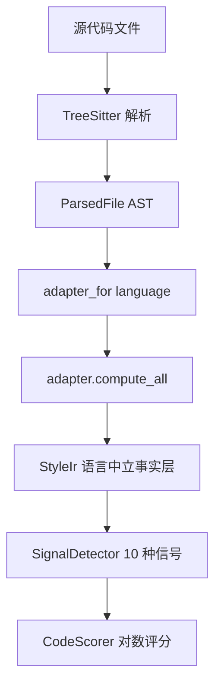

+++
title = "工具的暴政"
date = 2026-06-12
description = "garbage-code-hunter 要分析 11 种语言的代码质量。每种语言有自己的 AST、命名规范、惯用模式。工具怎么避免把所有问题都变成钉子？"
weight = 4
[taxonomies]
tags = ["Rust", "TreeSitter", "Code Quality", "decision-archaeology"]
series = ["decision-archaeology"]
[extra]
series = "decision-archaeology"
+++

# 工具的暴政

> **Problem**: garbage-code-hunter 要分析 11 种语言的代码质量。每种语言有自己的 AST 结构、命名规范、惯用模式。工具怎么避免"把所有问题都变成钉子"？

## 锤子和钉子

你写了一个代码质量分析工具。最初只支持 Rust，所有规则都是 Rust 特有的：`unwrap()` 是坏习惯，`panic!()` 是核弹，`unsafe` 块要审计，单字母变量名是命名灾难。这些规则写死了在检测逻辑里，跑得挺好。

然后需求来了：支持 Python、Go、Java、JavaScript、TypeScript、C、C++、Ruby、Swift、Zig。

问题立刻浮现。`unwrap()` 在 Rust 里是坏习惯，因为它绕过了 `Result` 的错误处理链。但 Python 里没有 `unwrap` 这个概念——Python 的 `try/except` 是标准写法，`bare except` 才是问题。Go 里 `panic()` 是运行时崩溃，但 Go 社区的惯例是用 `error` 返回值，`panic` 只在真正不可恢复的场景使用。

"命名不规范"更复杂。Rust 用 `snake_case`，Go 用 `snake_case` 但导出标识符要大写开头，Java 用 `camelCase`，Python 的类名用 `PascalCase` 但变量用 `snake_case`。同一条规则"检查命名规范"，在 11 种语言里是 11 种完全不同的规则。

如果你把 Rust 的规则直接套到 Python 上，你会得到一堆误报。如果你为每种语言写一套独立的规则，你就有了 11 个工具，没有跨语言可比性。

这是工具的暴政：**你手里有什么锤子，就会把什么问题都看成钉子。**

## LanguageAdapter：每种语言自己定义"什么是问题"

garbage-code-hunter 的解决方案是 `LanguageAdapter` trait。它定义了一组语义方法，每种语言各自实现：

```rust
// src/language/adapter/mod.rs:78-94
pub trait LanguageAdapter: Send + Sync {
    fn language(&self) -> Language;
    fn count_panic_calls(&self, file: &ParsedFile) -> usize;
    fn extract_functions(&self, file: &ParsedFile) -> Vec<FunctionNode>;
    fn max_nesting_depth(&self, file: &ParsedFile) -> usize;
    fn count_naming_violations(&self, file: &ParsedFile) -> usize;
    fn count_deeply_nested_blocks(&self, file: &ParsedFile) -> usize;
    fn count_debug_calls(&self, file: &ParsedFile) -> usize;
    fn count_excessive_params(&self, file: &ParsedFile, threshold: usize) -> usize;
    fn count_unsafe_blocks(&self, file: &ParsedFile) -> usize { 0 }
    fn count_magic_numbers(&self, file: &ParsedFile) -> usize { 0 }
    fn count_goroutine_spawns(&self, file: &ParsedFile) -> usize { 0 }
    fn count_defer_in_loop(&self, file: &ParsedFile) -> usize { 0 }
    // ... ~20 个方法，大部分有默认实现返回 0
}
```

关键设计：**方法名是语义的，实现是语言特定的。** `count_panic_calls` 这个名字表达的是"统计会导致程序崩溃的调用"，但每种语言里"崩溃"的含义不同。

Rust adapter 匹配的是 `.unwrap()` 和 `panic!()` 宏：

```rust
// src/language/adapter/rust.rs:150-175
fn count_panic_from_batch<'a>(
    &self,
    file: &ParsedFile,
    batch: &[Vec<QueryCapture<'a>>],
) -> usize {
    let test_ranges = cfg_test_ranges(&file.content);
    let mut count = 0;
    for m in batch {
        for c in m {
            if (c.name == "pc_method" && c.text == "unwrap")
                || (c.name == "pc_m"
                    && matches!(c.text, "panic" | "assert" | "assert_eq" | "assert_ne"))
            {
                // 排除 #[cfg(test)] 模块里的调用
                let byte_offset = c.node.start_byte();
                if test_ranges.iter().any(|&(s, e)| byte_offset >= s && byte_offset < e) {
                    continue;
                }
                count += 1;
            }
        }
    }
    count
}
```

Python adapter 匹配的是 `bare except` 和 `except BaseException`：

```rust
// src/language/adapter/python.rs:297-320
fn count_panic_from_batch<'a>(
    &self,
    _file: &ParsedFile,
    batch: &[Vec<QueryCapture<'a>>],
) -> usize {
    let mut count = 0;
    for m in batch {
        for c in m {
            if c.name == "pc_clause" {
                if let Some(value) = c.node.child_by_field_name("value") {
                    if let Ok(vtext) = value.utf8_text(_file.content.as_bytes()) {
                        if vtext == "BaseException" || vtext == "Exception" {
                            count += 1;
                        }
                    }
                } else {
                    // bare except — 没有 value 子节点
                    count += 1;
                }
            }
        }
    }
    count
}
```

Go adapter 匹配的是 `panic()` 函数调用：

```rust
// src/language/adapter/go.rs:138-147
fn count_panic_from_batch<'a>(
    &self,
    _file: &ParsedFile,
    batch: &[Vec<QueryCapture<'a>>],
) -> usize {
    batch.iter()
        .filter(|m| m.iter().any(|c| c.name == "pc_fn"))
        .count()
}
```

三种语言，同一个方法名，三种完全不同的匹配逻辑。**adapter 不是翻译层，是语义层。** 它回答的不是"这个语法结构叫什么"，而是"这个行为在当前语言里意味着什么"。

## 三层架构

garbage-code-hunter 的架构分三层，每一层有明确的职责边界。

**第一层：TreeSitter 引擎层** (`src/treesitter/engine.rs`)

通用 AST 解析，11 种语言共享一个 parser cache：

```rust
// src/treesitter/engine.rs:15-17
pub struct TreeSitterEngine {
    parsers: Mutex<HashMap<Language, tree_sitter::Parser>>,
}
```

`Mutex<HashMap<Language, Parser>>` 保证了线程安全——rayon 并行分析时，多个线程可能同时请求不同语言的 parser。引擎层只负责"把源代码变成 AST"，不关心语义。

**第二层：LanguageAdapter 层** (`src/language/adapter/*.rs`)

每种语言一个 adapter 文件，定义"什么算 panic"、"什么算命名违规"、"什么算 debug 调用"。dispatch 逻辑很朴素：

```rust
// src/language/adapter/mod.rs:488-503
pub fn adapter_for(lang: Language) -> Option<&'static dyn LanguageAdapter> {
    match lang {
        Language::Rust => Some(&RustAdapter),
        Language::Python => Some(&PythonAdapter),
        Language::Go => Some(&GoAdapter),
        Language::JavaScript => Some(&JSAdapter),
        Language::Ruby => Some(&RubyAdapter),
        Language::TypeScript => Some(&TSAdapter),
        Language::Java => Some(&JavaAdapter),
        Language::C => Some(&CAdapter),
        Language::Cpp => Some(&CppAdapter),
        Language::Swift => Some(&SwiftAdapter),
        Language::Zig => Some(&ZigAdapter),
        _ => None,
    }
}
```

**第三层：Style IR 层** (`src/style_ir/mod.rs`)

语言中立的事实表示：

```rust
// src/style_ir/mod.rs:57-133
pub struct StyleIr {
    pub language: Language,
    pub line_count: usize,
    pub functions: Vec<FunctionNode>,
    pub panic_call_count: usize,        // Rust: unwrap/panic!, Python: bare except
    pub naming_violation_count: usize,   // 每种语言规则不同
    pub deeply_nested_block_count: usize,
    pub debug_call_count: usize,         // println! / print() / console.log
    pub excessive_param_count: usize,
    pub unsafe_block_count: usize,
    pub magic_number_count: usize,
    pub commented_out_lines: usize,
    pub todo_count: usize,
    pub goroutine_spawn_count: usize,   // Go 专属
    pub defer_in_loop_count: usize,     // Go 专属
    pub go_convention_count: usize,     // Go 专属
    pub python_issue_count: usize,      // Python 专属
    pub java_issue_count: usize,        // Java 专属
    pub ruby_issue_count: usize,        // Ruby 专属
    pub c_issue_count: usize,           // C/C++ 专属
    pub ts_issue_count: usize,          // TypeScript 专属
    pub js_issue_count: usize,          // JavaScript 专属
    pub swift_issue_count: usize,       // Swift 专属
    pub dead_code_count: usize,
    pub duplicate_import_count: usize,
}
```

StyleIr 的设计原则是**存事实，不存判断**。`panic_call_count` 是一个数字，不是"这个代码有问题"的判断。判断留给上层的信号检测系统。



## 批量查询优化

每个 adapter 通过 `query_patterns()` 声明自己的 tree-sitter 查询模式。Rust adapter 有 10 个 pattern，Python adapter 有 9 个，Go adapter 有 10 个。11 种语言加起来大约 100 个 pattern。

如果每个 pattern 单独执行一次 AST 遍历，100 个 pattern 就是 100 次遍历。对于大型项目（几万个文件），这是不可接受的。

解决方案是 `collect_captures_multi`：把同一语言的所有 pattern 合并，在一次 cursor 遍历中收集所有匹配。每个 pattern 的 capture name 加前缀（`pc_` 表示 panic call，`nv_` 表示 naming violation，`dp_` 表示 debug call），避免不同 pattern 之间的命名冲突。

```rust
// src/language/adapter/mod.rs:278-304
fn compute_all(&self, file: &ParsedFile) -> AdapterCounts {
    let batch = self.batch_captures(file);  // 一次遍历，收集所有 pattern 的匹配
    AdapterCounts {
        functions: self.extract_functions_from_batch(file, &batch),
        panic_calls: self.count_panic_from_batch(file, &batch),
        naming_violations: self.count_naming_from_batch(file, &batch),
        deeply_nested_blocks: self.count_deeply_nested_blocks(file),
        debug_calls: self.count_debug_from_batch(file, &batch),
        excessive_params: self.count_excessive_from_batch(file, &batch),
        // ... 所有计数都从同一个 batch 结果里提取
    }
}
```

这个优化把 100 次 AST 遍历变成了 11 次（每种语言一次）。在实际测试中，分析一个包含 5 万行代码的项目，TreeSitter 解析阶段的时间占比从 60% 降到了 25%——因为 adapter 层的查询不再重复遍历 AST。

## 信号检测：从事实到判断

StyleIr 存的是事实，但用户需要的是判断。信号检测系统 (`src/signals.rs`) 负责这个转换。

10 个 `SignalDetector`，每个从 StyleIr 读取事实，输出信号分数：

```rust
// src/signals.rs:138-150
pub enum StyleSignal {
    Duplication,      // 重复代码
    PanicAddiction,   // 恐慌成瘾
    NamingChaos,      // 命名混乱
    NestedHell,       // 嵌套地狱
    HotfixCulture,    // 热修复文化
    OverEngineering,  // 过度工程
    CodeSmells,       // 代码异味
    LegacyCode,       // 遗留代码
    TodoMountain,     // 待办堆积
    LineCountSmell,   // 文件过长
}
```

每个 detector 读取 StyleIr 的一个或多个字段，输出原始违规计数。然后通过密度公式转换为分数：

```rust
// src/signals.rs:82-86
pub fn violations_to_score(count: usize, total_lines: usize) -> f64 {
    let k_lines = (total_lines as f64 / 1000.0).max(0.001);
    let density = count as f64 / k_lines;
    ((density + 1.0).log2() * 6.0).min(25.0)
}
```

这个公式的设计意图是：分数随密度对数增长，上限 25 分。一个 1000 行的文件有 1 个 `unwrap()` 调用，密度是 1.0，分数是 `(1.0 + 1.0).log2() * 6.0 = 6.0`。有 10 个 `unwrap()`，密度是 10.0，分数是 `(10.0 + 1.0).log2() * 6.0 ≈ 20.7`。有 100 个，分数触及 25.0 上限。

**对数函数保证了边际递减：** 从 0 到 1 个问题的分数增长，远大于从 100 到 101 个问题的增长。这避免了"问题数量线性映射到分数"导致的极端情况——一个有 1000 个 `unwrap()` 的 10 万行文件不应该得 1000 分。

多个信号分数组合后，系统会生成一个 StyleProfile，将数字转化为可读的人格特征。当某个信号的分数 >= 12.0 时，它成为主导信号，生成单一人格标签——比如 PanicAddiction 主导时标记为 "The Copy-Paste Artist"，Duplication 主导时标记为 "The YOLO Engineer"。当多个信号都 >= 6.0 但没有单一主导时，系统组合出复合人格，比如 PanicAddiction + HotfixCulture 组合成 "The Startup Survivor"。如果所有信号都低于 6.0，则标记为 "The Enterprise Bureaucrat"——代码没有明显问题，但也缺乏活力。这套推断系统让开发者看到的不是一堆数字，而是一个有性格的代码画像。

## 行业对比

跨语言代码质量分析，行业里有三种主流方案：

| 方案 | 代表 | 优势 | 问题 |
|------|------|------|------|
| 每种语言独立工具 | ESLint + Pylint + Clippy | 各自最优，规则最准 | 无法跨语言比较，报告格式不统一 |
| 统一规则引擎 | SonarQube | 一套规则跑所有语言，部署简单 | 规则粒度粗，误报多，语言特性被抹平 |
| AST 适配器 + 统一 IR | garbage-code-hunter | 跨语言可比，每种语言语义准确 | IR 设计是关键瓶颈，扩展新维度成本高 |

ESLint + Pylint + Clippy 的组合是最精准的，但你无法回答"这个 Rust 项目的代码质量和那个 Python 项目相比怎么样"——因为它们的评分标准完全不同。SonarQube 解决了可比性问题，但代价是规则粒度粗糙：它把所有语言的问题都塞进同一套"Bug / Vulnerability / Code Smell"分类里，丢失了语言特有的语义。

garbage-code-hunter 选择的路线是：**用 adapter 层保留语言语义，用 StyleIr 层建立可比性基础。** `panic_call_count` 在 Rust 里是 `unwrap()` + `panic!()`，在 Python 里是 `bare except`，在 Go 里是 `panic()`——它们都是"程序可能在运行时崩溃"的信号，只是表现形式不同。

这条路的代价是 IR 设计。StyleIr 的 30 个字段不是拍脑袋决定的，每一个都要回答一个问题：这个维度在不同语言里是否有可比的语义？`unsafe_block_count` 只对 Rust 有意义，所以它在 StyleIr 里是一个独立字段，不参与跨语言比较。`panic_call_count` 对所有语言都有意义，所以它是核心字段。

## 如果今天重新设计

考古到这里，有三件事会做得不一样。

**第一，LanguageAdapter trait 应该拆成子 trait。** 当前的 trait 有 ~20 个方法，大部分默认返回 0。Go adapter 不需要 `count_unsafe_blocks`，Rust adapter 不需要 `count_goroutine_spawns`，但它们都被迫实现（或者依赖默认的空实现）。应该拆成 `BaseAdapter + NamingAdapter + SafetyAdapter + ComplexityAdapter + GoSpecificAdapter`，每个 adapter 按需组合。这样新增一种语言时，只需要实现它实际关心的子 trait。

**第二，StyleIr 的字段应该结构化。** 当前 30 个字段是扁平的，没有分组。`go_convention_count`、`python_issue_count`、`java_issue_count` 这些语言专属字段和 `panic_call_count`、`naming_violation_count` 这些通用字段混在一起。应该用嵌套 struct：`naming: NamingFacts`、`safety: SafetyFacts`、`complexity: ComplexityFacts`、`lang_specific: LanguageSpecificFacts`。这样上层代码可以按维度读取，不用在 30 个字段里找自己需要的。

**第三，跨语言可比性需要"语言置信度"。** Python 的 `panic_call_count` 和 Rust 的 `panic_call_count` 真的可比吗？Rust 的 `unwrap()` 是显式选择——开发者写下了 `.unwrap()` 这四个字符。Python 的 `bare except` 可能是疏忽，也可能是有意为之（比如在脚本里快速捕获所有异常）。同一个数字，在不同语言里的"问题严重程度"不同。应该在 IR 层标注一个"语言置信度"系数，让评分系统知道：Rust 的 `panic_call_count = 5` 和 Python 的 `panic_call_count = 5` 不应该得到相同的分数。具体来说，可以为每种语言的 `panic_call_count` 设定一个置信度系数：Rust 的 `unwrap()` 系数为 1.0（显式选择，问题明确），Python 的 `bare except` 系数为 0.7（可能是疏忽，也可能是有意为之），Go 的 `panic()` 系数为 0.9（社区惯例明确，但使用场景多样）。这样，当 Rust 和 Python 的 `panic_call_count` 都是 5 时，评分会分别为 5.0 和 3.5，更准确地反映实际风险。

工具的暴政不在于工具本身，而在于使用者忘记了工具的边界。garbage-code-hunter 的三层架构是一个尝试——用 adapter 层承认每种语言的独特性，用 StyleIr 层建立跨语言的可比性，用信号检测层把事实转化为判断。这个尝试不完美，但它至少问对了问题：**不是"这个代码有没有问题"，而是"在这个语言的语境下，这个行为意味着什么"。**

---

*Next: [危险边界的守卫](@/log/decision-archaeology/05-guarding-dangerous-boundaries.md) -- OmniScope 的 FFI 审计 + memscope-rs 的 Memory Passport：跨语言内存安全的两种守卫方式。*
