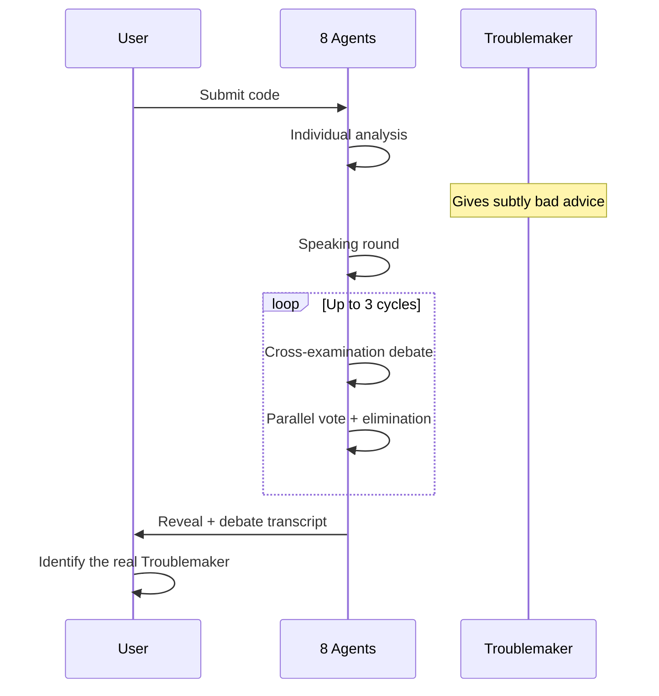

+++
title = "把代码评审变成一场戏"
date = 2026-07-16
description = "ESLint + SonarQube + Semgrep + CodeQL 每天发几十上百条 warning，没人读。CodeTribunal 的解法是反直觉的：往 8 人评审团里塞一个'故意说错话'的 agent（Troublemaker），让其他 agent 交叉质询、投票驱逐它。这篇考古的是——为什么'对抗性'比'一致性'更能让人认真读代码，以及怎么用一个 LLM 造出 8 个会吵架的评审员。"
weight = 15
[taxonomies]
tags = ["Go", "LLM", "Multi-Agent", "Code Review", "CodeTribunal", "decision-archaeology"]
series = ["decision-archaeology"]
[extra]
series = "decision-archaeology"
+++

# 把代码评审变成一场戏

> **Problem**: 你的团队有 ESLint、SonarQube、Semgrep、CodeQL。每个每天都发一堆 warning。没人看。工具在技术上全对，在实践上全被忽略。为什么？

这篇是我最"不正经"的一个项目，但它解决的问题特别真实：**再准的工具，只要人不读，准确率就等于零。** CodeTribunal 干脆放弃"更准"，转去解决"让人愿意读"。

## 先承认：这是注意力问题，不是准确率问题

代码评审工具有个根本缺陷：它们产出**结论，不产出对话**。

一个静态分析工具说："Line 42: potential null pointer dereference." 开发者看一眼 42 行，发现那个 null 分支在上下文里不可能走到，于是关掉警告。工具**无法反驳**，无法解释为什么这个 null 在更大语境里重要，也无法从这次忽略里学到东西。

结果就是 alert fatigue：

> 当每条 finding 都是同样的严重度、同样的格式，开发者就不读了。准确率 99% 的工具，被 1% 的忽略率杀死——因为人根本不点开。

## 如果工具能跟你吵呢

换一个场景。你提交代码给一个评审面板，八个评审员分析它：

- **架构师**说抽象错了；
- **安全守卫**标记一个潜在注入向量；
- **性能老手**质疑算法复杂度；
- **测试怀疑者**说测试覆盖在骗人。

然后安全守卫和性能老手**吵起来**。守卫说注入风险压过性能顾虑，老手反驳"这个注入只可能发生在每小时执行一次的代码路径上"。其他评审员带着证据加入。

这跟 warning 列表本质不同。它是**带证据、带反证、带裁决的结构化分歧**。

## 难点：一个 LLM 怎么造出 8 个会吵架的人

这是整个项目最反直觉的工程点。如果你用同一个 prompt 让 GPT 评审 8 次，你会得到 8 份几乎一样的评审——**LLM 被训练成乐于助人、保持一致，这恰恰是辩论最不需要的东西**。

fine-tune 8 个模型不现实。CodeTribunal 的解法是纯 prompt 工程，每个 persona 用四层约束把 LLM"锁"进角色（`internal/roundtable/persona.go`）：

```go
type PersonaDefinition struct {
    Name        string
    Description string
    Keywords    []string   // 1. 内容焦点：这个角色会注意什么
    OutputRules []string   // 2. 结构约束：JSON 字段、字数上限
    StylePrompt string     // 3. 语气人格：措辞和声音
    Example     string     // 4. few-shot 参考：一个具体示例
}
```

八个角色各有各的偏执：

| Persona | 关注点 | 语气 |
|---|---|---|
| Architect | 抽象、模块化、耦合 | 克制，爱引设计模式 |
| Security Guardian | 注入、鉴权、数据暴露 | 偏执，张口 OWASP |
| Performance Guru | 复杂度、分配、热路径 | 数字驱动，benchmark 脑 |
| Test Skeptic | 覆盖质量、边界、mock | 质疑一切，要证据 |
| DX Advocate | 可读性、命名、API 手感 | 共情，替下一个人着想 |
| Error Philosopher | 错误处理、恢复、韧性 | 对失败模式很哲学 |
| Dependency Watcher | 供应链、版本、传递依赖 | 谨慎，想长期维护 |
| Simplicity Zealot | 过度设计、多余抽象 | 对复杂度冷酷 |

光有 prompt 还不够，输出会跑偏。`ValidatePersonaOutput` 检查输出里命中了几个角色关键词，命中 <2 就用强化 prompt 重试，最多 3 次（`session.go:330`）:

```go
func ValidatePersonaOutput(output string, def PersonaDefinition) bool {
    hitCount := 0
    lower := strings.ToLower(output)
    for _, kw := range def.Keywords {
        if strings.Contains(lower, strings.ToLower(kw)) { hitCount++ }
    }
    return hitCount >= 2  // 至少命中 2 个关键词，否则重试
}
```

一个我很喜欢的取舍：**评审用自由文本，投票用 JSON。** 因为——

> Security Guardian 被强制吐 JSON，就会和其他吐 JSON 的 agent 声音一模一样。结构化输出锁住格式，却杀死人格。所以"评审该像人说话，投票该像机器计票"。

## 往里塞一个"故意说错话"的人

CodeTribunal 走得更远（详见 `04-troublemaker-mechanic` 与 `05-debate-and-voting`）。八个评审员里，**有一个是偷偷藏着的 Troublemaker**——它被指示给出"看起来有用、实则微妙有害"的建议，其他 agent 不知道谁是小人，而且它的伪装策略每局从 5 种里随机挑一个，你学不会固定套路。

初审之后进入**辩论阶段**（`DebateRound`，`session.go:530`）：每个 agent 指控另一个，且被强制引用证据：

```text
When accusing a player, you MUST:
1. Quote their specific statement
2. Reference specific code lines
3. Explain why their advice is wrong or suspicious
4. Provide a counter-argument they should have made
```

没有这条约束，agent 只会含糊地说"Player 3 好像有问题"；有了它，就变成"Player 3 说'错误处理很扎实'，但这函数第 15-20 行根本没有错误处理"。然后**并行投票**（`AIVoteAndEliminate`，`session.go:671`，用 `errgroup` 并发、JSON 结构化）驱逐得票最高者——并行是为了**防止跟风效应**：没有 agent 在投票前看到别人的票。



辩论最多 3 轮（`MaxDebateCycles`），每轮上下文越滚越厚，Troublemaker 越来越难藏。真实的命中分布是：

| 结果 | 概率 |
|---|---:|
| 第 1 轮就被揪出 | ~40% |
| 第 2 轮被揪出 | ~35% |
| 撑过全部 3 轮 | ~25% |

有四分之一的概率它能骗过所有 AI——**这个"骗得过"恰恰是设计的一部分**，因为它逼着最后由你（用户）来做判断。

## 为什么这招管用

三件事让这个反直觉的设计成立：

1. **分歧比一致更有信息量。** 两个 agent 为"这个 finding 是不是真的"吵起来时，争吵本身就在教读者为什么这段代码安不安全。warning 列表给你结论，辩论给你推理。
2. **Troublemaker 制造主动阅读。** 你知道有一个评审员在暗中使坏，于是你逐条较真，不敢自动忽略任何一条。这正好是 alert fatigue 的反面。
3. **游戏产出结构化输出。** 辩论记录不是娱乐，是同一段代码上多种视角 + 证据链 + 反论证的结构化档案，比任何单一工具的报告都有用。

## 它"不是"什么（我得划清边界）

我不想把它吹成银弹，所以明确说清它不干什么：

- 它**不替代**静态分析。它不找 null pointer dereference 或 buffer overflow——那些交给 Semgrep。它工作在另一个层：**代码质量推理**（架构决策、命名、测试策略、安全姿态、性能权衡）。
- 它**不是**生产级评审工具，是一个**思考工具**。它适合"启发思考"，不适合"当裁判"。

## 这个决策欠了什么债

- **成本债**：8 个 LLM 实例 + 多轮辩论 + 投票，token 消耗是单次静态扫描的几十倍。它本就不该用在 CI 的每条 PR 上，而是用在你真正想"想清楚"的时候。
- **不确定性债**：Troublemaker 的"微妙有害"很难拿捏——太明显就成搞笑，太隐蔽就没人发现。这是 prompt 工程里最细的一根针。
- **可复现债**：每轮辩论有随机性，同一段代码两次跑结果可能不同。persona 分配和 Troublemaker 伪装都是随机的，这是特性，不是 bug。
- **解析债**：为了保住人格用了自由文本，代价是 `ParseReviewOutput` 得靠分隔符和正则从自由文本里抠字段——脆弱，但为了真实感值得。

但传统 warning 列表的债更致命：**它产出的结论，被人的忽略率清零了**。CodeTribunal 把"忽略"这件事变得昂贵——因为你知道有人在骗你，你就不敢不读。

## 结论

> 47 条 ESLint warning 没人看，因为结论是平的。我反过来，往评审团里塞一个故意说错话的 agent，逼你逐条较真。一致性让人懈怠，分歧才让人清醒。

传统工具追求"更准的 warning"；CodeTribunal 追求"让人愿意读 warning"。这是两个不同的问题——前者是技术精度，后者是**人类注意力**。大多数团队死在后者上，却一直在优化前者。

这呼应 03「错误是设计的镜子」：系统怎么对待失败，暴露的是设计哲学；CodeTribunal 对待"可能被骗"的方式，是主动制造一场戏，而不是默默列一张没人看的清单。而它那套"多 agent + 随机 + 对抗"的哲学，走到尽头就是下一篇——当"选哪个策略最好"本身没有唯一答案时，干脆让策略自己交配、自己淘汰。

---

*Next: [用遗传算法给 Agent 选策略](@/log/decision-archaeology/16-genetic-algorithm-agent-selection.md) -- 同一套多 agent 哲学走到尽头：当'选哪个策略最好'本身没有唯一答案，让策略自己交配、自己淘汰，比任何手调都诚实。*
