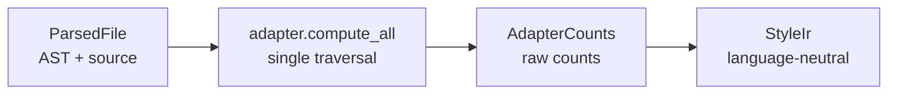
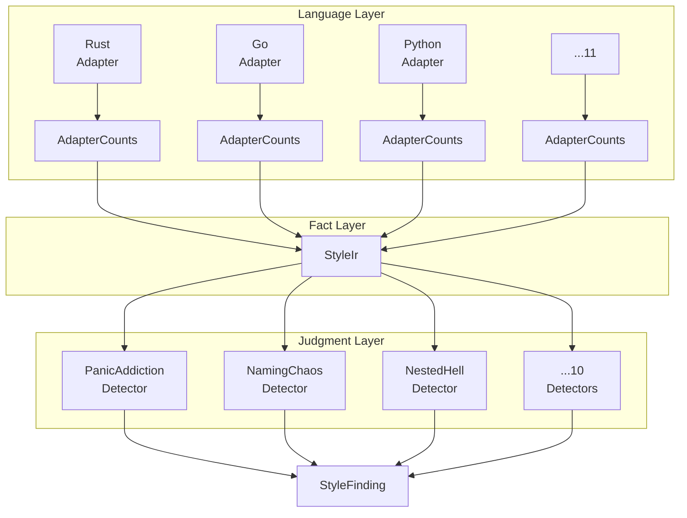

+++
title = "StyleIR: The Language-Neutral Intermediate Representation"
date = 2026-05-27
description = "You have 11 language adapters that each produce raw counts. You have 10 detectors that each need those counts. How do you connect them without coupling detectors to language-specific data structures?"
weight = 36
[taxonomies]
tags = ["Rust", "Code Quality", "Static Analysis"]
series = ["garbage-code-hunter"]
[extra]
series = "garbage-code-hunter"
+++

# StyleIR: The Language-Neutral Intermediate Representation

> **Question**: You have 11 language adapters that each produce raw counts. You have 10 detectors that each need those counts. How do you connect them without coupling detectors to language-specific data structures?

## The Coupling Problem

Consider the `PanicAddictionDetector`. It needs to know how many panic-like calls exist in a file. In Rust, that is `unwrap()` and `expect()`. In Go, that is `panic()`. In Python, that is bare `raise` without a specific exception type.

Without an intermediate layer, the detector would need to either:
1. Query each adapter directly (coupling detector to adapter)
2. Maintain its own tree-sitter queries (duplicating adapter logic)
3. Read raw AST nodes (coupling detector to language grammar)

All three options create tight coupling that breaks when you add language #12.

## StyleIR: Facts, Not Judgments

StyleIR (`src/style_ir/mod.rs`) is a language-neutral fact layer. It stores **counts** — objective measurements extracted by adapters — not **judgments** about whether those counts are problematic.

```rust
// src/style_ir/mod.rs:55-133
pub struct StyleIr {
    pub language: Language,
    pub line_count: usize,
    pub functions: Vec<FunctionNode>,
    pub panic_call_count: usize,
    pub naming_violation_count: usize,
    pub deeply_nested_block_count: usize,
    pub debug_call_count: usize,
    pub excessive_param_count: usize,
    pub unsafe_block_count: usize,
    pub magic_number_count: usize,
    pub commented_out_lines: usize,
    pub todo_count: usize,
    pub goroutine_spawn_count: usize,
    pub defer_in_loop_count: usize,
    pub go_convention_count: usize,
    pub python_issue_count: usize,
    pub java_issue_count: usize,
    pub ruby_issue_count: usize,
    pub c_issue_count: usize,
    pub ts_issue_count: usize,
    pub js_issue_count: usize,
    pub swift_issue_count: usize,
    pub dead_code_count: usize,
    pub duplicate_import_count: usize,
}
```

The key insight: **every field is a `usize`** (or `Vec<FunctionNode>`). There are no language-specific types. A detector reading `ir.panic_call_count` does not know or care whether the panics came from Rust's `unwrap()` or Go's `panic()`.

## Construction: From ParsedFile to StyleIR

The data flow is a three-step pipeline:



The construction happens in `StyleIr::from_parsed()` (`src/style_ir/mod.rs:143-172`):

```rust
pub fn from_parsed(file: &ParsedFile) -> Option<Self> {
    let adapter = adapter_for(file.language)?;       // 1. Get the right adapter
    let counts = adapter.compute_all(file);           // 2. Run batch query
    Some(Self {
        language: file.language,
        line_count: file.content.lines().count(),
        functions: counts.functions,
        panic_call_count: counts.panic_calls,
        naming_violation_count: counts.naming_violations,
        deeply_nested_block_count: counts.deeply_nested_blocks,
        debug_call_count: counts.debug_calls,
        excessive_param_count: counts.excessive_params,
        // ... all counts mapped 1:1
    })
}
```

Three important details:

1. **`adapter_for()` returns `Option`** — if a language has no adapter, `from_parsed()` returns `None`. Callers fall back to legacy rule logic.

2. **`compute_all()` runs once** — the batch query optimization from Article 03 means all counts are extracted in a single AST traversal.

3. **Counts are mapped 1:1** — `AdapterCounts` fields map directly to `StyleIr` fields. No transformation, no filtering. The adapter already did the semantic work.

## Derived Signals: Composite Counts

Some quality signals are not directly measured — they are **derived** from multiple base counts. StyleIR computes these composites:

```rust
// src/style_ir/mod.rs:174-204

/// Functions exceeding the god-function threshold (50 lines).
pub fn god_function_count(&self) -> usize {
    self.functions
        .iter()
        .filter(|f| f.end_line.saturating_sub(f.start_line) > Self::GOD_FUNCTION_LINE_THRESHOLD)
        .count()
}

/// Combined over-engineering signal.
pub fn over_engineering_count(&self) -> usize {
    self.god_function_count() + self.excessive_param_count + self.goroutine_spawn_count
}

/// Combined code-smell signal.
pub fn code_smell_count(&self) -> usize {
    self.unsafe_block_count * 2
        + self.magic_number_count
        + self.go_convention_count
        + self.python_issue_count
        + self.java_issue_count
        + self.ruby_issue_count
        + self.c_issue_count
        + self.ts_issue_count
        + self.js_issue_count
        + self.swift_issue_count
        + self.dead_code_count
        + self.duplicate_import_count
}
```

This is where the "facts, not judgments" philosophy pays off. The `god_function_count()` method is a **judgment** — it decides that 50 lines is the threshold. But the underlying data (function start/end lines) is a **fact** extracted by the adapter. If you want to change the threshold, you change one constant, not 11 adapters.

## FunctionNode: The Richer Data

Not everything fits in a `usize`. Function metadata needs more structure:

```rust
// src/language/adapter/mod.rs:38-44
pub struct FunctionNode {
    pub name: String,
    pub start_line: usize,
    pub end_line: usize,
    pub nesting_depth: usize,
}
```

This gives detectors the ability to ask questions like:
- "Is there a function longer than 50 lines?" (`god_function_count()`)
- "Is there a function with more than 5 parameters?" (via `excessive_param_count`)
- "Is there a deeply nested function?" (via `nesting_depth`)

## The Summary: JSON-Ready Output

For downstream consumers (CI bots, dashboards, the `analyze --json` command), StyleIR produces a stable summary:

```rust
// src/style_ir/mod.rs:207-250
pub fn summary(&self) -> StyleIrSummary {
    StyleIrSummary {
        language: self.language.display_name().to_string(),
        line_count: self.line_count,
        function_count: self.functions.len(),
        god_function_count: self.god_function_count(),
        panic_call_count: self.panic_call_count,
        naming_violation_count: self.naming_violation_count,
        // ... all fields
        is_clean_signal_baseline: self.is_clean_signal_baseline(),
        thresholds: StyleIrThresholdSummary {
            excessive_param_threshold: Self::EXCESSIVE_PARAM_THRESHOLD,
            god_function_line_threshold: Self::GOD_FUNCTION_LINE_THRESHOLD,
        },
    }
}
```

The `is_clean_signal_baseline` field is interesting — it returns `true` when a file has zero violations across all signals. This allows CI pipelines to quickly identify "clean" files without inspecting every count.

## Why Not Use a General AST?

A natural question: why not give detectors access to the full AST and let them extract what they need?

The answer is **separation of concerns**:

| Approach | Pros | Cons |
|----------|------|------|
| Direct AST access | Maximum flexibility | Detectors must understand 11 grammars |
| StyleIR counts | Language-agnostic, fast | Must pre-compute everything detectors need |
| Hybrid (counts + AST) | Best of both | Complex, easy to bypass the abstraction |

garbage-code-hunter chose the pure StyleIR approach because:

1. **Detectors are simple.** A detector is 10-30 lines of code — it reads a count and decides if it is above threshold. No AST walking, no language matching.

2. **Testing is easy.** You can construct a `StyleIr` with known counts and verify detector behavior without parsing real code.

3. **Performance is predictable.** `from_parsed()` does one batch query. No lazy evaluation, no surprise traversals.

4. **Adding languages is free.** New adapters produce the same `AdapterCounts`. Detectors do not change.

The cost is that adding a new quality signal requires touching the adapter trait. In practice, this happens infrequently — the current set of 20+ counts covers all signals used by the 10 detectors.

## How Detectors Consume StyleIR

Here is the `PanicAddictionDetector` (`src/detectors.rs:44-62`):

```rust
impl SignalDetector for PanicAddictionDetector {
    fn signal(&self) -> StyleSignal {
        StyleSignal::PanicAddiction
    }

    fn supported_languages(&self) -> &'static [Language] {
        ADAPTER_LANGUAGES  // all 11 languages
    }

    fn count_violations(&self, file: &ParsedFile) -> usize {
        StyleIr::from_parsed(file)
            .map(|ir| ir.panic_call_count)
            .unwrap_or(0)
    }

    fn count_violations_with_ir(&self, ir: &StyleIr, _file: &ParsedFile) -> usize {
        ir.panic_call_count
    }
}
```

Notice two paths:
- `count_violations()` — constructs a fresh StyleIR (used when no pre-computed IR is available)
- `count_violations_with_ir()` — reads from an existing StyleIR (used in the batch pipeline to avoid redundant computation)

Both return `ir.panic_call_count`. The detector has zero knowledge of Rust, Go, or any language.

## The Architecture in One Diagram



Three layers, each with a clear responsibility:
- **Language Layer**: Adapters absorb grammar-specific knowledge
- **Fact Layer**: StyleIR stores objective counts, language-agnostic
- **Judgment Layer**: Detectors decide what constitutes a problem

---

*Next: [The Signal Detection System](@/log/garbage-code-hunter/05-signal-detection-system.md) — How 10 detectors cover the full spectrum of code smells, and why "fewer rules, stronger signals" beats the alternative.*
