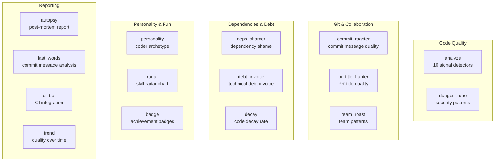
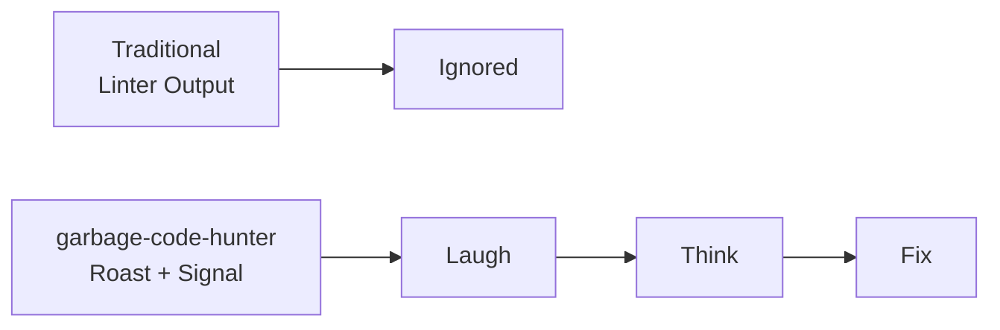

+++
title = "The Fun Side: Roasts, Personality, and the Tool Belt"
date = 2026-05-27
description = "Developers ignore code quality reports. They close linter warnings without reading them. They treat CI checks as gatekeepers, not advisors. How do you make them actually care? By making code analysis fun."
weight = 40
[taxonomies]
tags = ["Rust", "Code Quality", "Static Analysis"]
series = ["garbage-code-hunter"]
[extra]
series = "garbage-code-hunter"
+++

# The Fun Side: Roasts, Personality, and the Tool Belt

> **Question**: Developers ignore code quality reports. They close linter warnings without reading them. They treat CI checks as gatekeepers, not advisors. How do you make them actually care?

## The Engagement Problem

Every code quality tool faces the same problem: **developers do not read the output.**

ESLint output scrolls past in terminal. SonarQube dashboards collect dust. Code review comments about "consider using const instead of let" are resolved without thought.

The problem is not that the tools are wrong. The problem is that they are **boring**. They speak in the language of compliance, not in the language of developers.

garbage-code-hunter takes a different approach: **make it entertaining.**

## 14 Tools, Not Just Code Analysis

garbage-code-hunter is not a single tool — it is a **tool belt** of 14 independent analyzers, each targeting a different aspect of project health:



Each tool runs independently and produces its own score. The `scan` command runs all 14 in parallel:

```rust
// src/main.rs:153-436 (conceptual)
std::thread::scope(|s| {
    s.spawn(|| commit_roaster::run());
    s.spawn(|| deps_shamer::run());
    s.spawn(|| pr_title_hunter::run());
    // ... 11 more tools
});
```

## The Commit Roaster

The `commit_roaster` analyzes git commit messages and rates their quality. It checks for:

- **Vague messages**: "fix stuff", "update", "changes"
- **Missing context**: no issue reference, no explanation of why
- **Too long**: commit messages should be a tweet, not an essay
- **Too short**: "fix" is not a commit message

The output is not a score — it is a **roast**:

> "Your last 50 commits have the literary quality of a shopping list. 'fix bug' is not a commit message — it is a cry for help."

## The Personality System

The `personality` tool maps signal score patterns to developer archetypes (`src/signals.rs:344-382`):

```rust
pub fn infer_personality_type(&self) -> &'static str {
    let dup = self.score(StyleSignal::Duplication);
    let panic = self.score(StyleSignal::PanicAddiction);
    let naming = self.score(StyleSignal::NamingChaos);
    let nested = self.score(StyleSignal::NestedHell);
    let hotfix = self.score(StyleSignal::HotfixCulture);
    let over_eng = self.score(StyleSignal::OverEngineering);

    if dup >= 12.0 && dup >= panic && dup >= naming && dup >= nested {
        return "The Copy-Paste Artist";
    }
    if panic >= 12.0 && panic >= dup && panic >= naming && panic >= nested {
        return "The YOLO Engineer";
    }
    if nested >= 12.0 && nested >= naming && nested >= hotfix {
        return "The Trait Wizard";
    }
    if naming >= 12.0 && naming >= nested {
        return "The Legacy Necromancer";
    }
    if hotfix >= 12.0 {
        return "The Hotfix Mercenary";
    }
    if dup >= 6.0 && panic >= 6.0 {
        return "The Startup Survivor";
    }
    if (naming >= 6.0 && nested >= 6.0) || over_eng >= 12.0 {
        return "The Academic Wizard";
    }
    "The Enterprise Bureaucrat"
}
```

The archetypes:

| Archetype | Dominant Signal | Description |
|-----------|----------------|-------------|
| The Copy-Paste Artist | Duplication | Ctrl+C, Ctrl+V is their IDE |
| The YOLO Engineer | PanicAddiction | `.unwrap()` everywhere, hope for the best |
| The Trait Wizard | NestedHell | Callbacks within callbacks within callbacks |
| The Legacy Necromancer | NamingChaos | `x`, `temp`, `data2`, `final_final_v3` |
| The Hotfix Mercenary | HotfixCulture | `println!` in production, `// TODO: remove this` |
| The Startup Survivor | Duplication + Panic | Move fast, break things, copy-paste the fixes |
| The Academic Wizard | Naming + Nested | Over-engineered abstractions with cryptic names |
| The Enterprise Bureaucrat | (default) | The code works. It is not pretty. It ships. |

This is not just entertainment — it is a **communication tool**. "You are a Copy-Paste Artist" is more memorable than "Your Duplication score is 14.2."

## LLM-Powered Roasts

For users who want more creative feedback, garbage-code-hunter supports **LLM-generated roasts** via Ollama or any OpenAI-compatible API:

```rust
// src/config.rs
pub enum AppConfig {
    Local { /* hardcoded roasts */ },
    Llm {
        provider: LlmProvider,  // Ollama or OpenAI-compatible
        model: String,
        endpoint: String,
    },
}
```

When LLM mode is enabled, the tool sends the analysis results to the LLM and asks it to generate a personalized, humorous critique. The LLM sees:

- The quality score and level
- The top 3 worst signals
- The personality archetype
- Specific code examples from the analysis

The result is a roast that is specific to YOUR code, not a generic template.

## The Badge System

The `badge` tool generates achievement badges for project milestones:

- "Zero Nuclear" — no high-confidence issues
- "Naming Conformist" — naming score below 5
- "Copy-Paste Free" — zero duplication
- "The Refactorer" — improved score by 20+ points

These can be displayed in README badges, CI comments, or team dashboards.

## The Debt Invoice

The `debt_invoice` tool calculates the **estimated cost** of technical debt:

- Each issue is assigned an estimated fix time
- Fix time is multiplied by an average developer hourly rate
- The output is an "invoice" showing how much the technical debt would cost to fix

> "Your technical debt invoice: $47,200. This includes 23 god functions ($18,400), 156 magic numbers ($7,800), and 89 TODO markers ($21,000 at $250/hour for the emotional labor of reading them)."

## Extensibility: Adding New Tools

Adding a new tool to the belt is straightforward:

1. **Create a module** with a `run()` function
2. **Add CLI args** in `src/args.rs`
3. **Add dispatch** in `src/main.rs`
4. **Register in scan** if it should run with `garbage-code-hunter scan`

The tool can use any of the existing infrastructure:
- `TreeSitterEngine` for parsing
- `LanguageAdapter` for language-aware analysis
- `StyleIr` for signal data
- `Reporter` for output formatting
- `RoastProvider` for LLM integration

## Adding a New Language

Adding a new language (e.g., Kotlin) requires:

1. Add `tree-sitter-kotlin` dependency
2. Register parser in `parsers.rs`
3. Add `Language::Kotlin` variant
4. Implement `KotlinAdapter` with `query_patterns()`
5. Register in `adapter_for()`

**Zero changes to detectors, scoring, or tools.** The new language automatically works with all 14 tools.

## Adding a New Detector

Adding a new detector (e.g., `MagicNumberDetector`) requires:

1. Add `StyleSignal::MagicNumber` to the enum
2. Implement `SignalDetector` trait
3. Register in the detector list

**Zero changes to adapters.** The detector reads from `StyleIr`, which already contains `magic_number_count`.

## The Philosophy: Analysis Should Be Fun

garbage-code-hunter is built on a belief: **developers will only care about code quality if the feedback is engaging.**

A dry report saying "47 violations found" does not change behavior. A roast saying "Your code reads like a horror novel — chapter 1: The God Function" makes developers laugh, then think, then fix.

The humor is not decoration — it is the **delivery mechanism** for genuine quality insights. Behind every joke is a real signal. Behind every personality archetype is a real pattern in the code.



The 10 signal detectors provide the substance. The roasts, personalities, and badges provide the engagement. Together, they make code quality analysis something developers actually want to run.

---

*This concludes the series. To get started:*

```bash
cargo install garbage-code-hunter
garbage-code-hunter scan ./your-project
```

*Find out what kind of developer you are.*
