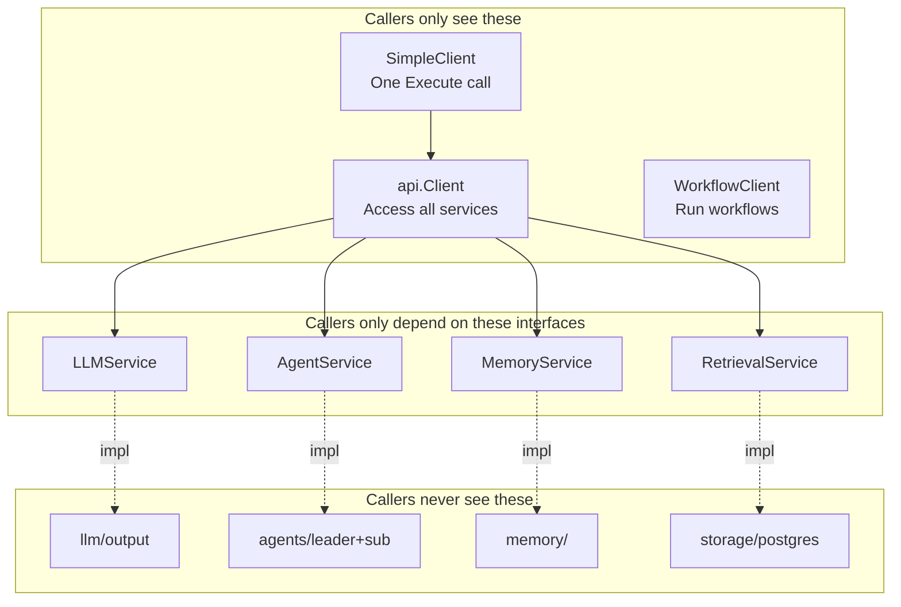

+++
title = "GoAgent Source Deep Dive 01: API Client — Converging Framework Capabilities Into a Usable Entry Point"
date = 2026-05-21
description = "## The Problem: How Should a Framework's Internal Modules Be Called Externally"
weight = 23
[taxonomies]
tags = ["Go", "AI", "LLM"]
series = ["goagent"]
[extra]
series = "goagent"
+++

# GoAgent Source Deep Dive 01: API Client — Converging Framework Capabilities Into a Usable Entry Point

## The Problem: How Should a Framework's Internal Modules Be Called Externally

You've built a multi-agent framework with LLM adapters, task orchestrators, memory managers, vector retrieval, workflow engines — a dozen packages, dozens of interfaces. Now someone wants to use your framework. How do you let them?

The most intuitive approach: let callers directly `import` your internal packages. But problems appear immediately.

## Limitations of Existing Approaches

**Approach A: Expose internal packages directly**

```go
import "github.com/Timwood0x10/goagent/internal/llm/output"
import "github.com/Timwood0x10/goagent/internal/agents/leader"
import "github.com/Timwood0x10/goagent/internal/memory"
```

Problems:
- Rename an internal variable and every caller has to change.
- Callers need to understand internal module topology to assemble a working Agent.
- Can't mock anything in tests — you have to boot the entire internal dependency chain.

**Approach B: Build a massive Facade package**

Cram everything into one package, expose one giant struct.

Problems:
- The struct balloons to hundreds of methods.
- Callers who only need LLM capabilities are forced to depend on Agent, Memory, and Workflow types.
- No layering; changing one service's interface ripples through everything.

Neither approach is a good answer. What GoAgent needs is: **a thin isolation boundary that keeps internal complexity outside, while letting callers depend only on the capabilities they need**.

## GoAgent's Approach

GoAgent uses three-layer Client + service interface isolation:

1. **Service interface layer** (`api/core/`): Defines `LLMService`, `AgentService`, `MemoryService`, `RetrievalService` interfaces. Callers depend on interfaces, not implementations.
2. **Capability layer** (`api.Client`): Holds all service instances, exposes service access through methods.
3. **Entry layer** (`SimpleClient`, `WorkflowClient`): Minimal encapsulation for specific scenarios.

This isn't a "designed architecture" — it's a layering that naturally emerges from the isolation requirement:



Key point: **callers never see any implementation under `internal/`**. Dashed lines mean "implementation relationships are completed inside the api package, invisible to the outside."

## Architecture Naturally Emerges

### Service Interfaces: The Core of Isolation

Interfaces defined in `api/core/` are the linchpin:

```go
// api/core/llm.go
type LLMService interface {
    Generate(ctx context.Context, prompt string, opts ...GenerateOption) (string, error)
    GenerateSimple(ctx context.Context, prompt string) (string, error)
    GenerateEmbedding(ctx context.Context, text string) ([]float64, error)
    GetConfig() *LLMConfig
    IsEnabled() bool
    GetProvider() string
    GetModel() string
}
```

Callers don't know whether it's OpenRouter, Ollama, or OpenAI underneath. This isn't just "wrapping" — it's **dependency inversion**: callers depend on abstract interfaces, implementation details are isolated inside the api package.

### api.Client: The Convergence Point

```go
// api/client.go
type Client struct {
    config    *Config
    llm       LLMService
    agent     AgentService
    memory    MemoryService
    retrieval RetrievalService
    closed    bool
}
```

`Client` does no business logic — only two things:
1. Hold service instances.
2. Expose service access through methods.

### SimpleClient: The Minimal Entry

`SimpleClient` solves the "I just want to call an LLM, not understand the whole framework" need:

```go
// api/client/simple.go:73
func (c *SimpleClient) Execute(ctx context.Context, query string) (string, error) {
    if query == "" {
        return "", errors.New("query cannot be empty")
    }

    llm := c.client.LLM()
    if llm == nil {
        return "", errors.New("LLM service not available")
    }

    prompt := fmt.Sprintf("Please help with: %s", query)
    return llm.GenerateSimple(ctx, prompt)
}
```

**Important clarification**: `SimpleClient.Execute` does NOT enter multi-agent orchestration — it wraps the query into a prompt and calls the LLM directly. This isn't a deficiency, it's design: lowering the barrier and providing full capabilities are two different entry points.

## Design Trade-offs

### Trade-off 1: Manual DI vs Framework DI

GoAgent manually assembles services, no Wire or dig. Cost: slightly more initialization code. Benefit: dependencies are explicitly visible in code, no DI framework magic to understand.

### Trade-off 2: SimpleClient Doesn't Go Through Agent Orchestration

Intentional. Lowering the barrier and providing full capabilities are two different needs that shouldn't be crammed into one entry point.

### Trade-off 3: No Caching at API Layer

Caching strategies are decided by individual internal services. The API layer stays thin and simple, avoiding cache consistency issues spreading across layers.

## Summary

API Client isn't "wrapping HTTP." It's GoAgent's isolation boundary: callers depend on interfaces, not implementations; internal refactoring doesn't affect external integration. Three Client types target different scenarios, enabling progressive adoption. The architecture wasn't pre-designed — it naturally emerged from the isolation requirement.
