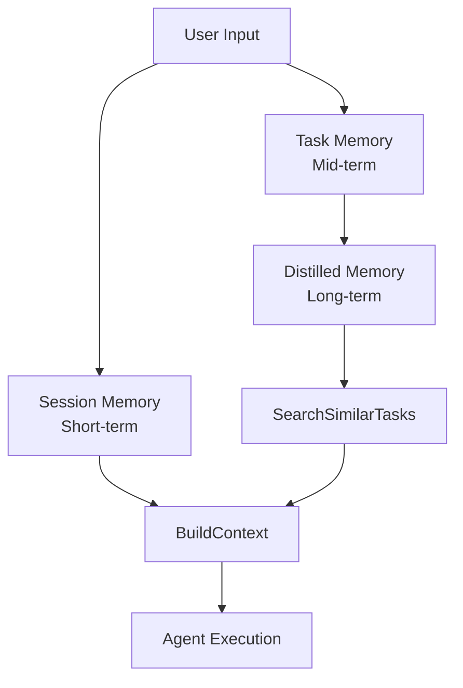
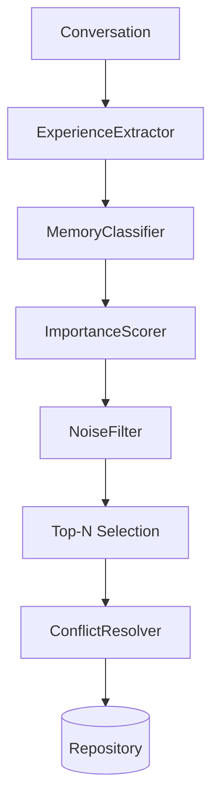

+++
title = "GoAgent Source Deep Dive 05: Memory System — Sessions, Tasks, and Distilled Memories"
date = 2026-05-21
description = "## The Problem: Agents Start From Scratch Every Conversation"
weight = 27
[taxonomies]
tags = ["Go", "AI", "LLM"]
series = ["goagent"]
[extra]
series = "goagent"
+++

# GoAgent Source Deep Dive 05: Memory System — Sessions, Tasks, and Distilled Memories

## The Problem: Agents Start From Scratch Every Conversation

You've built an agent with LLM calls. A user asks "recommend a Go book," and the agent recommends "The Go Programming Language." The user follows up with "is there a Chinese edition?" — the agent has no idea what "Chinese edition" refers to.

LLM calls are stateless. Each request is independent. This means: no conversation context, no task tracking, no experience reuse.

## Limitations of Existing Approaches

**Approach A: Stuff all history into the prompt** — Token cost grows linearly, exceeds context window, doesn't extract reusable knowledge.

**Approach B: Simple key-value cache** — Semantic matches miss, no classification, noise (code blocks, stack traces) gets stored too.

Both lack a **tiered memory architecture**: information at different lifecycles needs different storage and retrieval strategies.

## GoAgent's Approach

Three memory tiers for three time scales:

| Tier | Lifecycle | What | How Used |
|------|-----------|------|----------|
| Session | Current conversation | Multi-turn message history | Build context |
| Task | Current task | Task input/output | Track execution |
| Distilled | Long-term | Extracted experience | Retrieve for similar tasks |

## Architecture Naturally Emerges

### Session Memory

`BuildContext` combines current input with message history. Key designs: TTL cleanup, max history limit, fault tolerance (returns original input on error).

### Distilled Memory Pipeline

Not simple caching — a full pipeline:

**Classifier**: Knowledge, Preference, Interaction, Profile.
**Noise filter**: Code blocks, stack traces, logs, markdown tables.
**Conflict resolver**: Vector similarity detection, keep the more important memory.

## Two Implementations

| Feature | Old (Hash) | New (Distiller) |
|---------|-----------|-----------------|
| Vectors | Hash function | Embedding Service |
| Storage | Memory | PostgreSQL + pgvector |
| Retrieval | Cosine similarity | Vector + BM25 |
| Capacity | 5000 (LRU) | Unlimited |
| Quality | Basic | Full pipeline |

Switchable via `useNewDistill` flag; old method as fallback.

## Summary

Three tiers naturally emerge from three time-scale needs: session for context, task for tracking, distilled for experience. The distillation pipeline's complexity reflects real "experience management" needs — not archiving logs, but extracting, classifying, scoring, filtering, and resolving conflicts.
