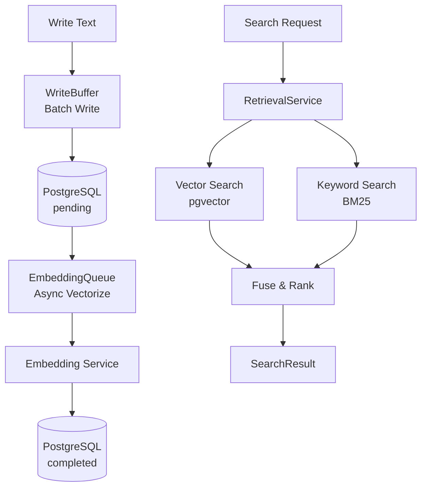
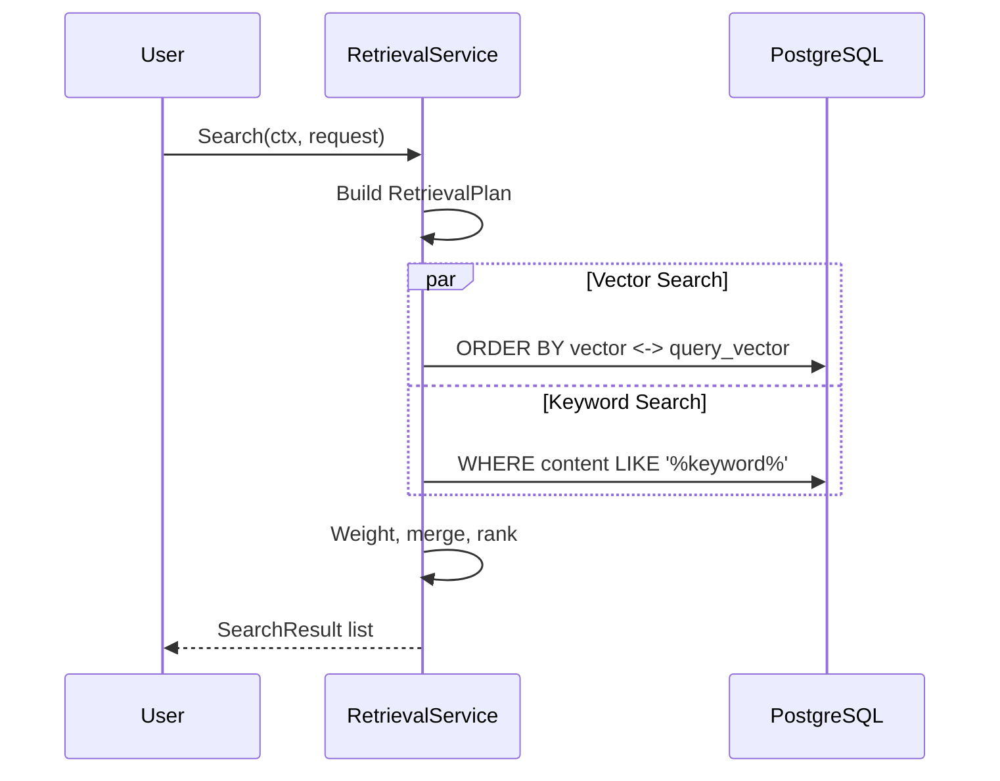

+++
title = "GoAgent Source Deep Dive 08: Storage and Retrieval — PostgreSQL, pgvector, and Hybrid Search"
date = 2026-05-21
description = "## The Problem: Where Do Agent Memories and Knowledge Live"
weight = 30
[taxonomies]
tags = ["Go", "AI", "LLM"]
series = ["goagent"]
[extra]
series = "goagent"
+++

# GoAgent Source Deep Dive 08: Storage and Retrieval — PostgreSQL, pgvector, and Hybrid Search

## The Problem: Where Do Agent Memories and Knowledge Live

Agent conversation history, knowledge base, and distilled experience need persistence. In-memory storage is lost on process restart. You need a database — but storage alone isn't enough. You also need efficient retrieval: "how was a similar problem solved last time" requires vector similarity search; "knowledge containing a keyword" requires full-text search.

## Limitations of Existing Approaches

**SQLite + file storage** — No vector retrieval, no concurrent writes, not production-ready.
**Direct PostgreSQL writes** — High-frequency writes perform poorly; no vectorization pipeline.
**Pure vector databases (Pinecone, Weaviate)** — External dependency, no relational queries, can't do structured + semantic retrieval simultaneously.

## GoAgent's Approach

PostgreSQL + pgvector as unified storage, with four capability layers:

1. **Connection pool**: Connection management with timeout and reuse.
2. **WriteBuffer**: Batch writes, content-hash dedup, graceful shutdown.
3. **EmbeddingQueue**: Async vectorization, idempotent dedup, dead letter queue.
4. **RetrievalService**: Hybrid search (vector + BM25), query rewriting, time decay, multi-source fusion.

## Architecture Naturally Emerges

### WriteBuffer

Buffers high-frequency writes, flushes on batchSize or flushInterval. Content-hash dedup prevents duplicate entries. `safeSend` uses `recover()` to handle write-on-closed-channel races.

### EmbeddingQueue

Async vectorization pipeline: text → DB (pending) → EmbeddingQueue → Embedding Service → DB (completed). Dedupe key ensures idempotency, dead letter queue handles repeated failures, reconciliation periodically retries pending records.

### RetrievalService: Hybrid Search

## Design Trade-offs

- **WriteBuffer vs direct write**: Batch + timer flush balances throughput and latency.
- **Hybrid vs pure vector**: Semantic + exact match, but more complexity. RetrievalPlan lets callers choose.
- **Async vs sync vectorization**: Writes don't wait; retrieval degrades to keyword search if vectors aren't ready.

## Summary

Storage and Retrieval isn't "just connect to a database." Connection pool, repository, batch writes, async vectorization, hybrid search, multi-tenant isolation — together they form the agent's knowledge infrastructure. Architecture naturally emerged from "where do memories live and how are they retrieved."
