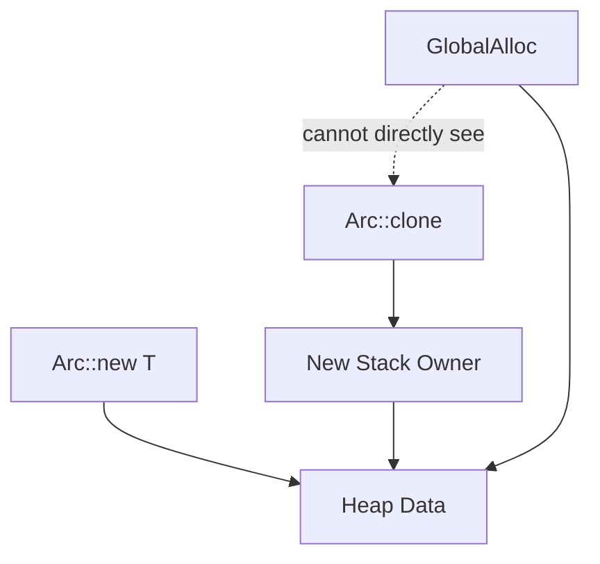
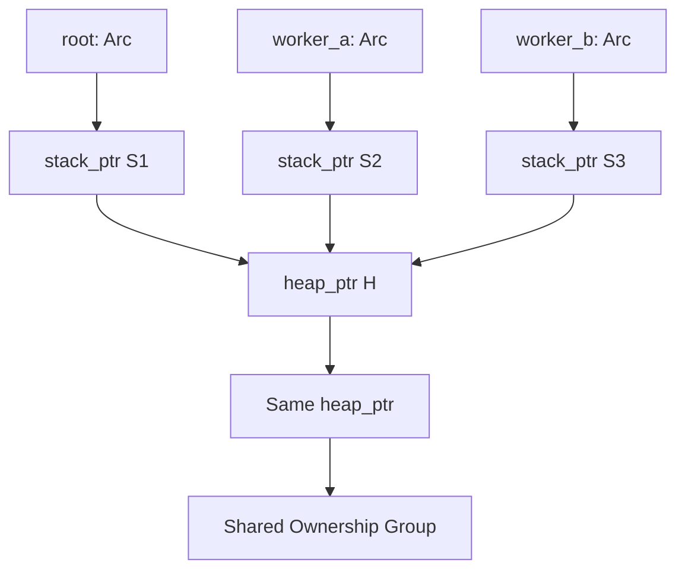
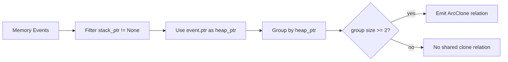
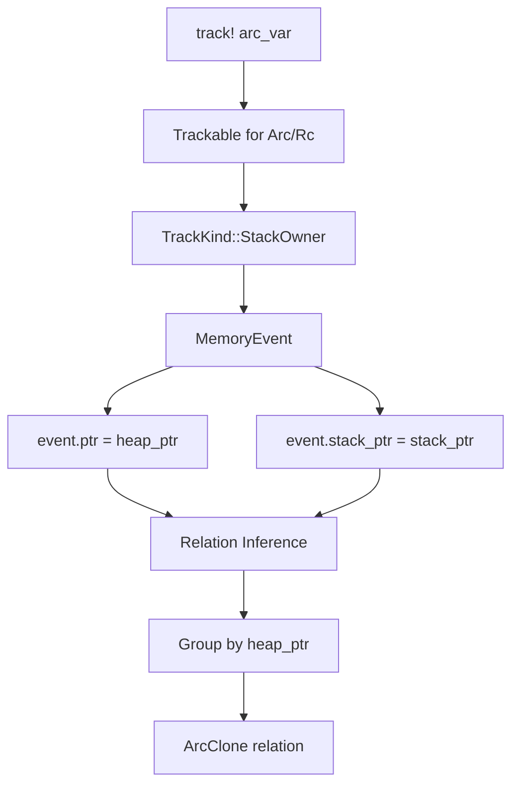

+++
title = "Arc/Rc Clone Detection: Why `StackOwner` Matters"
date = 2026-05-20
description = "Arc<T> and Rc<T> are safe Rust abstractions, but they make ownership harder to observe."
weight = 4
[taxonomies]
tags = ["Rust", "memscope-rs"]
series = ["memscope-rs"]
[extra]
toc = true
series = "memscope-rs"
+++

# Arc/Rc Clone Detection: Why `StackOwner` Matters

`Arc<T>` and `Rc<T>` are safe Rust abstractions, but they make ownership harder to observe.

Cloning an `Arc` or `Rc` usually does not allocate a new user object. It creates another smart pointer that shares ownership of the same heap data.

From a Rust perspective, ownership fan-out changed. From a raw allocator perspective, very little may have happened.

`memscope-rs` addresses this with the `StackOwner` model.

---

## 1. Why Arc/Rc Are Hard to Observe

Consider:

```rust
let root = Arc::new(vec![1, 2, 3]);
let worker_a = Arc::clone(&root);
let worker_b = Arc::clone(&root);
```

Allocator-level tracking may only see the original heap allocation. But logically there are now three smart pointer values sharing the same data.



The question is not just “where was memory allocated?” but:

> Which tracked smart pointers point to the same heap object?

---

## 2. The Key Insight: Arc/Rc Are Stack Owners

`Arc<T>` and `Rc<T>` are smart pointer values. The smart pointer value has its own address, and it points to heap data.

`memscope-rs` models this as:

```rust
TrackKind::StackOwner {
    ptr: stack_ptr,
    heap_ptr,
    size,
}
```

The full `TrackKind` enum includes:

```rust
pub enum TrackKind {
    HeapOwner { ptr: usize, size: usize },
    Container,
    Value,
    StackOwner { ptr: usize, heap_ptr: usize, size: usize },
}
```

The important distinction is:

- `stack_ptr` identifies the smart pointer value;
- `heap_ptr` identifies the shared heap data.

---

## 3. `Arc<T>` as `Trackable`

The `Arc<T>` implementation records both pointers:

```rust
impl<T> Trackable for std::sync::Arc<T> {
    fn track_kind(&self) -> TrackKind {
        let stack_ptr = self as *const _ as usize;
        let heap_ptr = &**self as *const T as usize;

        TrackKind::StackOwner {
            ptr: stack_ptr,
            heap_ptr,
            size: std::mem::size_of::<T>(),
        }
    }

    fn get_type_name(&self) -> &'static str {
        "Arc<T>"
    }

    fn get_ref_count(&self) -> Option<usize> {
        Some(std::sync::Arc::strong_count(self))
    }
}
```

`Rc<T>` uses the same model:

```rust
impl<T> Trackable for std::rc::Rc<T> {
    fn track_kind(&self) -> TrackKind {
        let stack_ptr = self as *const _ as usize;
        let heap_ptr = &**self as *const T as usize;

        TrackKind::StackOwner {
            ptr: stack_ptr,
            heap_ptr,
            size: std::mem::size_of::<T>(),
        }
    }

    fn get_ref_count(&self) -> Option<usize> {
        Some(std::rc::Rc::strong_count(self))
    }
}
```

This does not read private `ArcInner` or `RcBox` layout. It uses the smart pointer’s observable relationship to the data it dereferences.

---

## 4. Event Recording for `StackOwner`

When `track!` sees a `StackOwner`, it records the heap pointer as the event pointer and stores the stack pointer in metadata:

```rust
TrackKind::StackOwner {
    ptr: stack_ptr,
    heap_ptr,
    size,
} => {
    self.inner.track_allocation(stack_ptr, size);

    let mut event = MemoryEvent::allocate(heap_ptr, size, thread_id);
    event.var_name = Some(name.to_string());
    event.type_name = Some(type_name.clone());
    event.source_file = Some(file.to_string());
    event.source_line = Some(line);
    event.module_path = Some(module_path.to_string());
    event.stack_ptr = Some(stack_ptr);

    self.event_store.record(event);
}
```

This gives the analysis layer enough information to see:

```text
root      stack_ptr = S1, heap_ptr = H
worker_a  stack_ptr = S2, heap_ptr = H
worker_b  stack_ptr = S3, heap_ptr = H
```



---

## 5. Detection Strategy: Group by `heap_ptr`

The relation detector looks for records with `stack_ptr` metadata and groups them by heap pointer.

Simplified:

```rust
let mut stack_owners: Vec<(usize, usize)> = Vec::new();

for (i, record) in records.iter().enumerate() {
    if let Some(stack_ptr) = record.stack_ptr {
        if stack_ptr > 0x1000 {
            stack_owners.push((i, record.ptr));
        }
    }
}

let mut heap_to_records: HashMap<usize, Vec<usize>> = HashMap::new();

for (record_id, heap_ptr) in stack_owners {
    heap_to_records.entry(heap_ptr).or_default().push(record_id);
}

for (_heap_ptr, record_ids) in heap_to_records {
    if record_ids.len() >= 2 {
        for i in 0..record_ids.len() {
            for j in (i + 1)..record_ids.len() {
                relations.push(RelationEdge {
                    from: record_ids[i],
                    to: record_ids[j],
                    relation: Relation::ArcClone,
                });
            }
        }
    }
}
```



---

## 6. Why This Avoids Fragile Layout Assumptions

Some approaches to smart pointer analysis might try to inspect internal layout:

- strong count offset;
- weak count offset;
- data pointer offset;
- Rust-version-specific implementation details.

`memscope-rs` avoids that.

It does not need to know the internal layout of `ArcInner<T>`. It only needs to observe that multiple tracked smart pointer values point to the same heap data.

This is a practical design choice, not a perfect compiler-level ownership trace.

---

## 7. Example

```rust
use memscope_rs::{global_tracker, init_global_tracking, track, MemScopeResult};
use std::sync::Arc;

fn main() -> MemScopeResult<()> {
    init_global_tracking()?;
    let tracker = global_tracker()?;

    let root = Arc::new(vec![1, 2, 3, 4]);

    let worker_a = Arc::clone(&root);
    let worker_b = Arc::clone(&root);

    track!(tracker, root);
    track!(tracker, worker_a);
    track!(tracker, worker_b);

    tracker.export_json("MemoryAnalysis/arc_clone_demo")?;
    tracker.export_html("MemoryAnalysis/arc_clone_demo")?;

    Ok(())
}
```

The important part is that each clone must be explicitly tracked if it should appear as a `StackOwner` record.

---

## 8. What This Can Detect

The current implementation can detect:

- multiple tracked `Arc<T>` values pointing to the same heap data;
- multiple tracked `Rc<T>` values pointing to the same heap data;
- observed shared ownership fan-out;
- `ArcClone` relation candidates in the relation graph;
- a basis for later clone-storm or cycle analysis.

The careful description is:

> It detects observed shared ownership among tracked `StackOwner` values.

---

## 9. What This Cannot Detect

It cannot guarantee detection of:

- clones that were never passed to `track!`;
- the exact call site of every clone;
- every strong count change;
- short-lived smart pointer values that were not tracked;
- complete borrow/move semantics;
- foreign or custom reference-counted objects.

There is also a practical implementation note: a `track_clone!` macro exists, but the current main reliable path is `track!` → `StackOwner` → relation inference. The article should not present `track_clone!` as the primary clone detection path unless its event recording path is verified.

---

## 10. Performance Claims

The clone relation itself is reconstructed during post-analysis by grouping records with the same heap pointer.

Runtime overhead mainly comes from explicitly tracking `Arc/Rc` variables as `StackOwner` events.

The benchmark suite contains general tracking benchmarks, but not a standalone benchmark isolating `StackOwner` grouping. Performance claims should therefore stay conservative.

---

## 11. Summary

`StackOwner` matters because it maps shared ownership into observable runtime data:

```text
smart pointer value -> stack_ptr
shared heap object  -> heap_ptr
multiple stack_ptrs -> same heap_ptr
```



This is not perfect ownership tracing. It is a clear, explainable, and useful model for observing shared ownership in Rust programs.

