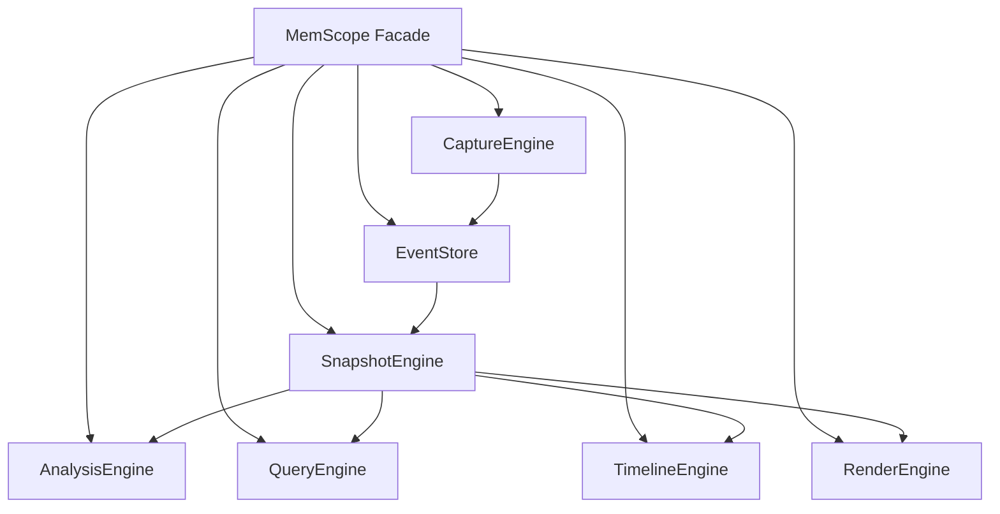

+++
title = "Architecture Deep Dive: From Facade to Event Store, Snapshot, Analysis, and Render"
date = 2026-05-21
description = "`memscope-rs` is not a single monolithic tracker. The project is organized as a set of connected engines:"
weight = 11
[taxonomies]
tags = ["Rust", "memscope-rs"]
series = ["memscope-rs"]
[extra]
toc = true
series = "memscope-rs"
+++

# Architecture Deep Dive: From Facade to Event Store, Snapshot, Analysis, and Render

`memscope-rs` is not a single monolithic tracker. The project is organized as a set of connected engines:

- capture;
- event storage;
- metadata;
- snapshot construction;
- query;
- analysis;
- timeline;
- rendering.

This article explains the architecture as it exists in the source code, not as a marketing diagram.

The main idea is:

> capture memory events once, store them centrally, then build snapshots, analysis views, exports, and dashboards from that event stream.

---

## 1. The Facade Layer

The `MemScope` facade wires the major engines together.

The source structure is explicit:

```rust
pub struct MemScope {
    pub event_store: Arc<EventStore>,
    pub capture: Arc<CaptureEngine>,
    pub metadata: Arc<MetadataEngine>,
    pub snapshot: Arc<SnapshotEngine>,
    pub query: Arc<QueryEngine>,
    pub analysis: Arc<Mutex<AnalysisEngine>>,
    pub timeline: Arc<TimelineEngine>,
    pub render: Arc<RenderEngine>,
}
```

The facade exists to provide a unified entry point, but the internals remain modular.



This architecture is useful because it separates event collection from analysis and presentation.

---

## 2. CaptureEngine: Backend Abstraction

`CaptureEngine` is responsible for turning allocation operations into `MemoryEvent`s and sending them to `EventStore`.

Its key fields are:

```rust
pub struct CaptureEngine {
    backend: Box<dyn CaptureBackend>,
    event_store: SharedEventStore,
}
```

The allocation path is simple:

```rust
pub fn capture_alloc(&self, ptr: usize, size: usize, thread_id: u64) {
    let event = self.backend.capture_alloc(ptr, size, thread_id);
    self.event_store.record(event);
}
```

The backend abstraction supports different capture strategies:

- `Core`
- `Lockfree`
- `Async`
- `Unified`

The important point is that capture does not own the data. It forwards events into a shared event stream.

---

## 3. EventStore: The Central Event Stream

The `EventStore` is the central storage layer:

```rust
pub struct EventStore {
    queue: SegQueue<MemoryEvent>,
    cache: RwLock<Vec<MemoryEvent>>,
    count: AtomicUsize,
    clearing: AtomicUsize,
}
```

Recording is queue-based:

```rust
pub fn record(&self, event: MemoryEvent) {
    if self.clearing.load(Ordering::Acquire) != 0 {
        return;
    }

    self.queue.push(event);
    self.count.fetch_add(1, Ordering::Release);
}
```

Snapshotting flushes the queue into the cache:

```rust
fn flush_to_cache(&self) {
    let mut cache = self.cache.write();
    while let Some(event) = self.queue.pop() {
        cache.push(event);
    }
}
```

This is not a pure append-only immutable log. It is a practical event store with a queue, cache, count, and clear coordination.

---

## 4. SnapshotEngine: Reconstructing State from Events

The `SnapshotEngine` builds point-in-time views from `EventStore`.

```rust
pub struct SnapshotEngine {
    event_store: SharedEventStore,
}
```

Its main method reads all events and constructs a snapshot:

```rust
pub fn build_snapshot(&self) -> MemorySnapshot {
    let events = self.event_store.snapshot();
    build_snapshot_from_events(&events)
}
```

This is important architecturally:

> snapshots are derived from events; they are not the primary source of truth.


---

## 5. RenderEngine: Output as a Separate Concern

`RenderEngine` consumes snapshots and renders output.

It has a registry of renderers:

```rust
pub struct RenderEngine {
    snapshot_engine: SharedSnapshotEngine,
    renderers: Vec<Box<dyn Renderer>>,
}
```

By default, it registers a JSON renderer:

```rust
let mut engine = Self {
    snapshot_engine,
    renderers: Vec::new(),
};

engine.register_renderer(Box::new(JsonRenderer));
```

This separation means rendering can evolve without changing capture or event storage.

---

## 6. GlobalTracker vs MemScope

The project has both a lower-level facade architecture and a higher-level global tracker path.

The `GlobalTracker` path is used by many examples and exposes convenience methods such as:

- `track_as()`
- `create_passport()`
- `record_handover()`
- `export_json()`
- `export_html()`

This is convenient, but it also means there are multiple entry points into the system. Articles and documentation should be clear about which path they describe.

---

## 7. Known Architectural Tradeoffs

### Strengths

- Capture and analysis are decoupled.
- Events are centralized.
- Snapshot construction is derived from events.
- Rendering/export is separate from tracking.
- Multiple backends can share the same event model.

### Tradeoffs

- Some paths use global state.
- Some components use `Mutex` internally.
- There are multiple APIs (`Tracker`, `GlobalTracker`, `MemScope`) that can confuse users if not documented clearly.
- Some conversion paths use placeholder values, such as reconstructing `ThreadId` from `u64` being impossible.

The architecture is practical and modular, but it is not minimal.

---

## 8. Summary

The core architecture can be summarized as:

```text
Capture -> EventStore -> Snapshot -> Analysis / Query / Render
```

`memscope-rs` is strongest when this event-driven architecture is kept clear. Runtime events should remain the source of truth; everything else should be understood as a derived view or analysis layer.

