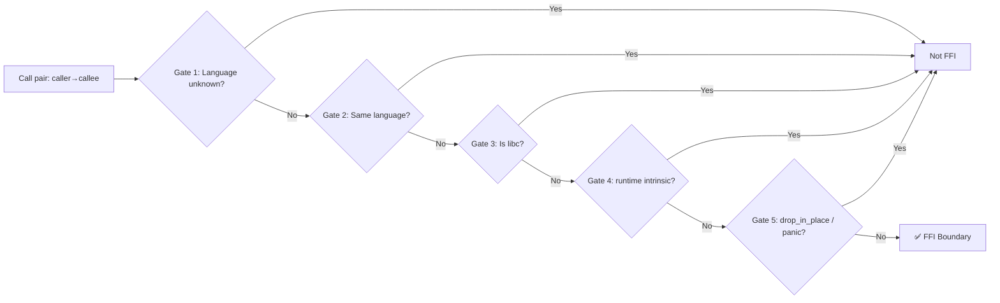
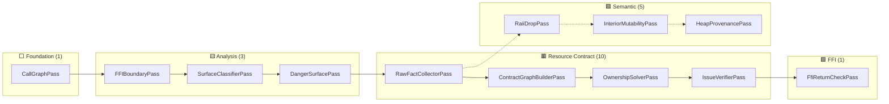
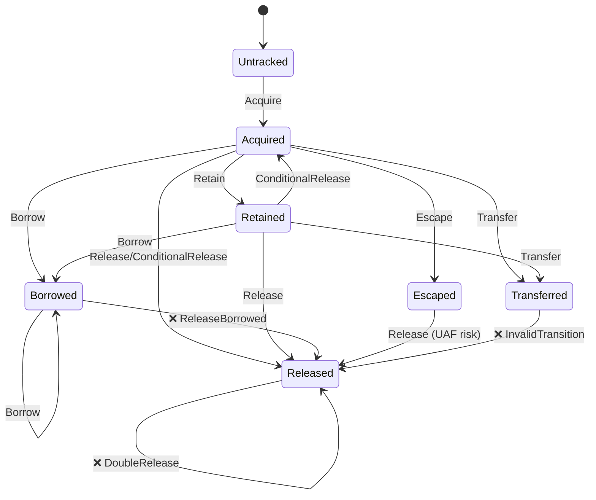
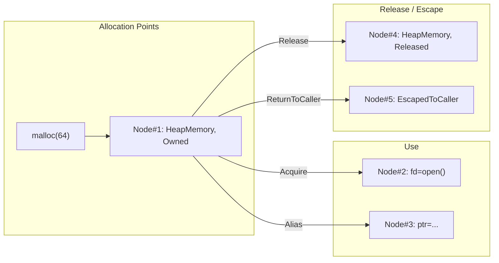
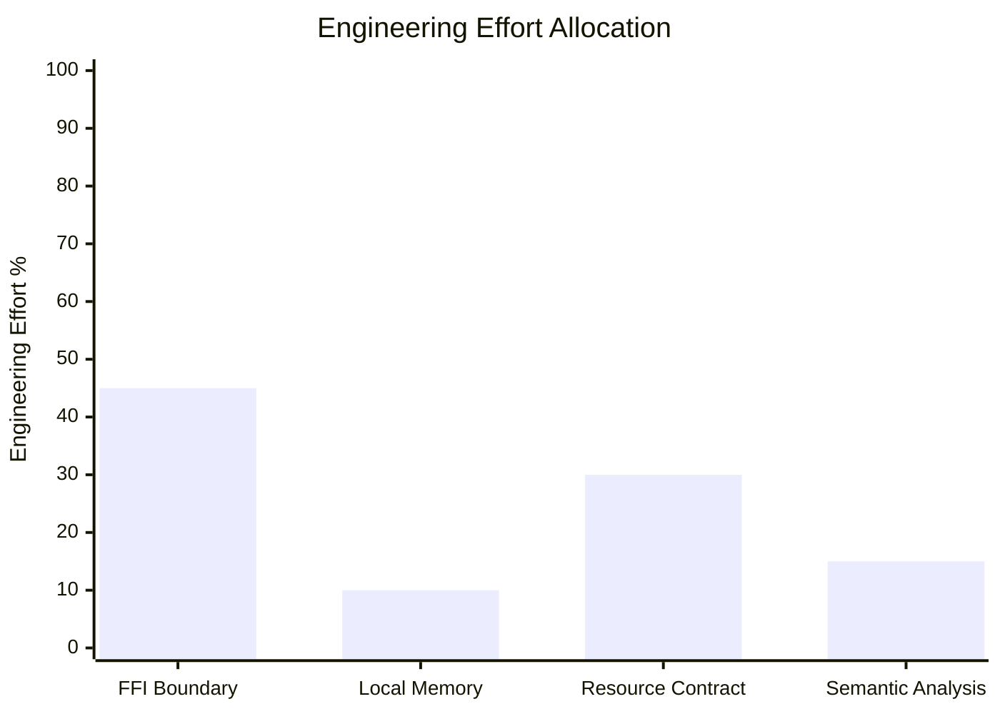

+++
title = "Why OmniScope — Cross-language FFI Safety Analysis: Call Graphs, State Machines, Semantic Trees, This Combo Took Two Years"
date = 2026-06-20
description = "The origin story of OmniScope-rs — the Rust rewrite of OmniScope. Why the Zig prototype wasn't enough, what changed in the Rust rewrite, and what 21 analysis passes reveal about cross-language memory safety."
weight = 50
[taxonomies]
tags = ["Rust", "LLVM", "FFI", "Static Analysis", "Memory Safety"]
series = ["omniscope-rs"]
[extra]
series = "omniscope-rs"
+++

# Why OmniScope — Cross-language FFI Safety Analysis: Call Graphs, State Machines, Semantic Trees, This Combo Took Two Years

> It started with me staring blankly at Rust's `CString::into_raw`.
>
> After that pointer is sent out, who is supposed to free it? Rust's allocator? C's `free`? Or some third-party library I've never even heard of?
>
> Nobody tells you. The compiler won't complain. Tests won't crash — until production.

---

## Prologue & Background

Let me be honest up front. I'm not some security research guru — I'm just a backend engineer.

Anyone doing backend work in the last two years knows this one truth: **no project is truly single-language anymore.** You write impeccable Rust, but you still call C libraries underneath. Your Go code is elegant, but FFI calls into C libraries crash just the same. Python data science projects are powered by C-heavy numpy/pandas under the hood.

Multi-language hybrid development has become the norm. But what about our toolchain?

- CI runs `cargo check` — OK
- CI runs `go vet` — OK
- CI runs `pylint` — OK
- What about the **cross-language boundary?** — **Nobody checks.**

## Why Hasn't Anyone Solved This?

I started out naive — surely someone must have solved this, right?

I surveyed the landscape, and the results were disappointing:

| Tool | What It Can Do | What It Can't Do |
|------|---------------|------------------|
| Valgrind + ASan | Runtime memory error detection | Can't cover all paths, slow in CI, needs test coverage |
| Clang Static Analyzer | Pure C/C++ static analysis | Doesn't understand Rust's `Box::into_raw` semantics |
| Rust `cargo miri` | Rust-internal MIR-level analysis | Can't see FFI-called C functions |
| Coverity / CodeQL | General-purpose static analysis | Almost no cross-language boundary rules out of the box |
| Manual Code Review | Can find issues | Who has that kind of headcount? |

The closest thing I found was a research tool called **CryptoGuard**, but it only checks crypto API compliance.

**I wanted one thing: give me the IR of a .so or .dll, and tell me if there's a cross-language memory problem.**

Nothing. Not a single tool.

## So I Rolled My Own

> I've always believed the best way to learn is to build your own wheel.
> Not because wheels aren't good enough — because after you build one, you'll never get stuck by one again.

When I made this decision, I had serious doubts. Cross-language security analysis is niche even in academia. In industry? People rely on "write more tests" and "run Valgrind."

But then I thought: **tests only cover scenarios you think of. Static analysis catches scenarios you haven't imagined.** That's why we need it.

## The Call Graph — Foundation of All Analysis

The first step in any security analysis is: **who calls whom?**

This sounds simple, but in a cross-language scenario, you need to track not just same-language call relationships, but also identify **cross-language call boundaries** — that is, FFI calls.

CallGraphPass is the first Pass registered in the pipeline. Without it, no other Pass can run.

```rust
/// crates/omniscope-pass/src/analysis/call_graph.rs (lines 1-417)
/// Foundation pass, no dependencies.
pub struct CallGraphPass;

impl Pass for CallGraphPass {
    fn name(&self) -> &str { "CallGraphPass" }
    fn dependencies(&self) -> &[&str] { &[] }  // no deps
    // ...
}
```

### Two-Phase Construction

Call graph construction proceeds in two phases:

**Phase 1: Node Building.** Iterate over all function metadata in ModuleIndex, creating a `CallGraphNode` for each function — containing the function name, parameter list, and whether it's a declaration.

**Phase 2: Edge Building.** Iterate over all `call` instructions (call_metas) within every function body, establishing call edges. Simultaneously detect FFI boundary calls.

```rust
// call_graph.rs core build logic (simplified)
fn build(&self, ctx: &PassContext) {
    // Phase 1: Build nodes from function metadata
    for func_meta in ctx.module_index.function_metas() {
        let kind = classify_function(&func_meta.name, func_meta.is_declaration, func_meta.language);
        let node = CallGraphNode::new(func_meta, kind);
        ctx.store("call_graph_nodes", node);
    }

    // Phase 2: Build edges + detect FFI boundaries
    for call in ctx.call_metas() {
        // Direct call edge
        ctx.store("call_graph_edges", CallGraphEdge::new(call.caller, call.callee));

        // FFI boundary check
        if is_ffi_boundary(call.caller, call.callee, caller_lang, callee_lang) {
            ctx.store("cross_lang_edges", CrossLangEdge::new(call));
        }
    }
}
```

The entire build process is O(n + e), where n = number of functions and e = number of call edges. For most projects, this completes in tens of milliseconds.

### classify_function: Four Gates

Function classification was my first pitfall. I naively thought: if a function name contains C keywords, it must be a C function. Until I realized that Rust's standard library also calls `malloc`.

The final `classify_function` uses four gates:

```rust
fn classify_function(name: &str, is_declaration: bool, language: Language) -> FunctionKind {
    // Gate 1: Is it a libc function?
    if is_libc(name) { return FunctionKind::LibC; }

    // Gate 2: Is it a known dangerous function?
    if is_dangerous(name) { return FunctionKind::ExternalUnknown; }

    // Gate 3: Is it a runtime intrinsic? (e.g. memset, memcpy)
    if is_runtime_intrinsic(name, language) { return FunctionKind::ExternalUnknown; }

    // Gate 4: Is it defined in this module? (has a body)
    if !is_declaration { return FunctionKind::Internal; }

    // Fallback: external, unknown
    FunctionKind::ExternalUnknown
}
```

Gates 1-3 are fast rejections — these functions don't need deep analysis because they're either standard library (known behavior) or dangerous boundary functions. **Only Internal functions are what we truly analyze.**

### is_ffi_boundary: Five-Gate Filter

FFI boundary detection is more nuanced than function classification. I initially tried using language detection alone — if caller and callee have different languages, it's an FFI boundary. But that produced too many false positives.

The final five-gate filter:



```rust
fn is_ffi_boundary(caller, callee, caller_lang, callee_lang) -> bool {
    if caller_lang == Language::Unknown || callee_lang == Language::Unknown { return false; }
    if caller_lang == callee_lang { return false; }
    if is_libc(callee) { return false; }
    if is_runtime_intrinsic(callee, callee_lang) { return false; }
    if callee.contains("drop_in_place") || callee.contains("panic") { return false; }
    true
}
```

Why so conservative? Because **it's better to miss an FFI boundary than to contaminate the entire analysis by mistaking intra-language calls as FFI.**

## 21 Analysis Passes: Five-Stage Pipeline

The call graph is just the first step. Real analysis requires 21 Passes working in concert.

```
Pipeline.register_default_passes() registration order:

Foundation (1):   CallGraphPass
Analysis   (3):   FFIBoundaryPass, SurfaceClassifierPass, DangerSurfacePass
Resource   (10):  RawFactCollectorPass → IRBehaviorSummaryPass → LanguageAdapterFactPass
                   → AbiLayoutPass → SummaryBuilderPass → StructuralInferencePass
                   → ContractGraphBuilderPass → OwnershipSolverPass
                   → CrossFunctionLifetimePass → IssueCandidateBuilderPass
                   → IssueVerifierPass → LeakDetectionPass
Semantic   (5):   RaiiDropPass → InteriorMutabilityPass → HeapProvenancePass
                   → BorrowEscapePass → WriteToImmutablePass
FFI        (1):   FfiReturnCheckPass
```

Why split 21 Passes so finely? Because each Pass is responsible for one **independently testable, independently optimizable, independently replaceable** analysis step.



**Stage 1: Foundation** builds the call graph — the skeleton for all analysis.
**Stage 2: Analysis** annotates the call graph — which calls are FFI boundaries, which are dangerous functions.
**Stage 3: Resource Contract** is the core analysis — tracking complete resource lifecycles.
**Stage 4: Semantic** suppresses false positives using semantic knowledge — RAII drop shouldn't report use-after-free.
**Stage 5: FFI Check** performs final verification — nullability of FFI return values.

### Effect: Atomic Vocabulary

Before diving into Passes, you need to understand a core concept: **Effect**. It is OmniScope's "atomic vocabulary."

```rust
/// crates/omniscope-types/src/effect.rs (lines 1-354)
pub enum Effect {
    Acquire { family: FamilyId, result: OperandRef },
    Release { family: FamilyId, arg: OperandRef },
    ConditionalRelease { family: FamilyId, arg: OperandRef },
    Retain { family: FamilyId, arg: OperandRef },
    ReturnsOwned { family: FamilyId, result: OperandRef },
    ReturnsBorrowed { result: OperandRef },
    ConsumesArg { arg: OperandRef, family: FamilyId },
    StoresArgToOwner { arg: OperandRef, owner: OperandRef },
    StoresArgToGlobal { arg: OperandRef, global: String },
    InitializesOutParam { arg: OperandRef },
    EscapesToCallback { arg: OperandRef, callback: OperandRef },
    OwnershipEscape { family: FamilyId, result: OperandRef },
    OwnershipReclaim { family: FamilyId, result: OperandRef },
    CrossLanguageFree { alloc_family: FamilyId, release_family: FamilyId, arg: OperandRef },
    NullGuardedRelease { family: FamilyId, arg: OperandRef },
    OutParamOwnedOnSuccess { family: FamilyId, arg: OperandRef },
    OutParamNullOnError { arg: OperandRef },
    NullStoreAfterRelease { arg: OperandRef },
}
```

Each Effect describes how a single instruction impacts resource ownership. `Acquire` means allocation (ownership gained), `Release` means deallocation (ownership surrendered), `StoresArgToOwner` means storing a resource into a struct field. **All 21 Passes reason based on Effects.**

## Ownership State Machine

Effects alone aren't enough. I need a **state machine** to track each resource's lifecycle.

```rust
/// crates/omniscope-semantics/src/resource/ownership_state.rs (lines 1-1059)
pub enum OwnershipState {
    Untracked,     // Not yet tracked
    Acquired,      // ✅ Owned
    Released,      // ✅ Freed
    Escaped(EscapeKind),  // Escaped to caller/out-param
    Transferred,   // Ownership transferred
    Retained,      // Reference count increased
    Borrowed,      // Borrowed
    Unknown,       // Unknown
}
```

Each `ResourceInstance` carries its current state:

```rust
pub struct ResourceInstance {
    pub id: u64,
    pub family: FamilyId,
    pub state: OwnershipState,
    pub contract: PointerContract,
    pub acquired_in: Option<u64>,    // Where allocated
    pub released_in: Option<u64>,    // Where released
    pub function_name: String,
}
```

### State Transition Rules

The core of the state machine is the `transition()` method. It defines how each `OwnershipEvent` transitions between states:



Key transition rules:

```rust
// Release: Acquired/Retained→Released=Ok
//           Released→DoubleRelease (error!)
//           Borrowed→ReleaseBorrowed (error!)
//           Escaped→Released=Ok (but has UAF risk)
//           Transferred→InvalidTransition
OwnershipEvent::Release => match self.state {
    OwnershipState::Acquired | OwnershipState::Retained => {
        self.state = OwnershipState::Released;
        self.released_in = Some(function);
        Ok(())
    }
    OwnershipState::Released => Err(OwnershipError::DoubleRelease { .. }),
    OwnershipState::Borrowed => Err(OwnershipError::ReleaseBorrowed { .. }),
    OwnershipState::Escaped(_) => {
        self.state = OwnershipState::Released;
        // ⚠️ Release after escape = Use-After-Free risk
        Ok(())
    }
    OwnershipState::Transferred => Err(OwnershipError::InvalidTransition { .. }),
    _ => Err(OwnershipError::InvalidTransition { .. }),
}

// ConditionalRelease: Retained→Acquired (fallback to base state)
//                     Acquired→Released (unique reference)
//                     Released→DoubleRelease
OwnershipEvent::ConditionalRelease { .. } => match self.state {
    OwnershipState::Retained => {
        self.state = OwnershipState::Acquired; // refcount decreased but resource alive
        Ok(())
    }
    OwnershipState::Acquired => {
        self.state = OwnershipState::Released; // last reference, free
        self.released_in = Some(function);
        Ok(())
    }
    // ...
}

// is_leak_candidate: Only Acquired and Retained may be leaks
pub fn is_leak_candidate(&self) -> bool {
    matches!(self.state, OwnershipState::Acquired | OwnershipState::Retained)
}
```

There's a critical design decision here: **ConditionalRelease**. When we detect operations like `Py_DECREF` or `Rust drop_in_place` (a "conditional release"), if there was a prior Retain (reference count increase), ConditionalRelease simply reverts to Acquired — the resource may still be alive. Only when the resource is a unique reference (Acquired state) does ConditionalRelease actually free it.

## MemoryGraph: Unified Resource View

The ownership state machine tracks individual resource lifecycles, but what about cross-function, cross-language resource flow?

That's where **MemoryGraph** comes in.

```rust
/// crates/omniscope-semantics/src/resource/memory_graph.rs (lines 1-603)
pub enum ResourceClass {
    HeapMemory,      // malloc, new, Box
    MmapRegion,      // mmap, VirtualAlloc
    FileDescriptor,  // open, creat, socket
    Socket,          // socket, accept, connect
    ProcessHandle,   // fork, CreateProcess
    ThreadHandle,    // pthread_create, CreateThread
    RuntimeManaged,  // GC, reference counted
    Unknown,
}

pub enum ResourceState {
    Unknown, Null, Owned, Released,
    EscapedToCaller, EscapedToOutParam,
    StoredToOwner, StoredToRuntime, RuntimeManaged,
}

pub enum MemoryEdgeKind {
    Acquire, Release, StoreToOwner, StoreToRuntime,
    ReturnToCaller, InitOutParam, NullOnErrorPath, Alias, Use,
}

pub struct MemoryNode {
    pub id: u64,
    pub resource_class: ResourceClass,
    pub state: ResourceState,
    pub function_name: String,
    pub family_id: Option<FamilyId>,
}

pub struct MemoryEdge {
    pub source: u64,
    pub target: u64,
    pub kind: MemoryEdgeKind,
    pub annotation: String,
}
```



## Semantic Tree: A Knowledge Base of 55+ SemanticKinds

The ownership state machine and MemoryGraph operate at the "syntax level." But the real world is full of patterns that pure syntactic analysis can't handle.

For example: Python's `Py_DECREF` and C++'s `delete` are both "release" operations, but their behaviors are completely different — `Py_DECREF` is a conditional release (refcount decrement), while `delete` is a deterministic release.

This is where SemanticKind comes in — **tagging every function with a semantic label.**

```rust
/// crates/omniscope-semantics/src/resource/semantic_tree/kind.rs (lines 1-1029)
pub enum SemanticKind {
    // R-0: Parameter Role
    ReadonlyParam, MutableParam,

    // R-1: Heap Provenance
    HeapProvenance, GlobalProvenance,

    // R-2: Interior Mutability
    InteriorMutability,

    // R-3: RAII Drop
    RaiiDropRelease,

    // R-4: Resource Operations
    FileOp, NetworkOp, ProcessOp,

    // R-6: Raw Pointer Transfer
    IntoRawTransfer,

    // R-7: Library Function Release
    LibraryRelease,

    // R-8: Get Resource From Parameter
    FromParameter,

    // Python Language Specialization (6 kinds)
    PythonRefcountInc, PythonRefcountDec, PythonBorrowedRef,
    PythonOwnedRef, GilProtected, RefcountManaged,

    // Go Language Specialization (4 kinds)
    GoDeferCleanup, GoFinalizer, GoCgoWrapper, GoRuntimeAlloc,

    // C++ Language Specialization (4 kinds)
    CppUniquePtr, CppSharedPtr, CppDestructor, CppExceptionPath,

    // Java/C#/WASM and more...
}
```

### R-0 Through R-8 Rule System

The semantic tree is organized by 9 rules (R-0 to R-8), prioritized highest to lowest. Each rule answers one question:

| Rule | Question | Variants |
|------|----------|----------|
| R-0 | Is the parameter readonly or mutable? | 2 |
| R-1 | What is the heap provenance of the pointer? | 2 |
| R-2 | Does it have interior mutability? | 1 |
| R-3 | Is it an RAII drop? | 1 |
| R-4 | Is it a file/network/process operation? | 3 |
| R-5 | Is it a resource release? | - |
| R-6 | Is it an into_raw transfer? | 1 |
| R-7 | Is it a library function release? | 1 |
| R-8 | Does it obtain resources from parameters? | 1 |

Plus cross-language specializations (Python/Go/C++/C#/Java/WASM/JS) totaling 55+ variants.

## Verifier Architecture: From Evidence to Conclusion

All the preceding analysis ultimately produces an `IssueCandidate` — a suspected evidence package. But is it a real bug? The verifier makes the final determination.

### EvidenceBundle

Each IssueCandidate is wrapped into an EvidenceBundle, aggregating all relevant evidence:

```rust
pub struct EvidenceBundle {
    pub candidate_id: u64,
    pub semantic_kinds: Vec<SemanticKind>,
    pub semantic_facts: Vec<SemanticFact>,
    pub evidence_kinds: Vec<EvidenceKind>,
    pub alloc_function: String,
    pub release_function: String,
    pub alloc_caller: Option<String>,
    pub release_caller: Option<String>,
    pub has_same_resource_evidence: bool,
    // ...
}
```

### VerifierVerdict

The verifier's output is a four-level verdict:

```rust
pub enum VerifierVerdict {
    ConfirmedIssue,  // 🐛 Confirmed bug
    ProbableIssue,   // 🤔 Likely a bug
    Diagnostic,      // ℹ️ Diagnostic information
    ExplainedSafe,   // ✅ Explained as safe
}
```

### Leak Detection (leak.rs)

```rust
/// crates/omniscope-pass/src/resource/issue_verifier/leak.rs (lines 1-424)
pub(crate) fn verify_definite_leak_with_bundle(bundle: &EvidenceBundle) -> VerifierVerdict {
    // Gate 1: OwnershipEscapeLeak — into_raw without from_raw
    if bundle.evidence_kinds.contains(&EvidenceKind::OwnershipEscapeLeak) {
        return VerifierVerdict::ConfirmedIssue;
    }

    let path_verifier = if has_path_refinement {
        PathSensitiveVerifier::with_path_data(2, 2, 0)
    } else { PathSensitiveVerifier::new() };

    // Gate 2: High-confidence suppression
    if bundle.has_leak_suppression_high_confidence() {
        return path_verifier.adjust_verdict(VerifierVerdict::ExplainedSafe);
    }

    // Gate 3: Medium-confidence suppression → downgrade
    if bundle.has_leak_suppression_medium_confidence() {
        return path_verifier.adjust_verdict(VerifierVerdict::ProbableIssue);
    }

    // Gate 4: Path analysis confirms leak
    path_verifier.adjust_verdict(VerifierVerdict::ConfirmedIssue)
}
```

### Double-Free Detection (double_free.rs)

Double-free detection uses six gates, filtering false positives layer by layer:

```rust
/// crates/omniscope-pass/src/resource/issue_verifier/double_free.rs (lines 1-334)
pub(crate) fn verify_double_release_with_bundle(bundle: &EvidenceBundle) -> VerifierVerdict {
    // Gate 1: Null guard triple → safe
    if has_null_guard && has_null_store && has_path_refinement {
        return VerifierVerdict::ExplainedSafe;
    }

    // Gate 2: Different callers → safe
    if has_null_guard && alloc_caller != release_caller {
        return VerifierVerdict::ExplainedSafe;
    }

    // Gate 3: Mutually exclusive branches (if/else each free once) → safe
    if is_deallocator && same_caller && !has_use_after && !has_strong_instance {
        return VerifierVerdict::ExplainedSafe;
    }

    // Gate 4: Same instance check
    // Gate 5: Alias rejection
    // Gate 6: Use-After-Free check
}
```

Gate 3 is the most interesting. Many "double-free" reports are actually artifacts of if/else branching — a node is freed either by `leaf_free` or by `internal_free`, but at the call return point the control flow merges, and the analyzer mistakenly thinks it was freed twice.

### Path-Sensitive Verifier

```rust
pub struct PathSensitiveVerifier {
    /// Total number of paths
    total_paths: usize,
    /// Number of safe paths
    safe_paths: usize,
    /// Number of leak paths
    leak_paths: usize,
}

impl PathSensitiveVerifier {
    pub fn adjust_verdict(&self, base: VerifierVerdict) -> VerifierVerdict {
        match self.confidence_score() {
            s if s >= 0.9 => base,
            s if s >= 0.6 => VerifierVerdict::ProbableIssue,
            _ => VerifierVerdict::ExplainedSafe,
        }
    }

    pub fn confidence_score(&self) -> f64 {
        if self.total_paths == 0 { return 0.5; }
        self.leak_paths as f64 / self.total_paths as f64
    }
}
```

## 28 IssueKinds: What We Detect

All analysis ultimately lands on 28 Issue types. These are split across two priority tiers following the 90/10 rule:

```rust
/// crates/omniscope-core/src/issue.rs (lines 1-300)
pub enum IssueKind {
    // ⭐ FFI Boundary Issues (90% engineering effort)
    CrossLanguageFree,     // CWE-762: Cross-language deallocation
    OwnershipViolation,    // CWE-763: Ownership violation
    FfiTypeMismatch,       // CWE-843: Type mismatch
    UncheckedReturn,       // CWE-252: Unchecked return value
    NullableReturn,        // CWE-758: Nullable return
    FfiStackBorrow,        // CWE-749: FFI stack borrow
    BorrowEscape,          // CWE-197: Borrow escape
    CallbackEscapeIssue,   // CWE-822: Callback escape

    // 🔧 Local Memory Issues (10% engineering effort)
    DoubleFree,            // CWE-415: Double free
    UseAfterFree,          // CWE-416: Use after free
    MemoryLeak,            // CWE-401: Memory leak
    NullDereference,       // CWE-476: Null pointer dereference
    BufferOverflow,        // CWE-120: Buffer overflow
    IntegerOverflow,       // CWE-190: Integer overflow

    // 🔧 Resource Contract Issues (new architecture)
    DefiniteLeak,
    ConditionalLeak,
    OwnershipEscapeLeak,
    // ...
}
```

**The 90/10 Product Decision**: 90% of engineering effort goes to FFI boundary problems, because those are what no other tool can handle. Local memory issues (DoubleFree, UseAfterFree, MemoryLeak) are better served by ASan and Valgrind, so we only invest 10% effort there.



## Real-World Validation: 9 Projects, 13 Real Bugs

The code is written — now it's time to take it for a spin.

| Project | Language Boundary | Findings |
|---------|-----------------|----------|
| **duckdb-rs** | Rust ↔ C (DuckDB) | 3 null pointer dereferences (CWE-476) |
| **rusqlite** | Rust ↔ C (SQLite) | 2 null pointer dereferences (CWE-476) |
| **rustls-ffi** | Rust ↔ C | Double free (CWE-415) |
| **JNA** | Java ↔ C | Double free (CWE-415) |
| pyo3 | Python ↔ C | FP reduced to 0 |
| go-sqlite3 | Go ↔ C | Complete boundary detection |

**rustls-ffi's double free** is the most textbook case. The Rust side calls `Box::into_raw` transferring ownership to C, the C side calls `free`, but on certain error paths the Rust side calls `drop_in_place` again. Both sides assumed the other wouldn't free.

Bugs like this are extraordinarily hard to catch in code review — they span files in two languages, governed by two different memory management models. **Only by unifying the tracking at the LLVM IR level can you catch them.**

## Honest Limitations

### 1. 68% Precision — Is That Good Enough?

No. Current precision is around 68%, meaning 32 out of every 100 reports are false positives. For CI gating, the target should be 90%+.

Major sources of false positives:
- **if/else branch merging**: Mutually exclusive branches each free once — looks like double-free
- **IR semantic loss**: `readonly` parameters that are actually mutable on certain platforms
- **Cross-module absence**: Allocation and release in different compilation units → false leak report

### 2. Why No Cross-Module Analysis?

Cross-module analysis means loading multiple IR files and linking function definitions. Engineering complexity ×5, with limited precision gains. Single-file analysis already discovers 13 real bugs.

### 3. Why Not ML/AI?

We tried. Two rounds of experimentation, F1 stuck around 0.72, recall at 0.68. For a security tool, **false negatives are unacceptable.** Hand-written rules are more controllable.

### 4. Why Split Into 21 Passes?

Each Pass can be independently optimized, independently tested, independently replaced. If one Pass breaks, the others are unaffected. This is modularity taken to its logical extreme.

## Preview of the Next Article

In the next article, we'll talk about **IR Loading** — 8 ways to wrestle with LLVM IR. You might think "what's there to say about loading IR?" — Ha, just wait until you've dealt with LLVM version numbers.

---

*Next: [OmniScope Architecture Deep Dive (Part 2): IR Loading — 8 Ways to Wrestle with LLVM IR](./02-ir-loading.md)*