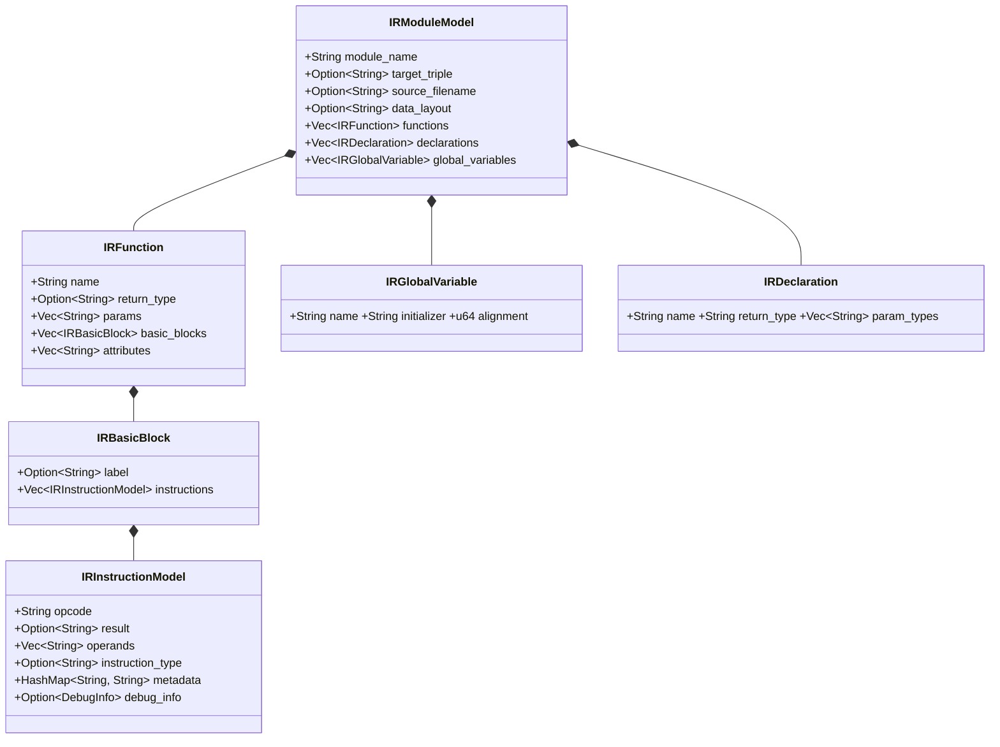
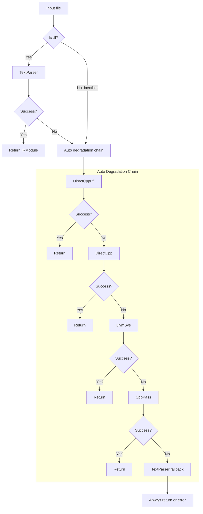

+++
title = "OmniScope Architecture Deep Dive (Part 2): IR Loading — 8 Ways to Wrestle with LLVM IR"
date = 2026-06-22
description = "How IR loading consumed 98% of analysis time in early OmniScope-rs, and why .bc and .ll files behave so differently at the LLVM layer."
weight = 51
[taxonomies]
tags = ["Rust", "LLVM", "FFI", "Performance"]
series = ["omniscope-rs"]
[extra]
series = "omniscope-rs"
+++

# OmniScope Architecture Deep Dive (Part 2): IR Loading — 8 Ways to Wrestle with LLVM IR

> If I had to find one word to describe the LLVM IR loading experience, it would be "Schrödinger's IR file."
>
> A `.ll` file, before you read it, is simultaneously likely to load successfully and also likely to have you chasing a core dump at 3 AM.

---

## The Predicament: Where Did 98% of the Time Go?

Early versions of OmniScope had a particularly mystifying phenomenon:

I launched an analysis on a 20MB `.bc` file and waited three minutes without seeing results. `top` showed CPU at 100%, but the analyzer's progress bar was stuck on "Loading IR..."

Wait — **IR loading** can take this long?

I wrote a simple benchmark:

```
.bc file (bitcode):      30s total analysis time → loading took ~29.4s  (98%)
.ll file (text IR):      30s total analysis time → loading took  ~0.1s  (0.3%)
```

**98% of the time was spent on IR loading alone.**

Even more absurd — `.ll` and `.bc` contain exactly the same information, just serialized in different formats. One is 300x faster, the other is slow enough to make you question your life choices.

This was the first "do I flip the table?" dilemma OmniScope faced.

## Why Is .bc So Slow?

Bitcode (`.bc`) is LLVM's binary serialization format. Its problems:

1. **Version-locked** — A `.bc` file produced by LLVM 12 may not be readable by LLVM 22. Experimentally, in many cases it indeed cannot be read.
2. **Requires full C++ LLVM library initialization** — Deserializing `.bc` requires booting the entire LLVM backend, building Module, Function, BasicBlock, Instruction…
3. **`.bc` was not designed for "reading"** — It was designed for Link-Time Optimization (LTO). In LTO scenarios, you read once and use it thousands of times; slowness is tolerable. But in analysis scenarios, reading happens once per invocation, and slow is a disaster.

What about `.ll`? `.ll` is a text format where every line is human-readable LLVM IR. You can write a pure Rust text parser — no C++ libraries needed.

The conclusion was clear: **`.ll` must be the priority.**

But a new problem emerged: **the user's LLVM IR itself is evolving.**

## LLVM IR Format Evolution: From Typed to Opaque

LLVM IR has a trap I repeatedly fell into during development — how pointer types are represented.

Before LLVM 15, IR used **typed pointers**. Every pointer annotated the type it points to. For example:

```llvm
define void @foo(i32* %ptr) {
  %val = load i32, i32* %ptr
  ret void
}
```

`i32*` explicitly tells the compiler: this pointer points to a 32-bit integer.

But starting with **LLVM 15**, LLVM mandates **opaque pointers**. Pointers no longer carry type information:

```llvm
define void @foo(ptr %ptr) {
  %val = load i32, ptr %ptr
  ret void
}
```

`i32*` became `ptr`. This has profound implications for IR loading:

1. **Text parser must support both formats simultaneously** — the parser must recognize both `i32*` and `ptr` syntax
2. **GEP instruction parameter structure changed** — typed pointers require extra parameters for result type derivation
3. **Type inference logic becomes more complex** — under opaque pointers, result types must be reverse-inferred from `load`/`store` target types

## ir_model.rs: Core IR Data Structures

Below the IR loading layer lies the data model defined in `crates/omniscope-ir/src/ir_model.rs`. All of OmniScope's core IR data structures reside here:

```rust
/// File: crates/omniscope-ir/src/ir_model.rs
pub struct IRModuleModel {
    pub module_name: String,
    pub target_triple: Option<String>,
    pub source_filename: Option<String>,
    pub data_layout: Option<String>,
    pub functions: Vec<IRFunction>,
    pub declarations: Vec<IRDeclaration>,
    pub global_variables: Vec<IRGlobalVariable>,
}
```

This is the final output format for all loading paths, and the input for subsequent analysis (dataflow, ownership inference).

**Function definition** `IRFunction`:

```rust
pub struct IRFunction {
    pub name: String,
    pub return_type: Option<String>,
    pub params: Vec<String>,
    pub basic_blocks: Vec<IRBasicBlock>,
    pub attributes: Vec<String>,
    pub visibility: Option<String>,
    pub alignment: Option<u64>,
    pub section: Option<String>,
    pub gc: Option<String>,
}
```

**Basic block** `IRBasicBlock`:

```rust
pub struct IRBasicBlock {
    pub label: Option<String>,
    pub instructions: Vec<IRInstructionModel>,
}
```

**Instruction** `IRInstructionModel`:

```rust
pub struct IRInstructionModel {
    pub opcode: String,
    pub result: Option<String>,
    pub operands: Vec<String>,
    pub instruction_type: Option<String>,
    pub metadata: HashMap<String, String>,
    pub debug_info: Option<DebugInfo>,
}
```

The design philosophy: **keep it as generic as possible** rather than binding to any single IR format:

- `operands` is `Vec<String>` rather than strongly typed — because different loading paths use different IR representations
- `metadata` is `HashMap<String, String>` — any metadata can be preserved
- `instruction_type` is `Option<String>` — not all instructions have types (e.g., `store`)

Supports both JSON and MessagePack serialization:

```rust
pub fn load_from_json(path: &Path) -> Result<IRModuleModel> {
    let file = File::open(path)?;
    let reader = BufReader::new(file);
    let model: IRModuleModel = serde_json::from_reader(reader)?;
    Ok(model)
}

pub fn load_from_msgpack(path: &Path) -> Result<IRModuleModel> {
    let data = std::fs::read(path)?;
    let model: IRModuleModel = rmp_serde::from_slice(&data)?;
    Ok(model)
}
```



## llvm_sys_adapter.rs: Calling LLVM C API from Rust

When the most complete type information is needed, the text parser isn't enough. You can use the `llvm-sys` path — through `crates/omniscope-ir/src/llvm_sys_adapter.rs`, directly calling the LLVM C API:

```rust
/// RAII wrapper for LLVM C API context management.
/// crates/omniscope-ir/src/llvm_sys_adapter.rs
pub struct ContextGuard { _private: () }

impl ContextGuard {
    pub fn new() -> Self {
        unsafe { LLVMInitializeAllAsmParsers(); }
        ContextGuard { _private: () }
    }
}
impl Drop for ContextGuard {
    fn drop(&mut self) { unsafe { LLVMShutdown(); } }
}
```

`ContextGuard` ensures the LLVM context is properly initialized and destroyed within Rust's lifetime. `ModuleGuard` automatically frees the LLVM Module on Drop:

```rust
pub struct ModuleGuard { module: LLVMModuleRef }

impl ModuleGuard {
    pub fn parse_ir(path: &str) -> Result<Self> {
        let _ctx = ContextGuard::new();
        let mem_buf = MemoryBufferGuard::new(path)?;
        let mut module: LLVMModuleRef = ptr::null_mut();
        let mut out_msg: *mut c_char = ptr::null_mut();
        let result = unsafe {
            LLVMParseIRInContext(LLVMGetGlobalContext(), mem_buf.as_ref(), &mut module, &mut out_msg)
        };
        // ...
        Ok(ModuleGuard { module })
    }

    pub fn get_pointer_type(&self, val: LLVMValueRef) -> Option<String> {
        unsafe {
            let t = LLVMTypeOf(val);
            if LLVMGetTypeKind(t) == LLVMPointerTypeKind {
                Some(format!("ptr addrspace({})", LLVMGetPointerAddressSpace(t)))
            } else { None }
        }
    }
}
impl Drop for ModuleGuard {
    fn drop(&mut self) { unsafe { LLVMDisposeModule(self.module); } }
}
```

The greatest value of this path: **it can extract precise type information that the text parser cannot obtain**, particularly the address space of opaque pointers. But this capability requires `--features llvm-backend` compilation, not enabled by default.

## Rethinking: One File, Eight Ways to Read

Back to the loading strategy itself. I initially thought IR loading was simple — just write "a parser supporting .ll and .bc."

But reality turned out far more complex:

- Do users have `.ll` files? Not necessarily. Commercial compilers may only output `.bc`.
- Do users have `opt` installed? Not necessarily. Docker images often lack it.
- Can users compile C++? Not necessarily. Windows users may not have LLVM dev packages.
- Do users have the `ir_extractor` binary? Not necessarily. It requires separate compilation.
- What LLVM version do users have? Unknown. Could be LLVM 12 or LLVM 22.

So my understanding of IR loading evolved:

> **IR loading is not a problem of "supporting two formats" — it's a problem of "loading as reliably as possible in an unreliable environment."**

The solution isn't finding a single "best loading method" — it's providing **a complete set of loading strategies that back each other up.**

I ultimately designed **8 LoadStrategies** (defined in `crates/omniscope-ir/src/loader_v2.rs`, lines 60-95):

```rust
#[derive(Debug, Clone, Copy, PartialEq, Eq)]
pub enum LoadStrategy {
    DirectCppFfi,    // ir_extractor + --slice=ffi, most precise FFI IR
    DirectCpp,       // ir_extractor, full IR without depending on opt
    LlvmSys,         // llvm-sys C API, LLVM dev package
    CppPass,         // opt + SafetyExportPass.so, existing LLVM pass workflow
    TextParser,      // Pure Rust text parser, zero dependencies
    MsgPack,         // MessagePack pre-extraction, 5-10x faster than JSON
    Auto,            // Auto-detect best strategy
    AutoFast,        // Default strategy, .ll priority
}
```

## Auto / AutoFast: Automatic Degradation Chain

```rust
/// crates/omniscope-ir/src/loader_v2.rs
/// Probe backends in priority order and fall back gracefully.
fn load_auto(path: &Path) -> Result<(IRModule, LoadStrategy)> {
    // Priority: DirectCppFfi > DirectCpp > llvm-sys > cpp pass > text parser
    if can_use_direct_cpp_ffi() {
        match load_via_direct_cpp_ffi(path) {
            Ok(m) if !m.functions.is_empty() => return Ok((m, DirectCppFfi)),
            Ok(_) => warn!("DirectCppFfi empty, falling back"),
            Err(e) => warn!(error = %e, "DirectCppFfi failed"),
        }
    }
    // ... degradation step by step ...
    let module = load_via_text(path)?;
    Ok((module, TextParser)) // TextParser as ultimate fallback
}
```

**AutoFast** is the default strategy: `.ll` files use TextParser first (instantaneous), `.bc` follows the normal Auto degradation chain. For large `.ll` files (>10MB), it directly takes the TextParser fast path, avoiding the overhead of probing external tools first.



## Main Entry Point: load_ir()

All strategies are exposed to upper layers through a unified entry point:

```rust
/// crates/omniscope-ir/src/loader_v2.rs
/// Primary entry point for CLI and pipeline.
pub fn load_ir(path: &Path, strategy: LoadStrategy) -> Result<LoadedIr> {
    if !path.exists() {
        bail!("IR file does not exist: {}", path.display());
    }
    let start = Instant::now();
    let (module, actual_strategy) = match strategy {
        Auto => load_auto(path)?,
        AutoFast => load_auto_fast(path)?,
        DirectCppFfi => (load_via_direct_cpp_ffi(path)?, DirectCppFfi),
        LlvmSys => (load_via_llvm_sys(path)?, LlvmSys),
        CppPass => (load_via_cpp_pass(path)?, CppPass),
        DirectCpp => (load_via_direct_cpp(path)?, DirectCpp),
        TextParser => (load_via_text(path)?, TextParser),
        MsgPack => (load_via_msgpack(path)?, MsgPack),
    };
    let load_ms = start.elapsed().as_millis() as u64;
    Ok(LoadedIr { module, strategy: actual_strategy, load_ms, .. })
}
```

The `LoadedIr` struct not only returns the load result, but also includes `actual_strategy` (the strategy actually used — because Auto performs degradation) and `load_ms` (loading time in milliseconds).

## LLVM Version Search: From 12 to 22

The project's early `BUILD_ENV.md` said "Please install LLVM 12 (`llvm@12`)." Now in `crates/omniscope-ir/Cargo.toml`:
```toml
llvm-sys = "221"  # LLVM 22
```

Five years, 10 major versions — each with mutually incompatible LLVM APIs. `find_opt()` probes from LLVM 22 down to LLVM 17:

```rust
/// crates/omniscope-ir/src/loader_v2.rs
/// Return common Homebrew LLVM bin directories (newest version first).
fn homebrew_llvm_bin_dirs() -> Vec<PathBuf> {
    [
        "/opt/homebrew/opt/llvm@22/bin",
        "/opt/homebrew/opt/llvm@21/bin",
        "/opt/homebrew/opt/llvm@20/bin",
        "/opt/homebrew/opt/llvm@19/bin",
        "/opt/homebrew/opt/llvm@18/bin",
        "/opt/homebrew/opt/llvm@17/bin",
        "/opt/homebrew/opt/llvm/bin",
    ].iter().map(PathBuf::from).collect()
}
```

```mermaid
flowchart TD
    A[Find opt binary] --> B{LLVM_OPT env var?}
    B -->|Set| C[Use directly]
    B -->|Unset| D{llvm@22?}
    D -->|Found| E[Use llvm@22]
    D -->|Not found| F{llvm@21?}
    F -->|Found| G[Use llvm@21]
    F -->|Not found| H{llvm@20..17?}
    H -->|Found| I[Use corresponding version]
    H -->|Not found| J{llvm-config?}
    J -->|Found| K[Use llvm-config path]
    J -->|Not found| L{which opt?}
    L -->|Found| M[Use opt from PATH]
    L -->|Not found| N[Return None]
```

## instruction_parser.rs: Instruction-Level Parsing

After TextParser loading, instructions also require additional parsing for dataflow analysis. `crates/omniscope-ir/src/instruction_parser.rs` provides best-effort instruction classification:

```rust
/// Best-effort instruction classification for LLVM IR.
pub fn classify_instruction(opcode: &str, operands: &[String]) -> InstructionKind {
    match opcode {
        "call" => InstructionKind::Call,
        "load" => InstructionKind::Load,
        "store" => InstructionKind::Store,
        "alloca" => InstructionKind::Alloca,
        "getelementptr" => InstructionKind::GEP,
        "phi" => InstructionKind::Phi,
        "icmp" | "fcmp" => InstructionKind::Compare,
        "br" | "switch" | "indirectbr" => InstructionKind::Branch,
        "ret" => InstructionKind::Return,
        "bitcast" | "ptrtoint" | "inttoptr" => InstructionKind::Cast,
        "malloc" | "free" | "calloc" | "realloc" => InstructionKind::MemoryOp,
        _ => InstructionKind::Other,
    }
}
```

It also includes callee extraction and atomic operation detection:

```rust
pub fn extract_callee(operands: &[String]) -> Option<&str> {
    operands.first().map(|s| s.trim_start_matches('@'))
}

pub fn is_atomic_op(instruction: &str) -> bool {
    instruction.starts_with("atomic") || instruction.contains(" atomic ")
}
```

This parser classifies about 15 instruction categories, covering the core instructions needed for dataflow analysis and ownership inference. It is **best-effort** — unrecognized instruction formats are tagged as `Other` and do not cause the entire load to fail.

## IR Cache System

Each C++ pass or ir_extractor invocation involves process startup, LLVM initialization, and JSON serialization — potentially 5-10 seconds. `crates/omniscope-ir/src/ir_cache.rs` provides file-fingerprint caching:

```rust
/// crates/omniscope-ir/src/ir_cache.rs
/// Compute cache key based on file identity (size + mtime + xxh3).
fn cache_key(path: &Path) -> Option<String> {
    let meta = std::fs::metadata(path).ok()?;
    let size = meta.len();
    let mtime = meta.modified().ok()?;
    let mtime_ns = mtime.duration_since(SystemTime::UNIX_EPOCH).ok()?.as_nanos();
    let canonical = std::fs::canonicalize(path).ok()?;
    let fingerprint = xxh3_fingerprint(&canonical, size, mtime_ns);
    Some(fingerprint.to_string())
}
```

Cache key composition: `canonical_path + file_size + mtime + xxh3 fingerprint`. xxh3 was chosen over SHA256 intentionally — cache keys don't need cryptographic security, only high-performance (nanosecond-level) collision resistance.

Cache storage path: `{cache_dir}/ir/{fingerprint}.json`. When files are modified, mtime changes and the cache is automatically invalidated. If the loading strategy is upgraded (e.g., from text parser to DirectCpp), the cache is also automatically invalidated.

## ModuleIndex: Pre-Computed Function Metadata

After loading IR, all passes need to frequently query function information. Traversing the IR structure each time is too slow, so `crates/omniscope-pass/src/module_index.rs` provides a pre-computed index:

```rust
/// Pre-computed index over function metadata for fast pass access.
pub struct ModuleIndex {
    pub functions: Vec<CachedFunctionMeta>,
}

pub struct CachedFunctionMeta {
    pub name: String,
    pub language: Language,
    pub is_ffi_boundary: bool,
    pub bb_count: usize,
    pub inst_count: usize,
    pub has_alloca: bool,
    pub has_unsafe_ops: bool,
    pub calls: Vec<CachedCallMeta>,
}

pub struct CachedCallMeta {
    pub callee: String,
    pub is_indirect: bool,
    pub is_ffi: bool,
    pub is_safe: bool,
}
```

ModuleIndex construction is a one-time cost, shared by all subsequent passes. Language detection (Language enum) is done through function name pattern matching, while FFI boundary classification combines boundary definitions from `omniscope.toml`.

## Source Location Mapping: IRLocation Resolution

Analysis results must map back to source locations to produce meaningful reports. `crates/omniscope-ir/src/location.rs` defines:

```rust
pub struct SourceLocation {
    pub file: Option<String>,
    pub line: u32,
    pub column: u32,
    pub function: Option<String>,
}
```

This struct is populated by parsing LLVM IR's debug metadata through logic in `crates/omniscope-ir/src/parser.rs`:

```llvm
define void @foo() !dbg !5 { ret void }
!5 = !DILocation(line: 12, column: 5, scope: !6)
!6 = !DIFile(filename: "main.cpp", directory: "/home/user/project")
```

The parsing logic in parser.rs:

```rust
/// Parse DILocation metadata from LLVM IR debug info.
fn parse_dilocation(line: &str) -> Option<SourceLocation> {
    let line_val = extract_named_value(line, "line")?.parse().ok()?;
    let col_val = extract_named_value(line, "column")?.parse().ok()?;
    Some(SourceLocation { file: None, line: line_val, column: col_val, function: None })
}
```

Every call instruction with debug info maps back to source file line and column numbers. This means analysis results show you `main.cpp:42` instead of `@some_obscure_ir_name`.

## memory_pool.rs: Low-Level Memory Allocation Infrastructure

IR loading involves a large number of small object allocations and deallocations. `crates/omniscope-core/src/memory_pool.rs` provides an arena allocator:

```rust
/// Arena-based bump allocator for high-throughput IR loading.
use bumpalo::Bump;
use std::cell::UnsafeCell;

pub struct MemoryPool {
    bump: UnsafeCell<Bump>,
}

impl MemoryPool {
    pub fn new() -> Self { MemoryPool { bump: UnsafeCell::new(Bump::new()) } }

    pub fn alloc<'a, T>(&'a self, val: T) -> &'a T {
        unsafe { (*self.bump.get()).alloc(val) }
    }

    pub fn alloc_slice<'a, T>(&'a self, val: &[T]) -> &'a [T] where T: Copy {
        unsafe { (*self.bump.get()).alloc_slice_copy(val) }
    }

    pub fn reset(&self) { unsafe { (*self.bump.get()).reset() }; }
}
```

Key design decisions:

- **Arena allocation** — allocate a large chunk once, allocate small objects individually, reclaim the entire chunk on free. An order of magnitude faster than jemalloc/malloc.
- **`UnsafeCell<Bump>`** — bypasses Rust's borrow checker because the pool is shared-write but analysis is single-threaded.
- **`alloc_slice_copy`** — avoids individual allocation for large numbers of small Vecs like `IRInstructionModel`.

In IR loading scenarios, the text parser produces thousands of small objects (`IRFunction`, `IRBasicBlock`, `IRInstructionModel`) that are directly allocated via the arena, avoiding memory fragmentation.

## platform_filters.toml: Edge Case Handling

After IR loading completes, the analysis system needs to distinguish between "safe library calls" and "suspicious user code." The project root's `platform_filters.toml` defines platform-specific safe API lists:

```toml
[macos]
safe_functions = [
    "malloc", "free", "calloc", "realloc",
    "mmap", "munmap", "shm_open", "shm_unlink",
    "dlopen", "dlclose", "dlsym",
    "pthread_create", "pthread_join", "pthread_mutex_lock",
]

[linux]
safe_functions = [
    "malloc", "free", "calloc", "realloc",
    "mmap", "munmap", "brk", "sbrk",
    "dlopen", "dlclose", "dlsym",
    "pthread_create", "pthread_join",
]

[windows]
safe_functions = [
    "HeapAlloc", "HeapFree", "VirtualAlloc", "VirtualFree",
    "LoadLibraryA", "LoadLibraryW", "FreeLibrary",
]

[common]
safe_functions = [
    "memcpy", "memset", "memmove", "memcmp",
    "strlen", "strcmp", "strncmp",
    "printf", "fprintf", "sprintf", "snprintf",
]
```

When a function call is in the `safe_functions` list, the analyzer skips it, avoiding false positives. This mechanism is a key prerequisite for the next article on noise reduction.

## Strategy Comparison and Tradeoffs

| Dimension | TextParser | LlvmSys | CppPass | DirectCpp |
|-----------|-----------|---------|---------|-----------|
| **Startup Speed** | Milliseconds | Seconds (LLVM init) | Seconds (process startup) | Milliseconds (binary) |
| **IR Completeness** | Limited (~90%) | Complete | Complete | Complete |
| **Build Deps** | None | llvm-sys + LLVM dev | opt + .so plugin | ir_extractor C++ binary |
| **Cross-platform** | All platforms | Platforms with LLVM dev | Platforms with opt | Platforms with compiler |
| **Memory Overhead** | Low (arena alloc) | High (LLVM internal state) | Medium (process isolated) | Medium |
| **Use Case** | Quick prototype, Docker | Precise type info needed | Complex IR features | Production FFI analysis |
| **Type Inference** | Limited (pattern matching) | Precise (C API) | Precise (LLVM pass) | Precise (C++ pass) |

From an engineering tradeoff perspective, core tradeoffs are:

1. **Full load vs on-demand load**: Currently full-load — entire IR module read into memory at once. Subsequent analysis has zero latency, but large files consume significant memory (>50MB becomes noticeable). Lazy loading is theoretically possible but not currently needed.

2. **Memory vs speed**: TextParser + MemoryPool strikes the best balance. LlvmSys, while rich in type information, has 2-3x the memory overhead of TextParser.

3. **Compatibility vs precision**: TextParser has the best compatibility (zero dependencies, all platforms) but limited precision. LlvmSys has the highest precision but worst compatibility (needs LLVM dev packages). The 8 strategies exist to offer a sliding scale between these two dimensions.

## Engineering Philosophy Summary

Looking back at the IR loading layer, key takeaways are:

1. **LLVM ecosystem fragmentation is unavoidable** — version, toolchain, and format polymorphism demands a strategy pattern to cope
2. **Degradation chains beat single solutions** — no universal loading method exists, but a set of mutually-supporting loading methods does
3. **Caching is the primary optimization for IO-intensive operations** — but cache key design must be sound, or it introduces bugs
4. **Low-level infrastructure (MemoryPool) impacts performance as much as algorithm optimization** — without a bump allocator, IR loading for many small objects would be 2-3x slower
5. **Debug metadata parsing precision determines downstream analysis usability** — analysis results without source locations are effectively "no analysis" from the user's perspective

## Honest Limitations

### 1. TextParser IR Coverage

Certain instruction formats introduced in new LLVM versions (`callbr`, `freeze`, `poison`-related operations) may not be recognized by the text parser. Currently falling back to LlvmSys or CppPass. But if you're using LLVM 23+ without dev packages, the text parser may be the only option — encountering new instructions will error out. This is increasingly common in the 2026 LLVM ecosystem.

### 2. .bc Version Forward Compatibility

Each LLVM major version changes the .bc serialization format. I can only follow up quickly after each new LLVM release, but a lag window is inevitable. The README already says "Use .ll" in bold uppercase, but some users still insist on using .bc.

### 3. MsgPack Format Has No Standard

MessagePack serialization is OmniScope-custom, not a universal standard. When migrating to other tools, .msgpack files cannot be reused. JSON output preserves interoperability, but JSON is both large and slow.

### 4. ModuleIndex Monolith

`module_index.rs` is currently 1709 lines, and the code's own comments say "TODO: this file is too large, should be split." Function metadata indexing, language detection, and FFI boundary classification — all in one file — making maintenance increasingly difficult.

### 5. Why Not a Single Optimal Solution?

Every time I look at the 8 strategies, I wonder: is this over-engineered? But every reflection leads to the same conclusion: **a single optimal solution does not exist.** Docker containers lack C++ toolchains, CI environments only deploy ir_extractor, macOS users have Homebrew's LLVM. The 8 strategies are a compromise with different runtime environments, not over-engineering.

## Preview of the Next Article

After loading IR, the next step is analysis. But a bigger problem awaits:

**"After analysis, I got 4,525 alerts — who's going to read all that?"**

Next article preview: **Noise Reduction — An Epic Optimization from 5,098 to ~45.** From platform_filters to risk scoring and a 9-layer false-positive suppression system, we filter out 99% of noise, leaving only the ~45 high-confidence issues users truly need to care about.

---

*Previous: [Why OmniScope — Call Graphs, State Machines, Semantic Trees](./01-why-omniscope.md)*
*Next: [Noise Reduction — An Epic Optimization from 5,098 to ~45](./03-noise-reduction.md)*