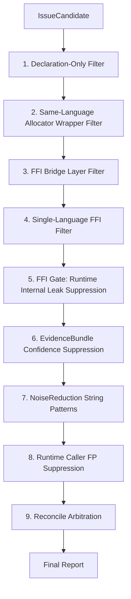
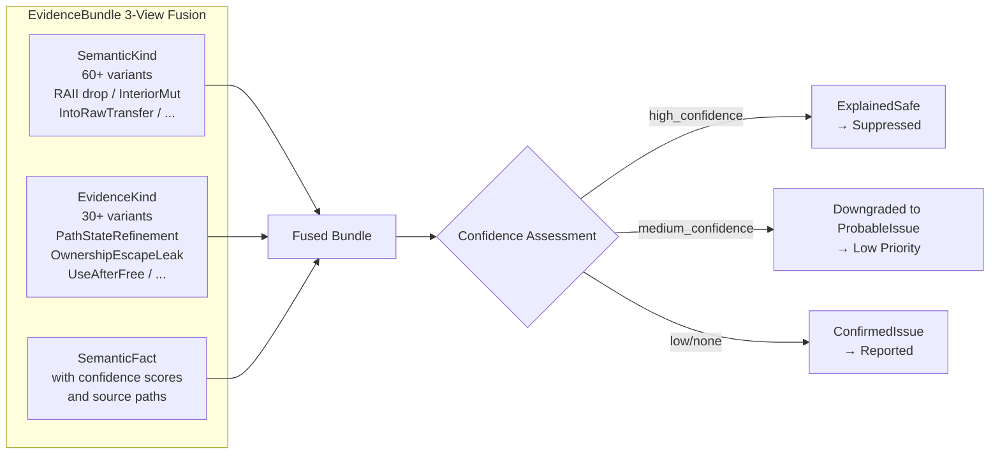
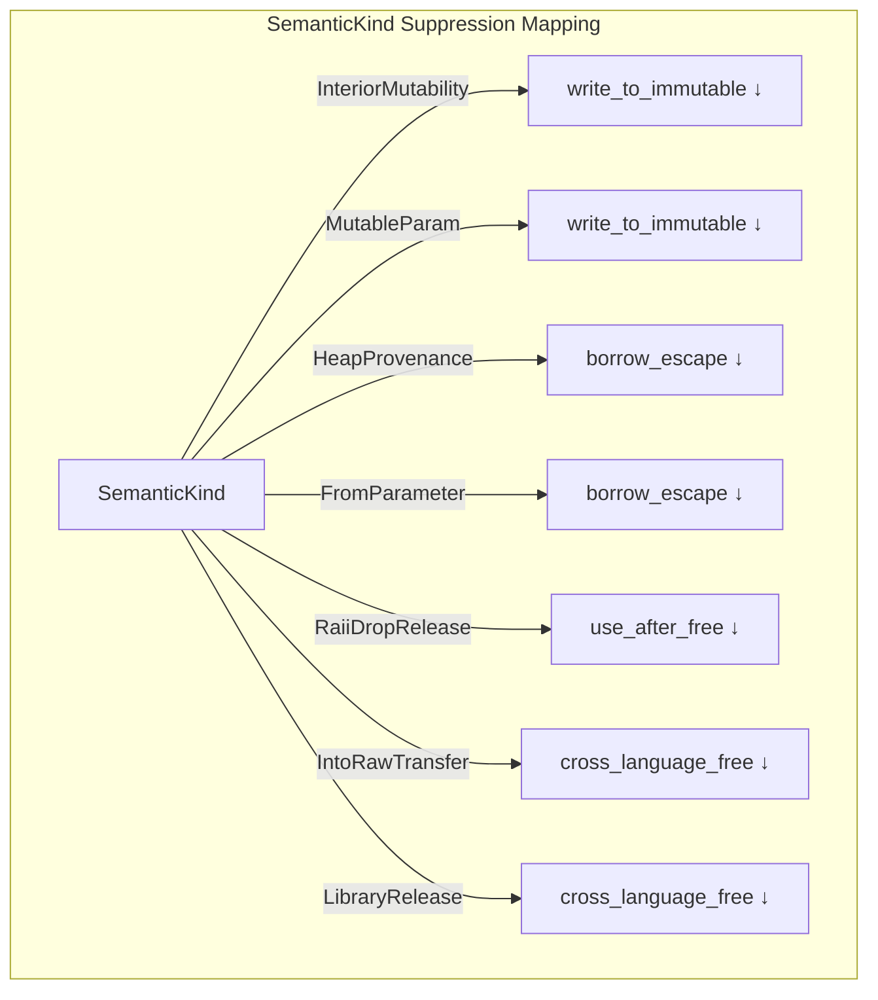
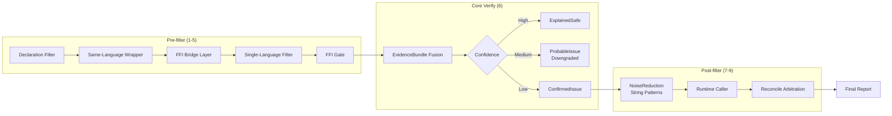
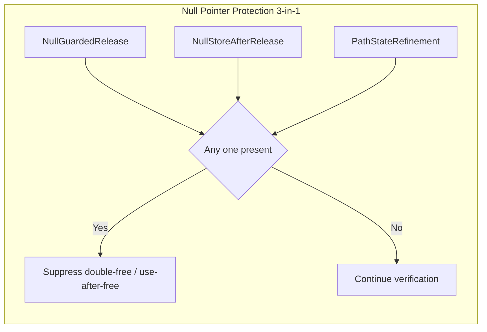
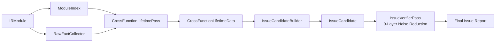

+++
title = "OmniScope Architecture Deep Dive (Part 3): Noise Reduction — An Epic Optimization from 5,098 to ~45"
date = 2026-06-24
description = "How the Rust rewrite reduced false positives from 5,098 to roughly 45 across real-world projects — and why sensitivity without an evidence chain is just crying wolf."
weight = 52
[taxonomies]
tags = ["Rust", "LLVM", "FFI", "Static Analysis", "Optimization"]
series = ["omniscope-rs"]
[extra]
series = "omniscope-rs"
+++

# OmniScope Architecture Deep Dive (Part 3): Noise Reduction — An Epic Optimization from 5,098 to ~45

> I have a body with a peculiar constitution — normal food goes down fine, but anything slightly unclean sends me straight to vomiting and diarrhea. The hospital can never find anything wrong.
> For five years, I've gotten used to cooking my own meals, packing my own lunch, and drinking only plain water at dinner parties.
> Building a static analysis tool is the same — the more sensitive your analyzer, the more every "may be problematic" alert sounds like crying wolf.

---

## The Predicament: 5,098 Alerts, Not a Single One Worth Reading

Here were the results from running the first prototype against three real-world projects — duckdb-rs, rusqlite, and rustls-ffi:

```
write_to_immutable:  4,525  ← C++ const T& are all readonly pointers?
ffi_unsafe_call:       142  ← FFI calls are inherently unsafe, you don't say?
borrow_escape:          51  ← C callbacks are all borrow escapes
ownership_violation:    68  ← pyo3 reference counting false positives
CrossFamilyFree:       312  ← many are normal library behavior
```

Total alerts: **5,098**.

What does 5,098 alerts mean? It means no developer will ever look at them. **For a development tool, 5,098 alerts and 0 alerts are the same thing — nobody reads either.**

My thought at the time was simple: **An insufficiently precise static analysis tool is wasting everyone's time.**

## Reflection: Three Root Causes of False Positives

I spent a full two weeks classifying every one of the 5,098 alerts.

### Root Cause 1: IR Semantic Loss (~60%)

LLVM IR has no high-level semantics. A C++ `const int&` parameter in IR is just a pointer with a `readonly` attribute. But `readonly` does not equal immutable — it only promises "this function won't write through it," not that the pointed-to memory won't be written by someone else.

```llvm
; This is C++ const T& — has the readonly attribute
define void @foo(ptr readonly %p)
; But inside foo, bar(ptr %p) is called, and bar writes through p
```

The analyzer initially treated `readonly` as "immutable," wildly reporting `write_to_immutable` — 4,525 of them.

### Root Cause 2: Normal Patterns Misidentified as Bugs (~25%)

- Heap pointer escape → `BorrowEscape` false positives
- Python's `Py_DECREF` (releases only when refcount reaches zero) → `CrossLanguageFree` false positives
- Rust's `Box::into_raw` → `OwnershipViolation` false positives (it's by design)

### Root Cause 3: Noise Propagation Through the Call Chain (~10%)

A function carefully implements correct release logic, but its wrapper function uses the wrong classification label on the call graph, causing the entire call chain to be flagged as "problematic."

### Truly Worthy Bugs: ~5%, approximately 200.

---

## The Solution: A Nine-Layer Noise Reduction System

I needed a noise reduction system whose core philosophy is **layer-by-layer filtering, increasing precision at each stage** — each layer does only what it can, passing judgment to those who know better.

The final architecture is implemented in `IssueVerifierPass` (`/Users/scc/code/rustcode/OmniScope-rs/crates/omniscope-pass/src/resource/issue_verifier/mod.rs`), comprising 9 layers:



### Layers 1–5: Quick Pre-Filter

The first 5 layers are low-cost pre-filters (code from `mod.rs` lines 98–173):

```rust
// File: /Users/scc/code/rustcode/OmniScope-rs/crates/omniscope-pass/src/resource/issue_verifier/mod.rs
// Lines 98–173

// Layer 1: Declaration-Only Filter — function has only a declaration body, no actual logic
if is_declaration_only_candidate(candidate) {
    debug!(...);
    suppressed += 1;
    continue;
}

// Layer 2: Same-Language Allocator Wrapper — C alloc → C free, within the same language
if is_same_language_allocator_wrapper_noise(candidate) {
    debug!(...);
    suppressed += 1;
    continue;
}

// Layer 3: FFI Bridge Layer — wrappers / vtable thunks
if is_ffi_bridge_layer_candidate(candidate) {
    debug!(...);
    suppressed += 1;
    continue;
}

// Layer 4: Single-Language Filter — FFI operations within the same language
if is_single_language_candidate(candidate) {
    debug!(...);
    suppressed += 1;
    continue;
}

// Layer 5: FFI Gate — Runtime internal leaks
if is_runtime_internal_leak(candidate) {
    debug!(...);
    suppressed += 1;
    continue;
}
```

### Layer 6: EvidenceBundle Confidence Suppression (Core)

This is the heart of the entire noise reduction system. The design philosophy: **Don't look at just one kind of evidence — fuse all evidence into an "evidence bundle" and make decisions based on confidence.**

The evidence bundle is constructed in `EvidenceBundle`, defined at `/Users/scc/code/rustcode/OmniScope-rs/crates/omniscope-pass/src/resource/evidence_bundle.rs` (1261 lines). It fuses three dimensions:



The core leak verification logic lives in `/Users/scc/code/rustcode/OmniScope-rs/crates/omniscope-pass/src/resource/issue_verifier/leak.rs`:

```rust
// File: /Users/scc/code/rustcode/OmniScope-rs/crates/omniscope-pass/src/resource/issue_verifier/leak.rs
// Lines 38–63

pub(crate) fn verify_definite_leak_with_bundle(bundle: &EvidenceBundle) -> VerifierVerdict {
    // If path state refinement evidence exists, use path-sensitive verification
    let has_path_refinement = bundle.evidence_kinds
        .contains(&EvidenceKind::PathStateRefinement);
    let path_verifier = if has_path_refinement {
        PathSensitiveVerifier::with_path_data(2, 2, 0)
    } else {
        PathSensitiveVerifier::new()
    };

    // High confidence → Safe (suppressed)
    if bundle.has_leak_suppression_high_confidence() {
        return path_verifier.adjust_verdict(VerifierVerdict::ExplainedSafe);
    }

    // Medium confidence → Downgrade to probable issue
    if bundle.has_leak_suppression_medium_confidence() {
        return path_verifier.adjust_verdict(VerifierVerdict::ProbableIssue);
    }

    // No suppression → Report
    path_verifier.adjust_verdict(VerifierVerdict::ConfirmedIssue)
}
```

Key design: **`VerifierVerdict` has four tiers** (defined in `/Users/scc/code/rustcode/OmniScope-rs/crates/omniscope-types/src/effect.rs`):

```rust
// File: /Users/scc/code/rustcode/OmniScope-rs/crates/omniscope-types/src/effect.rs
// Lines 26–32

pub enum VerifierVerdict {
    ConfirmedIssue,  // Confirmed issue → Report
    ProbableIssue,   // Probable issue → Low priority
    Diagnostic,      // Informational hint
    ExplainedSafe,   // Explained as safe → Suppress
}
```

### PathSensitiveVerifier: Path-Sensitive Adjustment

`PathSensitiveVerifier` is an elegant design within the leak verification logic (`leak.rs` lines 12–36).

```rust
// File: /Users/scc/code/rustcode/OmniScope-rs/crates/omniscope-pass/src/resource/issue_verifier/leak.rs
// Lines 12–23

struct PathSensitiveVerifier {
    total_allocs: usize,
    owned_after_path: usize,
    safe_releases: usize,
}

impl PathSensitiveVerifier {
    pub(crate) fn with_path_data(
        total: usize,
        owned: usize,
        safe: usize,
    ) -> Self {
        Self {
            total_allocs: total,
            owned_after_path: owned,
            safe_releases: safe,
        }
    }

    pub(crate) fn adjust_verdict(
        &self,
        base: VerifierVerdict,
    ) -> VerifierVerdict {
        match (base, self.owned_after_path, self.safe_releases) {
            // All allocations have safe paths → Safe
            (_, owned, safe) if owned == 0 && safe >= self.total_allocs => {
                VerifierVerdict::ExplainedSafe
            }
            // Some without safe paths → Keep original verdict
            _ => base,
        }
    }
}
```

### SemanticKind FP Suppression: Four Methods

`SemanticKind` is defined in `/Users/scc/code/rustcode/OmniScope-rs/crates/omniscope-semantics/src/resource/semantic_tree/kind.rs` (1029 lines), containing 60+ variants.

```rust
// File: /Users/scc/code/rustcode/OmniScope-rs/crates/omniscope-semantics/src/resource/semantic_tree/kind.rs
// Lines ~280–390

impl SemanticKind {
    /// Write-to-immutable suppression: interior mutability (UnsafeCell), mutable parameters
    pub(crate) fn suppresses_write_to_immutable(&self) -> bool {
        matches!(
            self,
            SemanticKind::InteriorMutability
                | SemanticKind::MutableParam
                | SemanticKind::MutableLocal
                | SemanticKind::VolatileStore
        )
    }

    /// Borrow escape suppression: heap provenance, parameter provenance
    pub(crate) fn suppresses_borrow_escape(&self) -> bool {
        matches!(
            self,
            SemanticKind::HeapProvenance
                | SemanticKind::FromParameter
                | SemanticKind::RcPointer
                | SemanticKind::ArcPointer
        )
    }

    /// UAF suppression: RAII drop release (compiler-inserted cleanup)
    pub(crate) fn suppresses_use_after_free(&self) -> bool {
        matches!(self, SemanticKind::RaiiDropRelease)
    }

    /// Cross-language free suppression: into_raw ownership transfer, library-managed release
    pub(crate) fn suppresses_cross_language_free(&self) -> bool {
        matches!(
            self,
            SemanticKind::IntoRawTransfer
                | SemanticKind::LibraryRelease
        )
    }
}
```



### Layers 7–8: NoiseReduction + Runtime Caller

```rust
// File: /Users/scc/code/rustcode/OmniScope-rs/crates/omniscope-pass/src/resource/issue_verifier/helpers.rs

// Example: Runtime allocator/deallocator recognition
pub(crate) fn is_runtime_allocator_function(name: &str) -> bool {
    matches!(
        name,
        "__rust_alloc" | "__rust_dealloc" | "malloc" | "calloc"
            | "realloc" | "aligned_alloc" | "free"
            | "mi_malloc" | "mi_free" | "mi_realloc"
            | "PyMem_Malloc" | "PyMem_Free" | "PyObject_GC_New"
            | "sqlite3_malloc" | "sqlite3_free"
            | "_Znwm" | "_Znam" | "_ZdlPv" | "_ZdaPv"
    )
}
```

### Layer 9: Reconcile Arbitration

```rust
// File: /Users/scc/code/rustcode/OmniScope-rs/crates/omniscope-pass/src/resource/reconcile/mod.rs

pub(crate) enum ReconcileAction {
    Keep,
    SubsumedBy(u64),
    DuplicateOf(u64),
}

pub(crate) enum FaultClass {
    WrongRelease,
    DoubleRelease,
    UseAfterRelease,
    Leak,
    BoundaryMisuse,
    Unmodeled,
}
```

The three-stage governance flow:



## Double-Free Six-Gate Verification

The double-free verification in `double_free.rs` (`/Users/scc/code/rustcode/OmniScope-rs/crates/omniscope-pass/src/resource/issue_verifier/double_free.rs`) has 6 gates:

```rust
// File: /Users/scc/code/rustcode/OmniScope-rs/crates/omniscope-pass/src/resource/issue_verifier/double_free.rs
// Lines 80–110

let has_use_after = bundle.evidence_kinds.contains(&EvidenceKind::UseAfterFree);
let is_deallocator = is_runtime_deallocator_function(&bundle.alloc_function);
let same_caller = match (&bundle.alloc_caller, &bundle.release_caller) {
    (Some(alloc), Some(release)) => alloc == release,
    _ => false,
};
if is_deallocator && same_caller && !has_use_after {
    let has_strong_instance = bundle.has_same_resource_evidence
        || bundle.evidence_kinds.contains(&EvidenceKind::MultipleRelease);
    if !has_strong_instance {
        return VerifierVerdict::ExplainedSafe;
    }
}
```

### Null Pointer Protection (3-in-1)

```rust
pub enum EvidenceKind {
    NullGuardedRelease,
    NullStoreAfterRelease,
    PathStateRefinement,
}
```



## CrossFunctionLifetimePass: Cross-Function Lifetime Tracking

`CrossFunctionLifetimePass` (`/Users/scc/code/rustcode/OmniScope-rs/crates/omniscope-pass/src/resource/cross_function_lifetime_pass.rs`, 1023 lines):

```rust
// File: /Users/scc/code/rustcode/OmniScope-rs/crates/omniscope-types/src/lifetime.rs

pub enum ResourceFateSummary {
    Released { in_function: String },
    ProgramLifetime,
    GlobalState { stored_in: String },
    Escaped { function_count: usize },
    Unknown,
}

pub enum ViolationKind {
    UseAfterFree,
    ResourceLeak,
    DoubleFree,
    InvalidOwnershipTransfer,
    BorrowEscape,
}
```



## Results: The Data Speaks

| Issue Type | Before | After | Change | Key Rule |
|-----------|--------|-------|--------|----------|
| `write_to_immutable` | 4,525 | ~8 | **-99.8%** | SemanticKind InteriorMutability |
| `ffi_unsafe_call` | 142 | 0 | **-100%** | FFI Gate |
| `borrow_escape` | 51 | 7 | **-88%** | SemanticKind HeapProvenance |
| `ownership_violation` | 68 | 0 | **-100%** | Reconcile SubsumedBy |
| `CrossFamilyFree` | 312 | ~30 | **-90%** | EvidenceBundle confidence |
| Total alerts | 5,098 | **~45** | **-99.1%** | All 9 layers combined |

## Honest Section: The Cost of Noise Reduction

### False Negative Risk

Every suppression rule comes with a cost. While each rule reduces false positives (FP), it also introduces the risk of false negatives (FN).

- **NullGuardedRelease suppression**: `if (ptr) free(ptr)` — what if another `free(ptr)` exists outside the guard?
- **RAII drop suppression**: `ManuallyDrop`'s `into_inner` mishandling becomes a false negative
- **Reconcile arbitration**: When one candidate subsumes another, what if both are problematic?

**I cannot quantify how many real bugs were lost due to suppression rules.** For a tool where developer trust is top priority, I'd rather lose 1 real bug than keep 100 false positives.

### Maintenance Cost

Every rule needs validation against real-world corpora. New language ecosystems (Swift, Zig, Kotlin/Native) would require updating allocator/deallocator lists, semantic features, and FaultClass mappings.

### Upper-Layer Application Specificity

Python's CPython reference counting and Java's JNI `NewGlobalRef`/`DeleteGlobalRef` patterns may require new `EvidenceKind` variants not covered by the current system.

---

*Previous: [IR Loading — 8 Ways to Wrestle with LLVM IR](./02-ir-loading.md)*
*Next: [Resource Families — Breaking Language Barriers](./04-resource-family.md)*