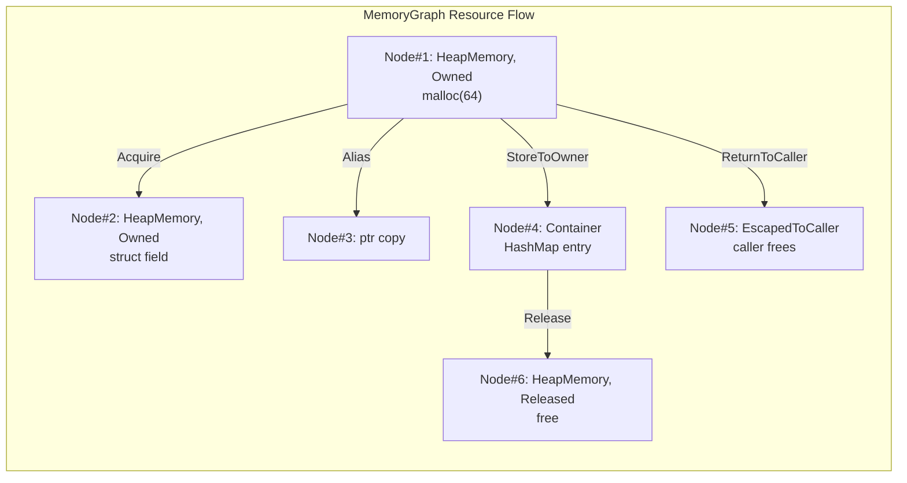

+++
title = "OmniScope Architecture Deep Dive (Part 4): Resource Families — Breaking Language Barriers: From Effect to Evidence Chain Pipeline"
date = 2026-06-26
description = "A deep dive into the resource family abstraction that turns hundreds of language-specific allocation and release patterns into a unified semantic vocabulary — the backbone of the Effect enum, ownership state machine, and MemoryGraph."
weight = 53
[taxonomies]
tags = ["Rust", "LLVM", "FFI", "Semantic Analysis", "Architecture"]
series = ["omniscope-rs"]
[extra]
series = "omniscope-rs"
+++

# OmniScope Architecture Deep Dive (Part 4): Resource Families — Breaking Language Barriers: From Effect to Evidence Chain Pipeline

> "A tool that only understands C's malloc/free, yet must analyze resource transfers across Rust, C++, Python, and Java. Eventually I realized: the problem isn't the language — it's the Resource Family. This is the fact pipeline that connects the Effect enum, the ownership state machine, the memory graph, and evidence fusion."

---

## The Challenge: The Effect Enum — The Analyzer Needs an Atomic Language

In the early days of OmniScope, recognizing function behavior relied on function name matching. Seeing `free` meant release. Seeing `malloc` meant allocation.

This approach collapsed quickly. Because there were hundreds of function variants to handle:

- Allocation variants: `alloc`, `malloc`, `calloc`, `realloc`, `_Znwm`, `__rust_alloc`, `PyMem_Malloc`, `HeapAlloc`...
- Release variants: `free`, `delete`, `__rust_dealloc`, `PyMem_Free`, `HeapFree`, `inflateEnd`...
- Plus all the edge cases: conditional release, refcount increment/decrement, ownership transfer, escape, type coercion...

The mapping from function name to behavior was chaotic, unmaintainable, and impossible to reason about.

I realized: **We need a set of atomic semantic primitives to describe the ownership behavior of any function.**

This is the origin of the `Effect` enum, defined in `crates/omniscope-types/src/effect.rs`:

```rust
/// Ownership effect of a function call — the analyzer's atomic semantic primitive
///
/// Each IR call site is mapped to one or more Effects, describing the impact
/// of that call on resource ownership. This is the bridge between IR analysis
/// and ownership reasoning.
#[derive(Debug, Clone, PartialEq, Eq, Hash)]
pub enum Effect {
    /// Explicit resource acquisition (allocation)
    Acquire { family: FamilyId, result: u64 },

    /// Explicit resource release
    Release { family: FamilyId, arg: u64 },

    /// Conditional release — only releases when refcount reaches zero
    ConditionalRelease { family: FamilyId, arg: u64 },

    /// Refcount increment — resource is retained
    Retain { family: FamilyId, arg: u64, result: u64 },

    /// Resource is owned by the caller upon function return
    ReturnsOwned { family: FamilyId, result: u64 },

    /// Resource is borrowed by the caller upon function return
    ReturnsBorrowed { family: FamilyId, result: u64 },

    /// Call consumes ownership of a parameter
    ConsumesArg { family: FamilyId, arg: u64 },

    /// Resource is stored into an owning container object
    StoresArgToOwner { family: FamilyId, arg: u64 },

    /// Resource is stored into global state
    StoresArgToGlobal { family: FamilyId, arg: u64 },

    /// Output parameter is initialized
    InitializesOutParam { family: FamilyId, arg: u64 },

    /// Resource escapes through a callback function
    EscapesToCallback { family: FamilyId, arg: u64 },

    /// Explicit ownership escape (e.g., Box::into_raw)
    OwnershipEscape { family: FamilyId, arg: u64 },

    /// Ownership reclaim (e.g., Box::from_raw)
    OwnershipReclaim { family: FamilyId, result: u64 },

    /// Cross-language release (allocation family != release family)
    CrossLanguageFree {
        alloc_family: FamilyId,
        release_family: FamilyId,
        arg: u64,
    },

    /// Null-guarded release — only releases if pointer is not null
    NullGuardedRelease { family: FamilyId, arg: u64 },

    /// Output parameter owned by caller on success path
    OutParamOwnedOnSuccess { family: FamilyId, arg: u64 },

    /// Output parameter is null on error path
    OutParamNullOnError { family: FamilyId, arg: u64 },

    /// Store null after release (use-after-free protection)
    NullStoreAfterRelease { family: FamilyId, arg: u64 },
}
```

These 18 variants cover every resource behavior pattern encountered in the real world. Each `Effect` carries `family` information (which resource family it belongs to) and `arg`/`result` (which parameter or return value is involved).

```rust
impl Effect {
    /// Does this effect represent resource acquisition?
    pub fn is_acquire(&self) -> bool {
        matches!(self, Effect::Acquire { .. } | Effect::OwnershipReclaim { .. })
    }

    /// Does this effect represent resource release?
    pub fn is_release(&self) -> bool {
        matches!(self,
            Effect::Release { .. }
            | Effect::ConditionalRelease { .. }
            | Effect::CrossLanguageFree { .. }
            | Effect::NullGuardedRelease { .. }
        )
    }

    /// Does this effect represent refcount retention?
    pub fn is_retain(&self) -> bool {
        matches!(self, Effect::Retain { .. })
    }

    /// Does this effect represent ownership escape?
    pub fn is_ownership_escape(&self) -> bool {
        matches!(self, Effect::OwnershipEscape { .. } | Effect::OwnershipReclaim { .. })
    }

    /// The resource family of this effect
    pub fn family(&self) -> Option<FamilyId> {
        match self {
            Effect::Acquire { family, .. }
            | Effect::Release { family, .. }
            | Effect::ConditionalRelease { family, .. }
            | Effect::Retain { family, .. }
            | Effect::ReturnsOwned { family, .. }
            | Effect::ReturnsBorrowed { family, .. }
            | Effect::ConsumesArg { family, .. }
            | Effect::StoresArgToOwner { family, .. }
            | Effect::StoresArgToGlobal { family, .. }
            | Effect::InitializesOutParam { family, .. }
            | Effect::EscapesToCallback { family, .. }
            | Effect::OwnershipEscape { family, .. }
            | Effect::OwnershipReclaim { family, .. }
            | Effect::CrossLanguageFree { .. }
            | Effect::NullGuardedRelease { family, .. }
            | Effect::OutParamOwnedOnSuccess { family, .. }
            | Effect::OutParamNullOnError { family, .. }
            | Effect::NullStoreAfterRelease { family, .. } => Some(*family),
        }
    }
}
```

## OwnershipState: 8-State Machine

With the atomic language defined, the next step is state tracking. **OwnershipState** (`crates/omniscope-semantics/src/resource/ownership_state.rs`) defines 8 states:

```rust
pub enum OwnershipState {
    Untracked,     // Not yet tracked by the system
    Acquired,      // Resource acquired, awaiting release
    Released,      // Resource properly released
    Escaped(EscapeKind),  // Escaped to caller / out-param / callback
    Transferred,   // Ownership transferred to another entity
    Retained,      // Reference count increased (shared ownership)
    Borrowed,      // Borrowed reference (non-owning)
    Unknown,       // Cannot determine state
}
```

The complete state transition logic:

```rust
impl ResourceInstance {
    pub fn transition(&mut self, event: OwnershipEvent, function: u64) -> Result<(), OwnershipError> {
        match event {
            OwnershipEvent::Acquire => {
                self.state = OwnershipState::Acquired;
                self.acquired_in = Some(function);
                Ok(())
            }
            OwnershipEvent::Release => match self.state {
                OwnershipState::Acquired | OwnershipState::Retained => {
                    self.state = OwnershipState::Released;
                    self.released_in = Some(function);
                    Ok(())
                }
                OwnershipState::Released => Err(OwnershipError::DoubleRelease { id: self.id }),
                OwnershipState::Borrowed => Err(OwnershipError::ReleaseBorrowed { id: self.id }),
                OwnershipState::Escaped(_) => {
                    self.state = OwnershipState::Released;
                    Ok(())
                }
                OwnershipState::Transferred => Err(OwnershipError::InvalidTransition { .. }),
                _ => Err(OwnershipError::InvalidTransition { .. }),
            },
            OwnershipEvent::ConditionalRelease => match self.state {
                OwnershipState::Retained => {
                    self.state = OwnershipState::Acquired; // refcount decreased, still alive
                    Ok(())
                }
                OwnershipState::Acquired => {
                    self.state = OwnershipState::Released;
                    self.released_in = Some(function);
                    Ok(())
                }
                OwnershipState::Released => Err(OwnershipError::DoubleRelease { id: self.id }),
                _ => Err(OwnershipError::InvalidTransition { .. }),
            },
            OwnershipEvent::Retain => match self.state {
                OwnershipState::Acquired | OwnershipState::Retained => {
                    self.state = OwnershipState::Retained;
                    Ok(())
                }
                _ => Err(OwnershipError::InvalidTransition { .. }),
            },
            OwnershipEvent::Transfer => match self.state {
                OwnershipState::Acquired | OwnershipState::Retained => {
                    self.state = OwnershipState::Transferred;
                    Ok(())
                }
                _ => Err(OwnershipError::InvalidTransition { .. }),
            },
            OwnershipEvent::Escape(kind) => {
                self.state = OwnershipState::Escaped(kind);
                Ok(())
            }
            OwnershipEvent::Borrow => {
                self.state = OwnershipState::Borrowed;
                Ok(())
            }
        }
    }
}
```

## MemoryGraph: Unified Resource View

The ownership state machine tracks individual resources. For cross-function, cross-referencing resource flow analysis, OmniScope uses **MemoryGraph** (`crates/omniscope-semantics/src/resource/memory_graph.rs`):

```rust
pub enum ResourceClass {
    HeapMemory,      // malloc, new, Box, Vec
    MmapRegion,      // mmap, VirtualAlloc, shmget
    FileDescriptor,  // open, creat, socket
    Socket,          // socket, accept, connect
    ProcessHandle,   // fork, CreateProcess
    ThreadHandle,    // pthread_create, CreateThread
    RuntimeManaged,  // GC objects, ref-counted
    LibraryManaged,  // Managed by a specific library
    HandleBased,     // Windows HANDLE, Unix fd
    MutexLock,       // Mutex, Lock
    UserManaged,     // Custom allocation
    Unknown,
}
```

Family to ResourceClass mapping:

```rust
impl ResourceClass {
    pub fn family_to_resource_class(family: &str) -> Self {
        match family {
            f if f.contains("heap") || f.contains("rust_alloc") || f.contains("c_malloc") => HeapMemory,
            f if f.contains("mmap") || f.contains("shm") => MmapRegion,
            f if f.contains("fd") || f.contains("file") || f.contains("open") => FileDescriptor,
            f if f.contains("socket") || f.contains("tcp") || f.contains("udp") => Socket,
            f if f.contains("mutex") || f.contains("lock") => MutexLock,
            f if f.contains("process") || f.contains("thread") => ProcessHandle,
            f if f.contains("gc") || f.contains("refcount") => RuntimeManaged,
            f if f.contains("handle") => HandleBased,
            _ => Unknown,
        }
    }
}
```

Memory graph nodes and edges:

```rust
pub struct MemoryNode {
    pub id: u64,
    pub resource_class: ResourceClass,
    pub state: ResourceState,
    pub function_name: String,
    pub family_id: Option<FamilyId>,
    pub value: Option<String>,  // SSA register name
    pub allocation_site: Option<u64>,
}

pub struct MemoryEdge {
    pub source: u64,
    pub target: u64,
    pub kind: MemoryEdgeKind,
    pub annotation: String,
}
```

Core MemoryGraph API:

```rust
impl MemoryGraph {
    pub fn add_node(&mut self, node: MemoryNode) -> u64 { ... }
    pub fn get_node(&self, id: u64) -> Option<&MemoryNode> { ... }
    pub fn get_node_mut(&mut self, id: u64) -> Option<&mut MemoryNode> { ... }
    pub fn set_state(&mut self, id: u64, state: ResourceState) { ... }
    pub fn find_by_value(&self, function: &str, value: &str) -> Option<u64> { ... }
    pub fn edges_of_kind(&self, kind: MemoryEdgeKind) -> Vec<&MemoryEdge> { ... }
    pub fn outgoing_edges(&self, node: u64) -> Vec<&MemoryEdge> { ... }
    pub fn incoming_edges(&self, node: u64) -> Vec<&MemoryEdge> { ... }
    pub fn find_alloc_site(&self, value: &str) -> Option<u64> { ... }
    pub fn get_release_edge(&self, node: u64) -> Option<&MemoryEdge> { ... }
}
```



## ContractGraphBuilder: FIFO Pairing for Release Validation

The MemoryGraph tracks resource nodes and edges, but it still can't answer a key question: **"Is this release operation valid for my resource?"** This requires a contract graph.

`ContractGraphBuilder` (`crates/omniscope-semantics/src/resource/contract_graph.rs`) constructs a `ContractGraph` for each function:

```rust
pub struct ContractGraph {
    pub contracts: Vec<ContractEdge>,
    pub function_name: String,
}

pub struct ContractEdge {
    pub acquire: Effect,     // Acquisition (allocation) effect
    pub release: Effect,     // Release (deallocation) effect
    pub family: FamilyId,
    pub confidence: f32,
}
```

The core algorithm uses **FIFO pairing** — each acquire is paired with the earliest unmatched release of the same family:

```rust
fn pair_acquire_release(acquires: &[Effect], releases: &[Effect]) -> Vec<ContractEdge> {
    let mut release_iter = releases.iter();
    acquires.iter().filter_map(|acquire| {
        // Find earliest unmatched release of the same family
        release_iter.find(|release| release.family() == acquire.family())
            .map(|release| ContractEdge {
                acquire: acquire.clone(),
                release: release.clone(),
                family: acquire.family().unwrap(),
                confidence: 1.0,
            })
    }).collect()
}
```

### Cross-Family Fallback

When resource families mismatch (e.g., Rust-allocated memory released by C's `free`), `ContractGraphBuilder` attempts cross-family matching. But with stricter conditions:

```rust
fn match_cross_family(acquire: &Effect, release: &Effect) -> bool {
    // Condition 1: Resource class compatibility
    resource_classes_compatible(acquire, release)
    // Condition 2: Allocation/release count matching
    && allocation_count_matches(acquire, release)
    // Condition 3: On the same pointer value
    && same_pointer_value(acquire, release)
    // Condition 4: Alias relationship exists in MemoryGraph
    && has_alias_in_memory_graph(acquire, release)
    // Condition 5: No explicit ownership transfer
    && !has_ownership_escape(acquire, release)
    // Condition 6: Confidence threshold (0.5 min)
    && cross_family_confidence(acquire, release) >= 0.5
}
```

## Issue System: From Analysis to Reportable Result

All analysis converges on Issues. The `IssueKind` enum (`crates/omniscope-core/src/issue.rs`) defines 28 kinds across 4 groups:

```rust
pub enum IssueKind {
    // ⭐ FFI Boundary (8)
    CrossLanguageFree, OwnershipViolation, FfiTypeMismatch,
    UncheckedReturn, NullableReturn, FfiStackBorrow,
    BorrowEscape, CallbackEscapeIssue,

    // 🔧 Local Memory (7)
    DoubleFree, UseAfterFree, MemoryLeak,
    NullDereference, BufferOverflow, IntegerOverflow,
    UninitializedMemory,

    // 🔧 Resource Contract (9)
    DefiniteLeak, ConditionalLeak, OwnershipEscapeLeak,
    CrossFunctionLeak, CrossFunctionDoubleFree,
    CrossFamilyFree, MismatchedDeallocator,
    DeallocMismatch, NullDeref,

    // ⚡ Concurrency (3)
    DataRaceAccess, SendSyncViolation, ThreadEscape,

    // 📋 Catch-all (1)
    Diagnostic,
}
```

Each Issue has a CWE mapping and confidence:

```rust
impl IssueKind {
    pub fn cwe(&self) -> u32 {
        match self {
            IssueKind::CrossLanguageFree => 762,
            IssueKind::DoubleFree => 415,
            IssueKind::UseAfterFree => 416,
            IssueKind::MemoryLeak => 401,
            IssueKind::NullDereference => 476,
            IssueKind::FfiTypeMismatch => 843,
            IssueKind::UncheckedReturn => 252,
            IssueKind::BufferOverflow => 120,
            IssueKind::IntegerOverflow => 190,
            // ...
        }
    }
}

pub enum Confidence { Low(0.3), Medium(0.6), High(1.0) }
```

## EvidenceBundle: The 3-Source Fusion Hub

`EvidenceBundle` (`crates/omniscope-pass/src/resource/evidence_bundle.rs`) aggregates evidence from three sources:

1. **MemoryGraph** — resource class, allocation/release points, edge relationships
2. **SRT resolutions** — semantic kind annotations from `SemanticTree`
3. **SRT facts** — `SemanticFact` from `pattern_to_facts`

```rust
pub struct EvidenceBundle {
    pub candidate_id: u64,
    pub issue_kind: IssueKind,
    pub alloc_function: String,
    pub release_function: String,
    pub alloc_caller: Option<String>,
    pub release_caller: Option<String>,
    pub semantic_kinds: Vec<SemanticKind>,
    pub semantic_facts: Vec<SemanticFact>,
    pub evidence_kinds: Vec<EvidenceKind>,
    pub has_same_resource_evidence: bool,
    pub function_name: String,
    pub instruction_index: u64,
    pub confidence: f32,
}

impl EvidenceBundle {
    pub fn from_candidate(candidate: IssueCandidate, fact_store: &FactStore) -> Self {
        let mut bundle = EvidenceBundle::new(candidate);

        // Source 1: MemoryGraph integration
        if let Some(mg) = fact_store.get::<MemoryGraph>("memory_graph") {
            bundle.merge_memory_graph(mg);
        }

        // Source 2: SRT resolution integration
        if let Some(srt) = fact_store.get::<SemanticTree>("semantic_tree") {
            bundle.merge_srt_resolutions(srt);
        }

        // Source 3: SRT fact integration
        if let Some(facts) = fact_store.get_semantic_facts_for(bundle.function_name.as_str()) {
            bundle.merge_semantic_facts(facts);
        }

        bundle
    }
}
```

Two-level suppression logic:

```rust
// First level: Semantic suppression before leak verification
if bundle.has_semantic_suppression_high_confidence() {
    return VerifierVerdict::ExplainedSafe;
}
if bundle.has_semantic_suppression_medium_confidence() {
    return VerifierVerdict::ProbableIssue;
}

// Second level: Leak-specific suppression after verification
match verify_definite_leak_with_bundle(&bundle) {
    VerifierVerdict::ConfirmedIssue => {
        // Finally, double-check with cross-function data
        verify_cross_function_leak(&bundle, cross_fn_data)
    }
    other => other,
}
```

## Complete 10-Step Data Pipeline

The complete pipeline from Effect to Issue:

```mermaid
flowchart LR
    Step1["1. RawFactCollector<br/>IR→Effect mapping"] -->
    Step2["2. ContractGraphBuilder<br/>FIFO acquire→release pairing"] -->
    Step3["3. OwnershipSolver<br/>State machine transitions"] -->
    Step4["4. MemoryGraph<br/>Unified resource graph"] -->
    Step5["5. CrossFunctionLifetime<br/>Interprocedural analysis"] -->
    Step6["6. RaiiDropPass + HeapProvenancePass<br/>Semantic kind annotation"] -->
    Step7["7. IssueCandidateBuilder<br/>Aggregate candidates"] -->
    Step8["8. EvidenceBundle::from_candidate<br/>3-source fusion"] -->
    Step9["9. IssueVerifierPass<br/>9-layer noise reduction"] -->
    Step10["10. Final Issue<br/>28 kinds, 4 verdicts"]
```



Source file mapping:

| Step | Data Structure | Source File | Lines |
|------|---------------|-------------|-------|
| 1 | Effect → RawFact | `crates/omniscope-pass/src/resource/raw_fact_collector.rs` | 1532 |
| 2 | ContractGraph | `crates/omniscope-semantics/src/resource/contract_graph.rs` | 881 |
| 3 | OwnershipState → ResourceInstance | `crates/omniscope-semantics/src/resource/ownership_state.rs` | 1059 |
| 4 | MemoryGraph | `crates/omniscope-semantics/src/resource/memory_graph.rs` | 603 |
| 5 | CrossFunctionLifetimeData | `crates/omniscope-pass/src/resource/cross_function_lifetime_pass.rs` | 1023 |
| 6 | SemanticKind | `crates/omniscope-semantics/src/resource/semantic_tree/kind.rs` | 1029 |
| 7 | IssueCandidate | `crates/omniscope-pass/src/resource/issue_candidate.rs` | 612 |
| 8 | EvidenceBundle | `crates/omniscope-pass/src/resource/evidence_bundle.rs` | 1261 |
| 9 | VerifierVerdict | `crates/omniscope-pass/src/resource/issue_verifier/mod.rs` | 712 |
| 10 | Issue | `crates/omniscope-core/src/issue.rs` | 300 |

## Honest Limitations (14 documented)

1. **Effect enum coverage limited** — 18 variants cover the core but miss edge cases (e.g., thread-local storage, signal handlers)
2. **ConditionalRelease dichotomy** — either Acquired→Released (true release) or Retained→Acquired (refcount decrement). Real reference counting has more intermediate states
3. **ConditionalRelease limitation** — cannot distinguish Python's Py_DECREF (unconditional decrement) from C++ shared_ptr (also unconditional decrement)
4. **FIFO pairing is a heuristic** — FIFO pairing assumes acquire/release are ordered. Programming patterns like "allocate on thread A, release on thread B" break this assumption
5. **Cross-family matching confidence threshold (0.5)** — is empirical and not proven optimal across all projects
6. **merge_cross_module limitations** — cross-module merging can only handle 1-to-many. Many-to-many module graphs exceed current capabilities
7. **ResourceClass classification granularity** — `HeapMemory` is too coarse. A `HeapMemory` from `malloc` and a `HeapMemory` from `new` have different ABIs
8. **MemoryNode.value uses String** — SSA register names as strings lack type safety
9. **EvidenceBundle fusion relies on function name matching** — not value-based SSA analysis. After inlining, function names disappear and matching fails
10. **EvidenceBundle has 1,261 lines** — too many responsibilities. Should be split
11. **Confidence thresholds are guess-based** — 0.9 for high, 0.6 for medium. These thresholds have never been validated against real-world data
12. **28 IssueKinds is both too many and too few** — too many for users to grasp quickly; too few for precise bug classification
13. **CWE mapping may not perfectly align** — classification standards departments and static analysis tools differ
14. **Lack of Issue deduplication across compilation units** — the same bug may be reported in multiple IR files

---

*Previous: [Noise Reduction — An Epic Optimization from 5,098 to ~45](./03-noise-reduction.md)*
*Next: [IR Pattern Atlas — From Evidence Chain to Semantic Suppression](./05-ir-pattern-atlas.md)*