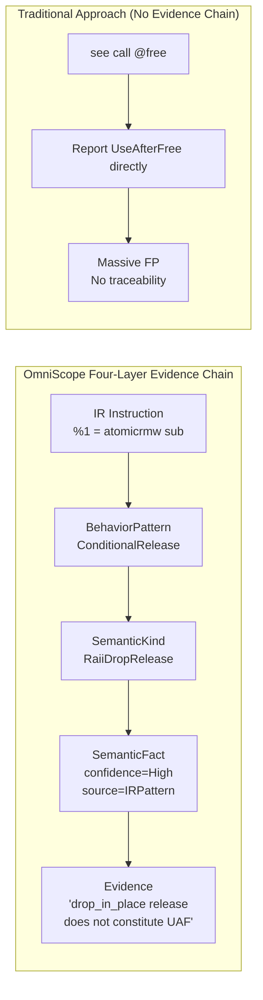
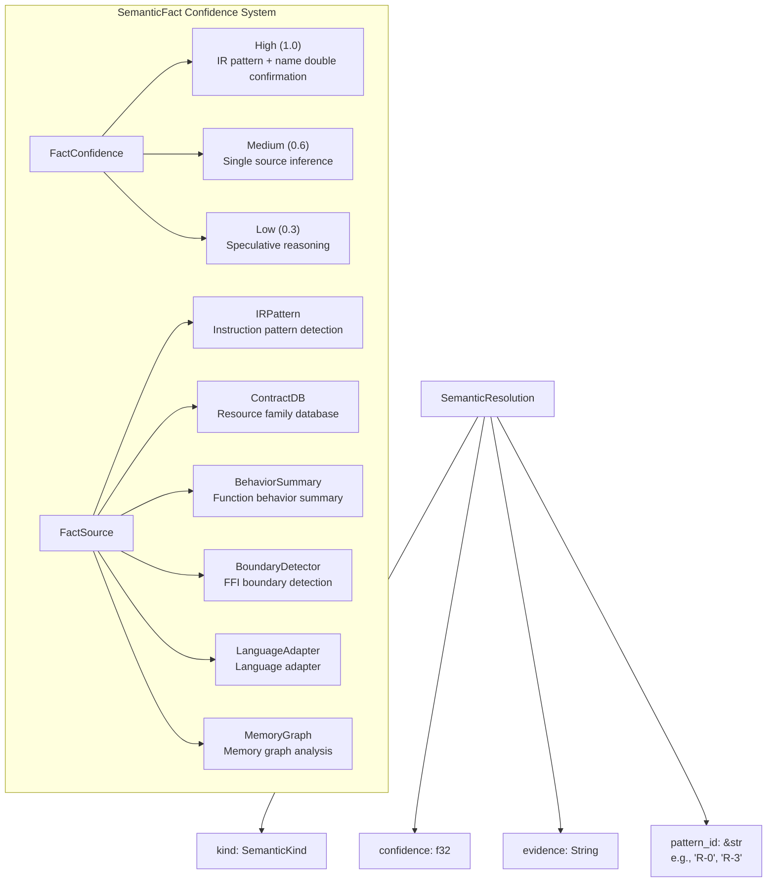
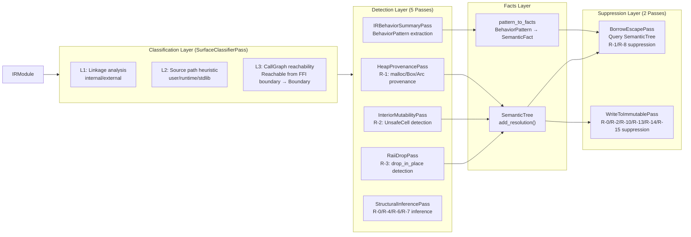

+++
title = "OmniScope Architecture Deep Dive (Part 5): IR Pattern Atlas — From Evidence Chain to Semantic Suppression"
date = 2026-06-28
description = "After scanning 67,337 LLVM IR instructions, the Rust rewrite built a four-layer evidence chain — IRPattern → BehaviorPattern → SemanticKind → SemanticFact — that finally made false-positive suppression traceable and explainable."
weight = 54
[taxonomies]
tags = ["Rust", "LLVM", "FFI", "Semantic Analysis", "Pattern Matching"]
series = ["omniscope-rs"]
[extra]
series = "omniscope-rs"
+++

# OmniScope Architecture Deep Dive (Part 5): IR Pattern Atlas — From Evidence Chain to Semantic Suppression

> After scanning 67,337 LLVM IR instructions, I came to a brutal realization: **A static analyzer isn't failing because it's not smart enough — it's failing because it never built a complete evidence chain from "instruction" to "semantics."**
>
> FP suppression without an evidence chain is, at its core, guesswork. OmniScope solves this with a four-layer evidence chain: IRPattern → BehaviorPattern → SemanticKind → SemanticFact → Evidence.

---

## The Core Problem: Why Do Analyzers Still Report False Positives?

In OmniScope's early versions, FP suppression relied on a "name whitelist" — skip `strlen`, flag `free`. The problems were obvious:

1. **Names are unreliable**: After LTO inlining, function names disappear, replaced by `call @0x7f8a43`
2. **Semantic confusion**: `malloc` in Rust's `alloc::alloc` is allocation, and in C it's also allocation — but the ownership semantics are completely different
3. **Cross-language disaster**: Python's `Py_DECREF` looks like a "release function" from C's perspective, but it's part of refcount management

The root cause: **The analyzer only sees IR instructions, yet it must make semantic judgments about ownership safety. There's no evidence chain in between.**



---

## Layer 1: IRPattern — Raw Instruction Fingerprints

The bottom layer is raw pattern matching on LLVM IR instructions. This is not about "looking at function names" — it's about **the dataflow relationships between instructions**.

Evidence chain starting point: `crates/omniscope-semantics/src/resource/ir_pattern.rs`

```rust
// detect_conditional_release: doesn't look at function names, only at instruction flow
fn detect_conditional_release(body: &FunctionBody) -> Option<BehaviorPattern> {
    // Find atomicrmw sub (refcount decrement)
    // Check if result is used for icmp eq (compare to zero)
    // Conditional branch → non-zero branch calls destroy
    for atomic in atomic_insts {
        if atomic.atomic_op == Some("sub") {
            for icmp in icmp_insts {
                if icmp.icmp_pred == Some("eq")
                    && icmp.operands.contains(&atomic.dest) 
                {
                    return Some(BehaviorPattern::ConditionalRelease {
                        atomic_op: "sub",
                        threshold: icmp.operands.last(),
                    });
                }
            }
        }
    }
    None
}
```

This code detects the following sequence in LLVM IR:

```llvm
%old = atomicrmw sub ptr %rc, i32 1   ; refcount--
%zero = icmp eq i32 %old, 0           ; compare to zero?
br i1 %zero, label %release, label %done  ; conditional branch
release:
  call void @__rust_dealloc(...)       ; release only when zero
  ret void
done:
  ret void
```

`ir_pattern.rs` (1867 lines) defines 20+ IR instruction pattern detection functions:

| IR Instruction Sequence | BehaviorPattern | Typical Scenario |
|---|---|---|
| `atomicrmw sub` + `icmp eq` + `br` + `call free` | ConditionalRelease | Arc/Rc Drop |
| `call` return value only used in arithmetic/store | PureComputation | strlen, getenv |
| `call` returns ptr → passed to free | OwnershipTransfer | Cross-family release |
| `getelementptr` + `bitcast` + `ret` | PointerProjection | as_ptr() |
| `store` to struct field + `ret void` | Initialization | Constructor |
| `alloca` ptr → `store` to `@global` | StackToGlobalEscape | Use-after-return |
| `call @free(ptr %p)` ... `call @fn(..., ptr %p)` | FreeThenCallbackUse | CWE-416 UAF |

Key design: **Detection order equals priority order**. `extract_behavior()` checks safe patterns first (ConditionalRelease, NullGuardedRelease), then dangerous patterns (OwnershipTransfer), and finally falls back to PureComputation.

---

## Layer 2: BehaviorPattern — Behavioral Pattern Enum

Extracted from IR instruction patterns into the `BehaviorPattern` enum, with 20+ variants:

```rust
pub enum BehaviorPattern {
    ConditionalRelease   { atomic_op, threshold },
    PureComputation,
    OwnershipTransfer    { is_acquire: bool },
    PointerProjection,
    Initialization,
    InternalBridge,
    BorrowedReturn       { from_readonly_param: bool },
    RAiiDropRelease      { is_drop_in_place: bool },
    IntoRawTransfer,
    PosixNonMemoryOp     { category: PosixOpCategory },
    NullGuardedRelease   { arg_index: u32 },
    NullStoreAfterRelease { arg_index: u32 },
    FallibleOutParamInit { out_arg_index: u32 },
    OutParamNullOnError  { out_arg_index: u32 },
    OutParamOwnedOnSuccess { out_arg_index: u32 },
    StoreToOwner         { owner_field: String },
    StoreToRuntime       { runtime_target: String },
    ResourceEscape       { escape_type: EscapeType },
    ReleaseOnAllExitPaths { release_function: String },
    StackToGlobalEscape  { global_target, alloca_reg },
    ReturnAlias          { aliased_param: String },
    FreeThenCallbackUse  { freed_reg, use_callee },
    HeapToGlobalEscape   { global_target, param_reg },
    BufferOverflow       { callee, overflow_amount, opcode },
}
```

Each variant is a **semantic abstraction** over an IR instruction sequence — instead of saying "I see atomicrmw sub + icmp eq + br + call," we say "this is a conditional release."

This abstraction means downstream code doesn't need to understand LLVM IR details:

```rust
// pattern_to_facts.rs: transforms BehaviorPattern into SemanticFact
pub(crate) fn pattern_to_facts(
    pattern: &BehaviorPattern, func_name: &str, _func_id: u64,
) -> Vec<SemanticFact> {
    match pattern {
        BehaviorPattern::ConditionalRelease { .. } => vec![
            SemanticFact::new(
                SemanticKey::Symbol(func_name.into()),
                SemanticKind::ReleaseOnAllExitPaths,
                FactConfidence::High,
                FactSource::IRPattern,
                "ConditionalRelease: atomicrmw conditional release",
            )
        ],
        BehaviorPattern::PureComputation => vec![
            SemanticFact::new(
                SemanticKey::Symbol(func_name.into()),
                SemanticKind::NonMemoryResource,
                FactConfidence::High,
                FactSource::IRPattern,
                "PureComputation: no ownership side effects",
            )
        ],
        BehaviorPattern::OwnershipTransfer { is_acquire } => {
            let kind = if *is_acquire { SemanticKind::HeapProvenance }
                        else { SemanticKind::IntoRawTransfer };
            vec![SemanticFact::new(
                SemanticKey::Symbol(func_name.into()), kind,
                FactConfidence::Medium, FactSource::IRPattern,
                format!("OwnershipTransfer: is_acquire={}", is_acquire),
            )]
        },
        // ... remaining ~20 pattern mappings ...
    }
}
```

---

## Layer 3: SemanticKind — 55+ Variant Semantic Classification System

`SemanticKind` is defined in `crates/omniscope-semantics/src/resource/semantic_tree/kind.rs`, and is the semantic core of the entire evidence chain.

### R-0 through R-8 Suppression Rules

9 R-N rules originate from the `bun_fp_reduction_plan`, covering the root causes of all measured false positives:

| Rule | SemanticKind | Suppresses | FP Covered |
|---|---|---|---|
| R-0 | ReadonlyParam / MutableParam | write_to_immutable | 1877 |
| R-1 | HeapProvenance / GlobalProvenance | borrow_escape | 71 |
| R-2 | InteriorMutability | write_to_immutable | ~100 |
| R-3 | RaiiDropRelease | use_after_free | 3 |
| R-4 | FileOperation / NetworkOperation / ProcessOperation | cross_language_free | 0 |
| R-5 | AbortOnOom | leak/leak_pair | 0 |
| R-6 | IntoRawTransfer | cross_language_free | 4 |
| R-7 | LibraryRelease | cross_language_free | 0 |
| R-8 | FromParameter | borrow_escape | 39 |

Plus R-10 (SSA local values), R-13 (C/C++ no immutable semantics), R-14 (Rust arena internals), R-15 (RawVec buffer writes) — these rules are implemented in `WriteToImmutablePass` (809 lines).

### Cross-Language Patterns (6 Language Adapters)

The `from_function_name()` method (kind.rs line 593) covers six languages through 42+ pattern matching branches:

```rust
pub fn from_function_name(func_name: &str) -> Self {
    // Python: 8 patterns
    if func_name.contains("Py_INCREF")  { return SemanticKind::PythonRefcountInc; }
    if func_name.contains("Py_DECREF")  { return SemanticKind::PythonRefcountDec; }
    if func_name.contains("PyList_GetItem") { return SemanticKind::PythonBorrowedRef; }
    
    // Go: 4 patterns (defer / SetFinalizer / mallocgc / _Cgo_)
    if func_name.starts_with("_Cgo_")  { return SemanticKind::GoCgoWrapper; }
    
    // C++: 4 patterns (unique_ptr / shared_ptr / ~destructor / __cxa_*)
    if func_name.starts_with('~') || func_name.contains("::~") {
        return SemanticKind::CppDestructor;
    }
    
    // C#: 3 patterns (SafeHandle / Finalize / DllImport)
    // Java: 3 patterns (LocalRef / GlobalRef / WeakRef)
    // WASM/JS: 7 patterns (malloc/free / emscripten_* / __import_*)
}
```

### Helper Methods

Each SemanticKind provides three query methods:

```rust
pub fn safety_score(&self) -> f32 {
    match self {
        SemanticKind::RaiiDropRelease     => 1.0,  // Compiler-managed, completely safe
        SemanticKind::CppUniquePtr        => 0.9,  // Exclusive ownership
        SemanticKind::PythonRefcountDec   => 0.3,  // Manual refcount, high risk
        _ => 0.5,
    }
}

pub fn requires_cleanup(&self) -> bool {
    matches!(self, SemanticKind::PythonOwnedRef 
        | SemanticKind::HeapProvenance 
        | SemanticKind::IntoRawTransfer
        | SemanticKind::JavaGlobalRef ...)
}

pub fn is_borrowed_or_temporary(&self) -> bool {
    matches!(self, SemanticKind::PythonBorrowedRef 
        | SemanticKind::JavaLocalRef 
        | SemanticKind::FromParameter ...)
}
```

### SemanticKey — 6 Query Dimensions

```rust
pub enum SemanticKey {
    Symbol(String),         // Symbol name (function, variable, type)
    Value(String),          // SSA register name
    Resource(u64),          // Resource allocation point ID
    Path(String, u64),      // (function name, path ID) path-sensitive analysis
    Owner(String),          // Owner name (container, struct)
    CallSite { caller, callee, index },  // Call site
}
```

---

## Layer 4: SemanticFact — Traceable Evidence with Confidence



### SemanticResolution vs SemanticFact

- **SemanticResolution** (stored in `SemanticTree`): Records *why* a value has a specific semantic kind. Written by detection passes, queried by suppression passes.
- **SemanticFact** (produced via `pattern_to_facts()`): Records *what* is known, with explicit source and confidence. Produced by IRBehaviorSummaryPass, consumed by IssueCandidateBuilder.

```rust
let resolution = SemanticResolution {
    kind: SemanticKind::HeapProvenance,
    confidence: 0.85,
    evidence: "call @malloc → store to %ptr".into(),
    pattern_id: "R-1",
};

let fact = SemanticFact::new(
    SemanticKey::Symbol("my_function".into()),
    SemanticKind::HeapProvenance,
    FactConfidence::High,
    FactSource::IRPattern,
    "OwnershipTransfer: is_acquire=true",
);
```

### Four Suppression Methods

```rust
impl SemanticKind {
    pub fn suppresses_write_to_immutable(&self) -> bool {
        matches!(self, SemanticKind::MutableParam 
            | SemanticKind::InteriorMutability ...)
    }

    pub fn suppresses_borrow_escape(&self) -> bool {
        matches!(self, SemanticKind::HeapProvenance
            | SemanticKind::GlobalProvenance
            | SemanticKind::FromParameter ...)
    }

    pub fn suppresses_use_after_free(&self) -> bool {
        matches!(self, SemanticKind::RaiiDropRelease ...)
    }

    pub fn suppresses_cross_language_free(&self) -> bool {
        matches!(self, SemanticKind::IntoRawTransfer
            | SemanticKind::FileOperation
            | SemanticKind::LibraryRelease ...)
    }
}
```

---

## The Pass Pipeline: From Detection to Suppression

Five detection passes + one classification pass form the complete pipeline from IR to semantics:



### Key Pass Detail

**SurfaceClassifierPass**: Three-tier classification — L1 checks linkage, L2 checks source path, L3 upgrades via CallGraph reachability from FFI boundary.

**HeapProvenancePass** (244 lines): R-1 detection — detect heap allocation calls, global provenance, stack provenance, write to `SemanticTree`.

**BorrowEscapePass** (318 lines): Stack escape detection — query `SemanticTree` for R-1/R-8 suppression.

**WriteToImmutablePass** (809 lines): Immutable write detection — query `SemanticTree` for R-0/R-2/R-10/R-13/R-14/R-15 suppression.

---

## Complete Evidence Chain Example: Arc::drop

### IR Instruction Level

```llvm
%old = atomicrmw sub ptr %rc, i32 1   ; refcount--
%is_zero = icmp eq i32 %old, 0        ; check zero
br i1 %is_zero, label %free, label %done

free:
  call void @__rust_dealloc(ptr %data, i64 16, i64 8) ; release
  ret void
done:
  ret void
```

### Evidence Chain Expansion

```
Layer 1: IRPattern
  detect_conditional_release() → atomicrmw sub + icmp eq + br + call
  
Layer 2: BehaviorPattern
  BehaviorPattern::ConditionalRelease { atomic_op: "sub", threshold: "0" }
  
Layer 3a: SemanticKind (via from_function_name supplement)
  __rust_dealloc → SemanticKind::RaiiDropRelease
Layer 3b: SemanticKind (via pattern_to_facts mapping)
  ConditionalRelease → SemanticKind::ReleaseOnAllExitPaths
  
Layer 4: SemanticFact
  SemanticFact {
    key: Symbol("__rust_dealloc"),
    kind: RaiiDropRelease,
    confidence: High,
    source: IRPattern,
    evidence: "RAiiDropRelease: drop_in_place=true",
  }
  
Suppression judgment: SemanticKind::RaiiDropRelease.suppresses_use_after_free() → true
Conclusion: UseAfterFree suppressed → FP eliminated ✅
```

---

## Honest Limitations

### 1. `from_function_name` Is a Sandcastle

42+ hardcoded if-else branches covering 6 languages. Every new library (libuv, openssl, sqlite) requires new branches. Should be replaced by a YAML/TOML-configured rule engine — but low priority since existing coverage suffices.

### 2. R-N Rule Confidence from Limited Samples

R-0 through R-8 data comes from the main project's `.ll` files (primarily Rust and C/C++). For Zig, Swift, Nim — unknown.

### 3. Four-Layer Evidence Chain Unverifiable at FP = 0

When FP approaches zero, `suppresses_*` methods become unverifiable — can you prove zero false negatives in a zero-FP set? Current approach: every suppression rule must attach evidence, and `--no-suppression` mode exists for regression testing.

### 4. SemanticFact and SemanticResolution Dualism

Functionally the same — recording "what I know." Separation is historical and should be merged.

### 5. Performance Cost

Four-layer chain means every IR instruction may be processed 4 times. On large projects (bun's 200,000 functions), analysis time may double. Layer 1's PureComputation filters out ~80% of functions before they enter Layer 2.

---

*Previous: [Resource Families — Breaking Language Barriers](./04-resource-family.md)*
*Next: [Reflection — Architecture Tradeoffs You Didn't See](./06-reflection.md)*

**Key Source Files:**
- `crates/omniscope-semantics/src/resource/ir_pattern.rs` (1867 lines) — IR pattern detection
- `crates/omniscope-semantics/src/resource/semantic_tree/kind.rs` (1029 lines) — SemanticKind 55+ variants
- `crates/omniscope-semantics/src/resource/semantic_engine.rs` (1853 lines) — FFI safety evaluation
- `crates/omniscope-pass/src/resource/pattern_to_facts.rs` — BehaviorPattern→SemanticFact mapping
- `crates/omniscope-pass/src/analysis/` — RaiiDropPass, InteriorMutabilityPass, HeapProvenancePass, BorrowEscapePass, WriteToImmutablePass