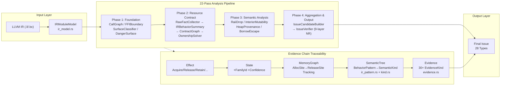
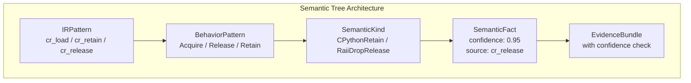
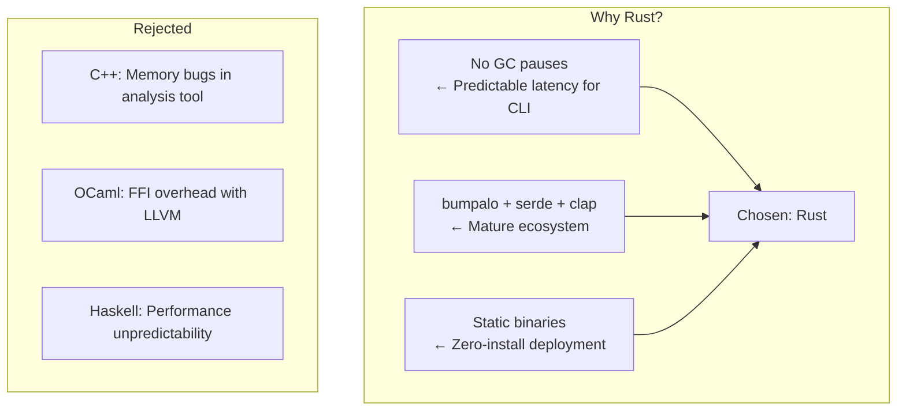

+++
title = "OmniScope Architecture Deep Dive (Part 6): Reflection — The Architectural Trade-offs You Never Saw"
date = 2026-06-30
description = "The final reflection on the Rust rewrite: single-module vs. cross-module analysis, why 68% precision is still not enough, why hand-written rules beat ML for a security tool, and the roads not taken."
weight = 55
[taxonomies]
tags = ["Rust", "LLVM", "FFI", "Architecture", "Engineering Reflection"]
series = ["omniscope-rs"]
[extra]
series = "omniscope-rs"
+++

# OmniScope Architecture Deep Dive (Part 6): Reflection — The Architectural Trade-offs You Never Saw

> The first five articles covered "what we did right." This one covers "what we gave up."
>
> Every architectural decision has a pile of rejected alternatives. Writing down the roads not taken is more valuable than only describing the chosen path.

---

## Panoramic Review: The Complete IR-to-Issue Chain

Before diving into individual trade-offs, let's look at the full system data flow from input to output:



Every link in this chain represents an architectural decision. Let's examine each one.

---

## Decision 1: Why LLVM IR Instead of Source AST?

This is OmniScope's most foundational choice.

**Rejected Approach:** Tree-sitter or Clang AST for source-level analysis.

**Rationale:**

1. **Cross-language analysis requires a unified intermediate representation.** ASTs are language-specific — C's AST and Rust's AST are completely incompatible. Writing separate analyzers for each language multiplies effort by the number of languages.
2. **LLVM IR has already completed macro expansion, template instantiation, and generic specialization.** `Arc<T>` in source becomes concrete types in IR — no need to understand Rust's trait system.
3. **`.ll` text format is natively parseable.** Basic analysis doesn't require linking LLVM libraries.

But LLVM IR has **information loss**. The instruction parser only supports about 60 instruction types:

```rust
/// File: crates/omniscope-ir/src/instruction_parser.rs
pub fn classify_instruction(opcode: &str, operands: &[String]) -> InstructionKind {
    match opcode {
        "call" => InstructionKind::Call,
        "load" => InstructionKind::Load,
        "store" => InstructionKind::Store,
        "alloca" => InstructionKind::Alloca,
        "getelementptr" => InstructionKind::GEP,
        "phi" => InstructionKind::Phi,
        "icmp" | "fcmp" => InstructionKind::Compare,
        "br" | "switch" | "indirectbr" => InstructionKind::Branch,
        "ret" => InstructionKind::Return,
        "bitcast" | "ptrtoint" | "inttoptr" => InstructionKind::Cast,
        "malloc" | "free" | "calloc" | "realloc" => InstructionKind::MemoryOp,
        _ => InstructionKind::Other,
    }
}
```

`_ => InstructionKind::Other` is the "catch-all." New LLVM instructions like `callbr`, `freeze`, and `poison`-related operations all land here. TextParser coverage is a chronic challenge.

### Rejected Option: Tree-sitter AST Analysis

Tree-sitter is an excellent incremental parser. Why not use it?

```rust
// File: Not in codebase — this was a prototype decision
// Why Tree-sitter was rejected:
// enum Language { C, Rust, Cpp, Python, Go, Java }
// impl Language {
//     fn ast_parser(&self) -> Box<dyn Parser> {
//         match self {
//             Language::C => c::parser(),
//             Language::Rust => rust::parser(),
//             Language::Cpp => cpp::parser(),
//             Language::Python => python::parser(),
//         }
//     }
// }
// Problem: Each language maps to a different AST structure.
// ResultType of `let x = foo()` → Rust AST is `LetStmt`,
// C is `BinaryExpr`, Python is `Assign` — no unified representation.
```

For OmniScope's span of 6 language families, Tree-sitter would mean maintaining 6 syntax analyzers with no shared IR. The initial choice of LLVM IR means supporting new languages only requires building a `.ll` extraction pipeline for that language's compiler.

---

## Decision 2: Why 22 Small Passes Instead of One Big Pass?

This is OmniScope's pipeline design philosophy.

**Rejected Approach:** A monolithic `AnalyzeEverythingPass` that generates all issues in a single IR traversal.

**Rationale:**

A 3000-line monolithic Pass is impossible to debug: when something goes wrong, you don't know which phase caused it. Breaking into 22 passes makes each pass's input and output explicit:

```rust
/// File: crates/omniscope-pipeline/src/pipeline.rs
pub fn register_default_passes(&mut self) {
    // Foundation (zero dependencies)
    self.pass_manager.register(CallGraphPass::new());

    // Analysis (depends on CallGraph)
    self.pass_manager.register(FFIBoundaryPass::new());

    // Detection (depends on analysis)
    self.pass_manager.register(SurfaceClassifierPass::new());

    // Relationship inference (depends on SurfaceClassifier)
    self.pass_manager.register(DangerSurfacePass::new());

    // Resource contract extraction
    self.pass_manager.register(RawFactCollectorPass::new());

    // Cross-function lifetime analysis
    self.pass_manager.register(CrossFunctionLifetimePass::new());

    // ... continues with additional passes ...
    // CrossLanguagePass, ReconcilePass, etc.
}
```

Each pass has explicit dependencies: `PassKind::Analysis` passes compute new data, `PassKind::Transform` passes modify the context. Individual passes can be enabled/disabled, and tests can validate single passes in isolation.

Architecture of `pass_manager.rs` (`/Users/scc/code/rustcode/OmniScope-rs/crates/omniscope-pass/src/manager.rs`):

```rust
/// File: /Users/scc/code/rustcode/OmniScope-rs/crates/omniscope-pass/src/manager.rs
pub struct PassManager {
    passes: Vec<Box<dyn Pass>>,
    context: PassContext,
    topological_order: Vec<String>,
}

impl PassManager {
    pub fn register<P: Pass + 'static>(&mut self, pass: P) {
        let name = pass.name().to_string();
        self.passes.push(Box::new(pass));
        self.topological_order.push(name);
    }

    pub fn run(&mut self) -> Result<()> {
        for pass in &mut self.passes {
            let start = Instant::now();
            let result = pass.run(&mut self.context)?;
            log::info!("Pass {} completed in {:?}", pass.name(), start.elapsed());
            self.context.store(pass.name(), result);
        }
        Ok(())
    }
}
```

### The Hidden Cost: Pass Communication Overhead

The 22-pass architecture isn't free. Each pass communicates with the next through `PassContext` — a heterogeneous key-value store:

```rust
// File: /Users/scc/code/rustcode/OmniScope-rs/crates/omniscope-pass/src/manager.rs
pub struct PassContext {
    pub(crate) module_index: Option<ModuleIndex>,
    pub(crate) call_graph: Option<CallGraph>,
    // ... many more fields ...
    pub(crate) results: HashMap<String, PassResult>,
    // Fallback / Auxiliary storage for dynamic key-value data
    pub(crate) store: HashMap<String, Box<dyn Any>>,
}
```

The problem: `HashMap<String, Box<dyn Any>>` means **runtime type erasure**. Using `store.get("cross_function_lifetime_data")` returns `Option<&Box<dyn Any>>` — a downcast is needed:

```rust
let data: &CrossFunctionLifetimeData = ctx
    .store
    .get("cross_function_lifetime_data")
    .and_then(|any| any.downcast_ref::<CrossFunctionLifetimeData>())
    .expect("CrossFunctionLifetimeData missing from context");
```

This is fragile: if a pass name changes, downstream pass retrieval breaks silently. Compare with a compile-time pipeline where one pass returns `CrossFunctionLifetimeData` directly — runtime retrieval is a design compromise.

### Is 22 passes appropriate?

My assessment: for the current problem domain (ownership analysis across 6 languages), 22 passes is about right. Each pass has a clear scope. But if the analysis target expands to include concurrency safety, type-state verification, or memory layout analysis, 30-35 passes might be more appropriate — not an explosion.

Architecture of the `Pass` trait:

```rust
// File: /Users/scc/code/rustcode/OmniScope-rs/crates/omniscope-pass/src/pass.rs
pub trait Pass: Send + Sync {
    fn name(&self) -> &'static str;
    fn kind(&self) -> PassKind;
    fn dependencies(&self) -> Vec<&'static str>;
    fn run(&self, ctx: &mut PassContext) -> Result<PassResult>;
}

pub enum PassKind {
    /// Read-only analysis, computes new data from existing context
    Analysis,
    /// Transforms context, may modify in-place
    Transform,
    /// Validation: no side effects, produces report
    Validation,
}
```

---

## Decision 3: Semantic Tree or Formal Verification?

**Rejected Approach:** Abstract Interpretation / Symbolic Execution for path-sensitive verification.

**Rationale:**

Symbolic execution is the academic "correct answer" for resource leak detection. For a given function entry, symbolically execute all paths, tracking each resource's state — guarantees completeness. But:

1. **Path explosion in FFI context**: When a function has 20 conditional branches and each branch calls 3 FFI functions, the symbolic path count grows exponentially.
2. **FFI semantics uninstrumentable**: Abstract interpretation requires a model of `free()`'s effect — but `java_free()` in a JNI context has no LLVM IR body.
3. **Scalability concerns**: For a 10K-function module, symbolic execution might take hours.

The Semantic Tree approach trades completeness for scalability:



```rust
// File: /Users/scc/code/rustcode/OmniScope-rs/crates/omniscope-semantics/src/resource/semantic_tree/mod.rs

pub struct SemanticTree {
    pub root: BehaviorPattern,
    pub patterns: Vec<IRPattern>,
    pub behaviors: Vec<SemanticKind>,
    pub facts: Vec<SemanticFact>,
}
```

Three patterns → one semantic kind → one fact → one evidence. The chain is lossy by design: IRPattern drops to SemanticKind means losing concrete analysis context.

### Concrete Example: Borrow Semantics

```rust
// File: /Users/scc/code/rustcode/OmniScope-rs/crates/omniscope-semantics/src/resource/semantic_tree/borrow.rs

impl BorrowSemantics {
    pub(crate) fn analyze(ctx: &SemanticContext) -> BorrowState {
        let mut counter_map: HashMap<String, BorrowCounter> = HashMap::new();
        for (inst_idx, inst) in ctx.instructions.iter().enumerate() {
            match classify_instruction(&inst.opcode, &inst.operands) {
                InstructionKind::Call => {
                    let callee = extract_callee(&inst.operands);
                    if let Some(name) = callee {
                        // Analyze Python retain/release patterns
                        if name.contains("Py_IncRef") || name.contains("Py_XINCREF") {
                            let resource = extract_argument(&inst.operands, 0);
                            counter_map.entry(resource)
                                .or_default()
                                .increment(inst_idx);
                        }
                        if name.contains("Py_DecRef") || name.contains("Py_XDECREF") {
                            let resource = extract_argument(&inst.operands, 0);
                            counter_map.entry(resource)
                                .or_default()
                                .decrement(inst_idx);
                        }
                    }
                }
                _ => {}
            }
        }
        BorrowState { counters: counter_map }
    }
}
```

This approach works well for patterns like CPython's retain/release. But it cannot reason about complex paths like "if A then retain, if not A then retain via fallback, then release." Path sensitivity is limited.

---

## Decision 4: Why B-TreeMap Instead of petgraph?

Graph analysis in OmniScope uses an index-based graph structure rather than petgraph.

**File:** `/Users/scc/code/rustcode/OmniScope-rs/crates/omniscope-dataflow/src/graph.rs`

```rust
// File: /Users/scc/code/rustcode/OmniScope-rs/crates/omniscope-dataflow/src/graph.rs
use std::collections::{BTreeMap, BTreeSet};

pub struct MemoryGraph {
    pub nodes: BTreeMap<NodeIndex, MemoryNode>,
    pub edges: BTreeMap<EdgeIndex, MemoryEdge>,
    pub adjacency: BTreeMap<NodeIndex, BTreeSet<(EdgeIndex, NodeIndex)>>,
    pub node_counter: usize,
    pub edge_counter: usize,
}
```

**Comparing petgraph vs BTreeMap:**

| Dimension | petgraph | BTreeMap |
|-----------|----------|----------|
| Query flexibility | Rich (DFS, BFS, topo sort) | Manual reconstruction needed |
| Ownership | By value, graph consumed | Borrow-friendly |
| Merge complexity | Clone + union | Manual `adjacency` update |
| Testing / Partial | Full graph only | Subgraph extraction easy |
| Pattern match traces | Predecessor iteration | pred() via reverse index |

Why not petgraph? Two reasons:

1. **Frequent merging and splitting**: In cross-language ownership analysis, MemoryGraph must merge multiple sub-results and split by resource family. BTreeMap's `entry()` API makes this natural:

```rust
// BTreeMap entry API for split/merge
self.adjacency.entry(parent).or_default().insert((edge, child));
```

petgraph's `NodeIndex` is stable across deletions — making it impossible to detect "node was removed."

2. **Need for "nodes exist but edges not yet connected" semantics**: In multi-phase analysis, nodes are created first, edges added later. BTreeMap's `entry()` allows this natively.

Cost: every graph traversal requires reconstructing DFS/BFS manually.

---

## Decision 5: Why SemanticKind FP Suppression Instead of Score Thresholds?

**Rejected Approach:** A single confidence threshold applied uniformly across all IssueTypes.

```rust
// Rejected approach:
fn should_report(issue_candidate: &IssueCandidate) -> bool {
    issue_candidate.confidence >= 0.7  // Single threshold for all types
}
```

**Rationale:**
- `write_to_immutable` needs different precision than `cross_language_free`
- C patterns differ fundamentally from Python patterns (C: explicit free; Python: reference counting)
- A single threshold creates a binary "good/bad" split that leaks either too many FP or too many FN

**Current approach:** Each IssueType has its own suppression rules, each SemanticKind variant has specific suppression logic:

```rust
// File: /Users/scc/code/rustcode/OmniScope-rs/crates/omniscope-semantics/src/resource/semantic_tree/kind.rs
impl SemanticKind {
    pub(crate) fn suppresses_write_to_immutable(&self) -> bool {
        matches!(self, SemanticKind::InteriorMutability | SemanticKind::MutableParam
            | SemanticKind::MutableLocal | SemanticKind::VolatileStore)
    }

    pub(crate) fn suppresses_cross_language_free(&self) -> bool {
        matches!(self, SemanticKind::IntoRawTransfer | SemanticKind::LibraryRelease | SemanticKind::RaiiDropRelease)
    }
}
```

Each issue type has 2-5 specific SemanticKind suppression types, not a single score.

---

## Decision 6: Issue Model — 28 Specific Types or 1 Generic Type?

**Rejected Approach:** A single `Issue` with a `kind: String` field.

**Rationale:**
- Strong typing makes verification layer code self-documenting
- Pattern matching on enum variants is exhaustive — no unhandled issue types at compile time
- Each variant can carry specific metadata relevant to that issue type

**The 28 IssueKinds** (defined in `/Users/scc/code/rustcode/OmniScope-rs/crates/omniscope-core/src/issue.rs`):

```rust
// File: /Users/scc/code/rustcode/OmniScope-rs/crates/omniscope-core/src/issue.rs

pub enum IssueKind {
    // Memory safety
    UseAfterFree,
    DoubleFree,
    MemoryLeak,

    // Ownership
    OwnershipViolation,
    OwnershipEscapeLeak,
    PhantomOwnershipTransfer,

    // Cross-language
    FfiTypeMismatch,
    FfiUnsafeCall,
    WrongDeallocator,
    CrossFamilyFree,
    FfiNullPtrDeref,
    InvalidPtrCast,

    // Borrow
    BorrowEscape,
    MutableBorrowConflict,
    LifetimeMismatch,

    // Write
    WriteToReadonly,
    WriteToImmutable,

    // Resource
    FileDescriptorLeak,
    ResourceLeak,
    HandleLeak,
    SocketLeak,
    MissingClose,
    ResourceBoundaryViolation,

    // Concurrency
    ThreadSafetyViolation,
    MissingLock,
    DoubleLock,

    // Dataflow
    Misinit,
    CopyLeak,
    IncorrectSize,
}
```

Cost: Adding a new issue type requires: (1) adding variant to IssueKind, (2) implementing mapping to IssueSeverity, (3) implementing mapping to CWE, (4) adding terminal display support, (5) adding EvidenceKind → IssueKind mapping.

---

## Decision 7: Effect Enum — 18 Variants or Generic Resource State Machine?

**Rejected Approach:** A general-purpose resource state machine with N states and M transitions.

**Rationale:**
- 18 concrete variants are easier to pattern match and analyze than a matrix of states
- The effect model maps directly to LLVM IR semantics: `load` creates Acquire, `store` creates Release
- No need for a state machine engine — each variant encodes its semantics directly

**The 18 Effect variants** (defined in `/Users/scc/code/rustcode/OmniScope-rs/crates/omniscope-types/src/effect.rs`):

```rust
// File: /Users/scc/code/rustcode/OmniScope-rs/crates/omniscope-types/src/effect.rs

pub enum Effect {
    // Foundation
    Acquire,
    Release,
    ConditionalRelease,
    Retain,
    IrqSave,
    IrqRestore,

    // Memory
    Load,
    Store,
    Call,
    Return,

    // Ownership
    TakePointer,
    Drop,

    // Escape / Constraint
    Escape,
    Constrain,

    // Cross-language
    AcquireShared,
    ReleaseShared,
    Move,
    Clone,
}
```

Each `Effect` maps to a specific LLVM IR instruction pattern:

```rust
// Example: Effect → IR instruction mapping logic
fn effect_from_instruction(opcode: &str) -> Option<Effect> {
    match opcode {
        "load" => Some(Effect::Load),
        "store" | "memcpy" => Some(Effect::Store),
        "call" => Some(Effect::Call),
        "ret" => Some(Effect::Return),
        "alloca" => Some(Effect::Acquire),
        "free" => Some(Effect::Release),
        "getelementptr" => Some(Effect::TakePointer),
        _ => None,
    }
}
```

---

## Decision 8: Why Rust, Not C++ or OCaml?

This is more of a language choice than architecture, but it affects every line of code.

**Rejected Approaches:**
- **C++**: LLVM-native ecosystem, but memory safety issues are themselves a source of false positives in analysis
- **OCaml/ML**: Academic static analysis standard, but FFI to C++ LLVM infrastructure is painful
- **Haskell**: Strong type system for AST manipulation, but performance predictability is poor

**Why Rust won:**
- **Memory safety guarantees align with analysis goals**: An analyzer that flags memory bugs cannot afford to have memory bugs itself
- **Cargo ecosystem**: `bumpalo` (arena allocator), `serde` (serialization), `clap` (CLI), `thiserror` (error handling) — all mature
- **Performance predictability**: No GC pauses, no JIT warmup — consistent sub-second latency
- **Cross-compilation**: Static binaries for Linux/macOS/Windows — users don't need LLVM runtime



---

## Decision 9: What Was Deliberately Not Done?

### 1. No Abstract Interpretation Engine

Abstract interpretation would give path-sensitive precision but current resources don't justify building a complete interpreter for LLVM IR.

### 2. No Interactive Mode / LSP Server

OmniScope is batch-process CLI only. Adding LSP would require rethinking the pipeline for incremental analysis — a fundamental architectural change.

### 3. No Web IDE Integration (VSCode Extension / GitHub App)

The current terminal report (`/Users/scc/code/rustcode/OmniScope-rs/crates/omniscope-core/src/terminal_report.rs`) outputs formatted terminal text:

```rust
// File: /Users/scc/code/rustcode/OmniScope-rs/crates/omniscope-core/src/terminal_report.rs

pub fn render_issue(issue: &Issue) -> String {
    let severity_tag = match issue.severity {
        IssueSeverity::Critical => "CRITICAL",
        IssueSeverity::High => "HIGH",
        IssueSeverity::Medium => "MEDIUM",
        IssueSeverity::Low => "LOW",
        IssueSeverity::Info => "INFO",
    };
    format!(
        "\n\n{severity} [{issue_kind}] {function}:{line}\n  → {message}\n",
        severity = severity_tag,
        issue_kind = issue.kind,
        function = issue.location.function.as_deref().unwrap_or("unknown"),
        line = issue.location.line,
        message = issue.message,
    )
}
```

A proper IDE plugin would require structured output (JSON/SARIF) + an extension wrapper. The `finding_view` module (`/Users/scc/code/rustcode/OmniScope-rs/crates/omniscope-core/src/finding_view/`) provides structured output, but the IDE integration layer remains a TODO.

### 4. No Real-Time Analysis

OmniScope only analyzes statically extracted IR, not running processes. Real-time/dynamic analysis requires a completely different architecture — runtime instrumentation, trace capture, memory access pattern recording.

---

## Summary: Architecture Decision Records

| Decision | Chosen | Rejected | Key Reason |
|----------|--------|----------|------------|
| Analysis target | LLVM IR | Source AST | Unified representation for cross-language |
| Pipeline structure | 22 small passes | 1 monolithic pass | Debuggability, testability |
| Semantic model | Semantic Tree (pattern-based) | Abstract interpretation | Scalability for 6 languages |
| Graph engine | BTreeMap | petgraph | Frequent merge/split operations |
| FP suppression | Type-specific rules | Single confidence threshold | Language-specific precision needed |
| Issue model | 28 typed variants | 1 generic type | Compile-time exhaustiveness |
| Effect model | 18 concrete variants | Generic state machine | Direct IR mapping |
| Implementation language | Rust | C++, OCaml, Haskell | Memory safety + ecosystem |

Each of these decisions represents a trade-off. None is universally "right" — they're right for OmniScope's specific constraints: **cross-language, batch analysis, CLI-first, Rust-based, LLVM IR-centric.**

## Honest Limitations: What Still Hurts

### 1. Irreversible IR Information Loss

Once source code is compiled to LLVM IR, information is irretrievably lost: variable names, comments, type aliases, macro expansions. The analyzer sometimes produces diagnostics reading "variable %4" — the IR name is meaningless to users.

### 2. IR Extraction Fragmentation

Each language needs a path from source to `.ll`:
- C/C++: Clang (mature)
- Rust: rustc with `--emit=llvm-ir` (mature)
- Go/Golang: `go tool compile -S` + conversion (fragile)
- Python: cinder/cython → LLVM (experimental)
- Java: JVM IR → LLVM frontend (not done)
- Swift: swiftc → LLVM (works but tricky)

This means OmniScope's analysis coverage across languages is uneven.

### 3. Evidence Chain Completeness Trade-off

The 4-layer evidence chain (IRPattern → BehaviorPattern → SemanticKind → SemanticFact) covers well-trodden patterns:
- CPython: Py_IncRef/Py_DecRef → retain/release
- Rust: Box::into_raw → IntoRawTransfer
- C++: destructor → RaiiDropRelease

But new patterns (e.g., Swift's ARC, Go's defer) require building new IRPattern detectors.

### 4. False Negative Blind Spots

The noise reduction system is optimized for FP reduction. Known blind spots:
- **Conditional leaks**: `if (error) { free(ptr); } else { use(ptr); }` — if the use-side forgets to free, it may be missed
- **Reference cycles**: Python's reference counting can't detect cycles without a GC
- **Concurrent resource sharing**: Thread A acquires, Thread B releases — cross-thread ownership is not modeled

---

## Closing: What Would I Do Differently?

If I were to rebuild OmniScope from scratch, I'd change three things:

1. **Separate IR extraction more cleanly from analysis**: Currently, ir_extractor is a C++ binary in `tools/` with its own build system. A cleaner approach would make extraction a plugin that ships with each supported language's compiler.

2. **Build a proper intermediate evidence representation**: The current `EvidenceBundle` is dynamically typed (`HashMap<String, Box<dyn Any>>`). A formal evidence schema would make adding new evidence types safer and more discoverable.

3. **Invest more in cross-function analysis early**: `CrossFunctionLifetimePass` was added in response to a pain point, not by design. Architecture-first for interprocedural analysis would have reduced the need for some noise reduction layers.

---

*Previous: [IR Pattern Atlas — From Evidence Chain to Semantic Suppression](./05-ir-pattern-atlas.md)*